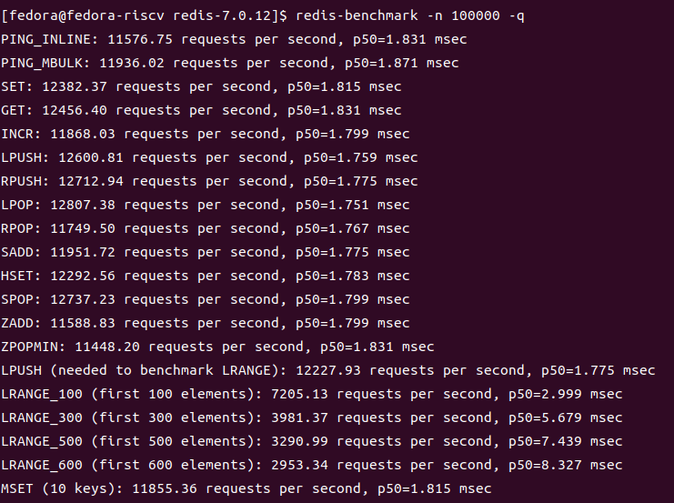

redis
------------------

redis测试工具介绍
>>>>>>>>>>>>>>>>>>>>>>>>>>>>>>>>>

``redis-benchmark`` 是一个用于测试 Redis性能的基准测试工具,可以帮助开发人员评估和比较 ``Redis`` 在不同配置或负载情况下的吞吐量和延迟.
测试结果包括每秒执行的命令数、平均延迟等指标

redis测试步骤
>>>>>>>>>>>>>>>>>>>>>>>>>>>>>>>>>

详细步骤
^^^^^^^^^^^^^^^^^

.. code:: bash

   sudo apt-get install redis-server #安装Redis
   redis-benchmark -h #安装Redis后,Redis-benchmark通常会自动安装,检查是否已安装Redis-benchmark
   redis-benchmark -n 100000  -q #示例,-n:指定要执行的请求总数,-q: 以安静模式运行,只输出最终统计信息。

运行结果示例
^^^^^^^^^^^^^^^^^

redis测试结果
>>>>>>>>>>>>>>>>>>>>>>>>>>>>>>>>>

测试环境

- ``SG2042 EVB``
- ``32GB * 4 DDR``
- ``Fedora38``
- ``64 core C920@2.0GHz``

.. code:: bash

   redis-benchmark -n 100000  -q

+-------------+----------------------------------------------+
| PING_INLINE | 11281.59 requests per second, p50=2.239 msec |
+-------------+----------------------------------------------+
| PING_MBULK  | 11134.62 requests per second, p50=2.271 msec |
+-------------+----------------------------------------------+
| SET         | 11361.05 requests per second, p50=2.215 msec |
+-------------+----------------------------------------------+
| GET         | 11266.34 requests per second, p50=2.239 msec |
+-------------+----------------------------------------------+
| INCR        | 11422.04 requests per second, p50=2.215 msec |
+-------------+----------------------------------------------+
| LPUSH       | 11461.32 requests per second, p50=2.207 msec |
+-------------+----------------------------------------------+
| RPUSH       | 11410.32 requests per second, p50=2.215 msec |
+-------------+----------------------------------------------+
| LPOP        | 11539.35 requests per second, p50=2.183 msec |
+-------------+----------------------------------------------+
| RPOP        | 11460.00 requests per second, p50=2.199 msec |
+-------------+----------------------------------------------+
| SADD        | 11366.22 requests per second, p50=2.223 msec |
+-------------+----------------------------------------------+
| HSET        | 11335.30 requests per second, p50=2.223 msec |
+-------------+----------------------------------------------+