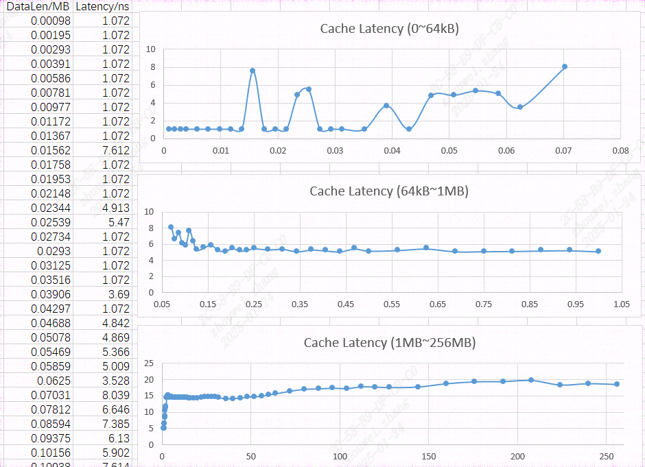

LMBench
------------------

LMBench工具介绍
>>>>>>>>>>>>>>>>>>>>>>>

``LMBench`` 是一个用于测试unix系统cache延迟的工具，通过该工具可以测试出不同级Cache的延时。

LMBench工具使用方法
>>>>>>>>>>>>>>>>>>>>>>>>>>>>>>>>>>>>

详细步骤
^^^^^^^^^^^^^^^^

.. code:: bash

    git clone https://github.com/sophgo/lmbench.git

    # 安装依赖
    # ubuntu
    sudo apt-get install gcc libtirpc-dev
    # fedora
    sudo yum install gcc libtirpc-devel
    # openEuler
    sudo dnf install libtirpc-devel

    cd lmbench
    make

    # 运行测试命令
    # 测试总长度为256MB，每个step为1024字节（1KB）
    ./bin/lat_mem_rd 256 1024

命令运行结束后，后输出两列数据，其中第一列为测试长度，单位为MB，第二列为latency，单位为ns。

将输出的结果复制到表格中进行处理，其中：

- 64KB 之前的数据，舍去异常值，取个平均，为 L1 的 latency。
- 1MB 到 64 KB 之间的数据，舍去异常值，取个平均，为 L2 的latency。
- 64MB 到 1MB 之前的数据，舍去异常值，取个平均，为 L3 的latency。

结果示例
^^^^^^^^^^^^^^^^

LMBench结果
>>>>>>>>>>>>>>>>>>>>>>>>>>>>>>>>>>>>

测试环境:

- ``SG2044 EVB``
- ``dual-rank 128GB DDR``
- ``OpenEuler24.03 (LTS) Linux6.12.6``
- ``64 core C920@2.8GHz``

+-----------------+--------------------+
| cache level     | cache latency(ns)  |
+=================+====================+
| L1              | 1.072              |
+-----------------+--------------------+
| L2              | 5.55               |
+-----------------+--------------------+
| L3              | 14.43              |
+-----------------+--------------------+