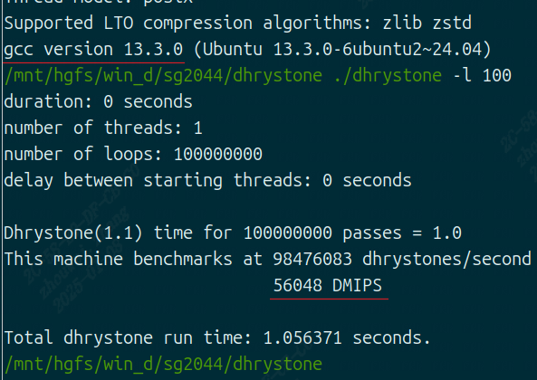

Dhrystone
------------------

Dhrystone工具介绍
>>>>>>>>>>>>>>>>>>>>>>>

``Dhrystone`` 是一种广泛使用的基准测试程序，用于测量计算机系统的整数运算性能。Dhrystone 测试的特点是它不依赖于浮点运算，
而是专注于整数运算、过程调用、指针引用等操作，这些操作对于大多数编程语言来说都是常见的。因此，它适合用来衡量处理器执行这类常见任务的效率。
它被设计成一个小型的、自包含的程序，可以在几乎任何计算机系统上编译和运行，从而提供了一个跨平台比较不同计算机性能的方法。

``Dhrystone`` 的结果通常以 ``DMIPS`` （Dhrystone Million Instructions Per Second）的形式给出，
代表了每秒钟可以执行多少个 Dhrystone 指令集。较高的 DMIPS 数值意味着更快的处理速度。

Dhrystone工具使用方法
>>>>>>>>>>>>>>>>>>>>>>>>>>>>>>>>>>>>

详细步骤
^^^^^^^^^^^^^^^^

.. code:: bash

    mkdir dhystone
    cd dhystone

    # 下载测试代码
    curl -O https://github.com/ARM-software/workload-automation/blob/master/wa/workloads/dhrystone/src/dhrystone.c

    # 收集gcc版本信息
    gcc -v

    # 编译代码
    gcc -O3 -static dhrystone.c -o dhrystone

    # 测试
    ./dhrystone -l 100

结果示例
^^^^^^^^^^^^^^^^

Dhrystone结果
>>>>>>>>>>>>>>>>>>>>>>>>>>>>>>>>>>>>

根据上图测试结果，测试得分为56048 DMIPS，与CPU频率相除，可以得出另一项得分：56048 DMIPS/ (2400 MHz) = 23.35 DMIPS/MHz。

测试环境:

- ``SG2044 EVB``
- ``dual-rank 128GB DDR``
- ``OpenEuler24.03 (LTS) Linux6.12.6``
- ``64 core C920@2.8GHz``

+-----------------+------------------------------+
| OS              | Ubuntu24.04                  |
+-----------------+------------------------------+
| CPU frequency   | 2.4 GHz                      |
+-----------------+------------------------------+
| gcc version     | gcc 13.3.0                   |
+-----------------+------------------------------+
| compile params  | -O3 -static                  |
+-----------------+------------------------------+
| test params     | gcc 13.3.0                   |
+-----------------+------------------------------+
| score           | 56048 DMIPS，23.35 DMIPS/MHz |
+-----------------+------------------------------+