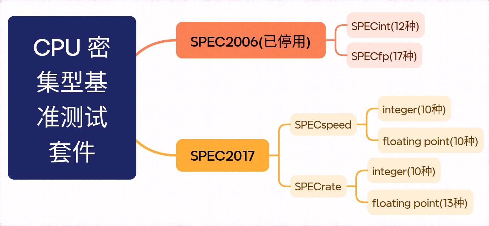
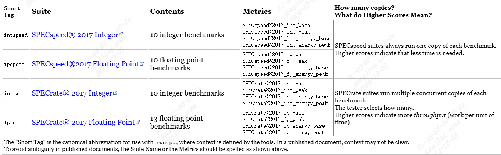
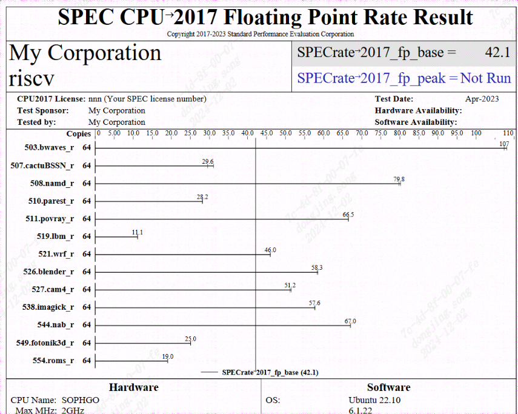
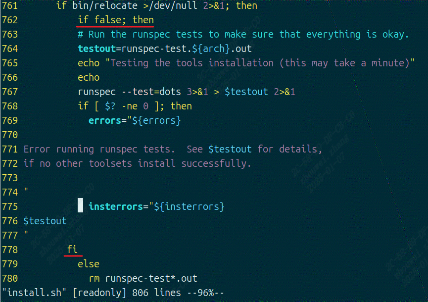

spec2017 & spec2006
---------------------

spec工具介绍
>>>>>>>>>>>>

``SPEC`` 组织开发的测试工具 ``SPEC cpu`` ，旨在全面评估CPU在科学计算、商业应用以及多媒体处理等不同任务中的
性能,是一个付费软件，有2006和2017两个版本。

``SPEC cpu2017`` 侧重于CPU、内存、编译器的性能测量，其 ``iso`` 中包含基准测试的源代码，用于编译、运行、
验证和报告基准的工具集，适用于多种操作系统的预编译工具， ``SPEC cpu2017`` 工具的源代码，适用于预编
译工具未涵盖的系统、文档、运行和报告规则。

``SPEC cpu2006`` 包含 ``SPECint`` (整数运算，包含12个测试项)， ``SPECfp`` (浮点数运算，包含17个测
试项)，两种基准测试，总共29个测试项。 `详情参考[Q11] <https://www.spec.org/cpu2006/Docs/readme1st.html>`_

``SPEC cpu 2017`` 包含 ``SPECspeed 2017 Integer`` ， ``SPECspeed 2017 Floating Point`` ，
``SPECrate 2017 Integer`` ， ``SPECrate 2017 Floating Point`` 四种基准测试，总共43个
测试项， `详情参考[Q13] <https://www.spec.org/cpu2017/Docs/overview.html#suites>`_

更多信息也可以参考 `第12章 <https://foxsen.github.io/archbase/>`_

``SPEC_cpu`` 套件的基准测试项和不同的基准测试标准差异如下图和表所示

.. list-table:: SPEC cpu 2017
    :widths: 3 10 10 15 15
    :header-rows: 1

    * - 简称
      - 套件名
      - 内容
      - 指标
      - 备注
    * - Intspeed
      - SPECspeed2017Integer
      - 10 integer benchmarks
      - SPECspeed2017_int_base,
        SPECspeed2017_int_peak
      - SPECspeed套件为每个基准运行一个副本,
        得分高的意味着花费的时间越少。
    * - Fpspeed
      - SPECspeed2017 Floating Point
      - 10 floating point benchmark
      - SPECspeed2017_fp_base,
        SPECspeed2017_fp_peak
      - SPECspeed套件为每个基准运行一个副本;
        得分高的意味着花费的时间越少。
    * - Intrate
      - SPECrate2017Integer
      - 10 integer benchmarks
      - SPECrate2017_int_base,
        SPECrate2017_int_peak
      - SPECrate套件为每个基准运行多个并发的副本,
        由测试人员选择多少个副本;
        得分高的意味着有更高的吞吐量。
    * - fprate
      - SPECrate2017Floating Point
      - 13 floating point benchmark
      - SPECrate2017_fp_base、
        SPECrate2017_fp_peak
      - SPECrate套件为每个基准运行多个并发的副本;
        由测试人员选择多少个副本;
        得分高意味着更高的吞吐量

原文的描述如下图所示

每个基准测试的指标为时间之比 :math:`T_{ref} / T_{test}`

整体规格 ``SPECspeed`` ， ``SPECrate`` 等指标为相应各个比率的 **几何平均值** 。

spec2017工具使用方法
>>>>>>>>>>>>>>>>>>>>

详细步骤
^^^^^^^^^^^^^^^^

- 预留1~2GB内存(SPECrate)或16GB(SPECspeed)
- 250GB磁盘空间
- C、C++ 和 Fortran 编译器

在工作网络下从NAS中下载 ``spec2017 iso`` ，该文件在 `NAS <https://disk.sophgo.vip/>`_ 中的 /bsp/_SG2042/BenchmarkTools/ 目录下

.. code:: bash

   cd ~/
   # 创建工作目录
   mkdir mnt spec2017

   # 挂载ISO
   sudo mount -o loop,ro cpu2017-1.1.9.iso mnt/

   # 安装spec2017
   cd mnt
   ./install.sh

   # 根据提示输入文件安装的路径
   ~/spec2017

   # 如果缺少libcrypto.so.1,需要安装完整的openssl库
   sudo dnf install libxcrypt-compat # on Fedora

   # 确认系统中存在gcc、g++、gfortran，如果没有使用如下命令安装
   sudo dnf install gcc gcc-c++ gcc-gfortran

安装结束之后，需要新建测试配置文件，步骤如下：

.. code:: bash

   # 进入测试文件所安装的目录
   cd ~/spec2017

   # 创建spec2017的RISC-V配置文件
   cd config
   cp Example-gcc-linux-aarch64.cfg gcc-linux-riscv.cfg

对刚拷贝的配置文件 ``~/spec2017/config/gcc-linux-riscv.cfg`` 进行修改，修改配置文件过程如下

.. note::

  注意： ``< %`` 符号所指的内容为修改后的结果

.. code:: diff

   67c67
   < %   define  build_ncpus  128   #      Or, you can set it on the command line:
   ---
   > %   define  build_ncpus  8     #      Or, you can set it on the command line:
   69a70,79
   > # Don't change this part.
   > %ifdef %{GCC4}
   > %   define model        ""    # mabi not present in older GCC 4
   > %elif %{bits} == 64
   > %   define model        -mabi=lp64
   > %elif %{bits} == 32
   > %   define model        -mabi=ilp32
   > %else
   > %   error Please define number of bits - see instructions in config file
   > %endif
   94,95c104,105
   < reportable           = 1
   < tune                 = base       # EDIT if needed: set to "base" for old GCC.
   ---
   > reportable           = 0
   > tune                 = base,peak  # EDIT if needed: set to "base" for old GCC.
   145c155
   < %   define  gcc_dir        ""  # EDIT (see above)
   ---
   > %   define  gcc_dir        "/opt/rh/devtoolset-9/root/usr"  # EDIT (see above)
   156c166
   < %define GCCge10  # EDIT: remove the '#' from column 1 if using GCC 10 or later
   ---
   > #%define GCCge10  # EDIT: remove the '#' from column 1 if using GCC 10 or later
   162,165c172,177
   <    SPECLANG                = %{gcc_dir}
   <    CC                      = $(SPECLANG)gcc     -std=c99
   <    CXX                     = $(SPECLANG)g++     -std=c++03
   <    FC                      = $(SPECLANG)gfortran
   ---
   >    preENV_LD_LIBRARY_PATH  = %{gcc_dir}/lib64/:%{gcc_dir}/lib/:/lib64
   >   #preENV_LD_LIBRARY_PATH  = %{gcc_dir}/lib64/:%{gcc_dir}/lib/:/lib64:%{ENV_LD_LIBRARY_PATH}
   >    SPECLANG                = %{gcc_dir}/bin/
   >    CC                      = $(SPECLANG)gcc     -std=c99   %{model}
   >    CXX                     = $(SPECLANG)g++     -std=c++03 %{model}
   >    FC                      = $(SPECLANG)gfortran           %{model}
   196c208
   < %   define suffix RV32
   ---
   > %   define suffix AARCH32
   198c210
   < %   define suffix RV64
   ---
   > %   define suffix AARCH64
   200c212
   <    PORTABILITY    = -DSPEC_LINUX_AARCH64
   ---
   >    PORTABILITY    = -DSPEC_LINUX_%{suffix}
   304c316
   <    OPTIMIZE         = -g -O3 -static
   ---
   >    OPTIMIZE         = -g -O3 -mcpu=native

创建了该配置文件之后，则可以使用该配置文件，进行测试文件编译和运行测试等步骤，具体命令如下：

.. code:: bash

   # 由于上面的cfg文件指定了static静态编译，所以需要安装静态编译相关的库
   sudo dnf install libstdc++-static libgfortran-static

   # 导入spec2017环境
   cd ../
   source shrc

   # 编译intrate和fprate
   runcpu --action=build --tune=base --config=gcc-linux-riscv.cfg intrate
   runcpu --action=build --tune=base --config=gcc-linux-riscv.cfg fprate

   # 清理缓存(需要root权限)
   sudo -i
   echo 1 > /proc/sys/vm/drop_caches

   # 运行spec2017的intrate和fprate
   # 下面的6条命令分别进行intrate、fprate在核数为1、32、64时的测试
   runcpu --action=run --tune=base --size=ref --config=gcc-linux-riscv.cfg --copies=1 --reportable intrate
   runcpu --action=run --tune=base --size=ref --config=gcc-linux-riscv.cfg --copies=32 --reportable intrate
   runcpu --action=run --tune=base --size=ref --config=gcc-linux-riscv.cfg --copies=64 --reportable intrate

   runcpu --action=run --tune=base --size=ref --config=gcc-linux-riscv.cfg --copies=1 --reportable fprate
   runcpu --action=run --tune=base --size=ref --config=gcc-linux-riscv.cfg --copies=32 --reportable fprate
   runcpu --action=run --tune=base --size=ref --config=gcc-linux-riscv.cfg --copies=64 --reportable fprate

   # 连接CPU和内存(如果有需要的话)
   numactl --cpunodebind=4 --membind=4 runcpu --action=run --tune=base 
            --config=gcc-linux-riscv.cfg --copies=1 --reportable intrate
   numactl --cpunodebind=0 --membind=0 runcpu --action=run --tune=base 
            --config=gcc-linux-riscv.cfg --copies=1 --reportable intrate

   # 运行特定benchmark
   runcpu --action=run --tune=base --config=gcc-linux-riscv.cfg --copies=1 502

针对 **runcpu** 命令一些可以替换的选择

.. code::

   --tune=<base|peek> # 用于指定优化模式,可选参数为base(使用严格的编译器选项限制,
               #所有测试项均使用相同的优化选项)、peak(允许更自由的优化,不同测试项使用不同优化选项),
               #通常使用base选项,具体可参考(https://www.spec.org/cpu2006/Docs/readme1st.html#Q14)
   --reportable --noreportable # noreportable表示不需要生成报告,reportable会生成一个txt文件
   --size=<test|train|ref> #:用于指定测试数据集及规模,可选参数为test(最小测试数据集,
               #用于验证环境是否正常)、train(用于调试的数据集规模)、ref(标准测试规模,适用于正式基准测试)
   --copies=1 # 制定rate运行多少个copies
   --action # run and build

运行结果示例
^^^^^^^^^^^^^^^^
如果测试时在测试命令中指定了参数 ``--reportable`` ，则会在测试命令运行结束后生成pdf文件，可以在该文件中找到如下图所示内容：

  SPEC运行示例

spec2006工具使用方法
>>>>>>>>>>>>>>>>>>>>

- 预留1~2GB内存(SPECrate)或16GB(SPECspeed)
- 250GB磁盘空间
- C、C++ 和 Fortran 编译器

spec2006运行流程：install->build->run

* install阶段主要是安装相应架构的tools，同时会对perl进行回归测试，若spec2006中没有相应的架构支持，则需要通过tools/src/buildtools编译出自己相应架构的tools。
* build阶段主要是对测试集进行编译。
* run阶段就是运行测试集，进行相关测试并给出报告。

详细步骤
^^^^^^^^^^^^^

在工作网络下从NAS中下载 ``cpu2006-1.2.iso`` 该文件在 `NAS <https://disk.sophgo.vip/>`_ 中的 /bsp/_SG2042/BenchmarkTools/ 目录下

.. code:: bash

   cd ~
   # 创建工作目录
   mkdir mnt spec2006 tmp

   # 挂载ISO
   sudo mount -o loop,ro cpu2006-1.2.iso mnt/

   cp -r mnt/* tmp/
   sync

   cd tmp
   # 下载最新的config文件
   curl -o config.guess https://git.savannah.gnu.org/cgit/config.git/plain/config.guess
   curl -o config.sub https://git.savannah.gnu.org/cgit/config.git/plain/config.sub

由于源码中的config.guess config.sub这两个文件比较旧了，所以在buildtools之前需要将这两个文件替换一下。
下载完最新的config文件后，在tmp目录下使用 find . -name "config.guess" 命令查找所有旧config.guess文件所在的目录，
然后使用新下载的 config.guess 进行替换。同样的，使用新下载的 config.sub 文件，替换旧的文件。

.. code:: bash

  cd tool
  # 替换文件
  find . -name "config.guess" -exec cp -f ../config.guess {} \;
  find . -name "config.sub" -exec cp -f ../config.sub {} \;

  # 运行编译命令
  ./src/buildtools

在编译过程中，会遇到一些错误，可参考页面( https://wiki.sophgo.com/pages/viewpage.action?spaceKey=SW&title=Spec2006 )中提到的
编译期错误处理方法，对错误进行处理，例如：

* 出现 ``__alloca'和__stat'`` 未定义的错误，将tools/src/make-3.82/glob/glob.c的211行的#if....#endif 和下边的#ifndef __GNU_LIBRARY__....#endif
  注释掉。注意这里只注释这四句，这些#if块中的内容，不用注释。
* 出现 ``'gets' undeclared here`` 错误。修改文件tools/src/specsum/gnulib/stdio.in.h，将第161-162行注释掉，
  修改tools/src/tar-1.25/gnu/stdio.in.h, 将第146-147行注释掉。
* 出现stack_limit重复定义的错误，是因为GCC10开始，-fno-common会默认开启，将其改为-fcommon，buildtolls前执行 ``export CFLAGS="$CFLAGS -fcommon"``
  或将此语句添加到buildtools中也可。
* 出现大量的pow、floor等未定义问题，原因是perl未引入数学库，执行 ``export PERLFLAGS="-A libs=-lm -A libs=-ldl"`` 即可。
* 在编译perl时，会提示 ``Hey! Some of the Perl tests failed! If you think this is okay, enter y now:，`` 直接输入y即可。
* error running TimeDate-1.20 test suite，这是perl的Time::Local::timegm函数的参数错了，tools/src/TimeDate-1.20/t/getdate.t文件
  第159行 ``my $offset = Time::Local::timegm(0,0,0,1,0,70);`` 修改为 ``my $offset = Time::Local::timegm(0,0,0,1,0,1970);``
* make perl时出现segmentation fault，修改tools/src/perl-5.12.3/Configure文件,将其中所有的 ``case "$gccversion" in  1*)``
  修改为  ``case "$gccversion" in  1.*)``

buildtools成功后，在spec2006根目录下运行 ``source shrc`` ，导出环境变量，然后执行 ``packagetools linux-riscv`` ，将生成的tools打包
为linux-riscv。

由于magic.t用例中的部分代码会导致安装spec2006失败，所以需要进行修改，在tools/src/perl-5.12.3/Configure文件中的第4690行下面新增代码，
如下：

.. code-block::

    if $ok; then
            : nothing
    elif echo 'Maybe "'"$cc"' -E -ftrack-macro-expansion=0" will work...'; \
            $cc -E -ftrack-macro-expansion=0 <testcpp.c >testcpp.out 2>&1; \
            $contains 'abc.*xyz' testcpp.out >/dev/null 2>&1 ; then
            echo "Yup, it does."
            x_cpp="$cc $cppflags -E -ftrack-macro-expansion=0"
            x_minus='';
    elif echo 'Maybe "'"$cc"' -E -ftrack-macro-expansion=0 -" will work...'; \
            $cc -E -ftrack-macro-expansion=0 - <testcpp.c >testcpp.out 2>&1; \
            $contains 'abc.*xyz' testcpp.out >/dev/null 2>&1 ; then
            echo "Yup, it does."
            x_cpp="$cc $cppflags -E -ftrack-macro-expansion=0"
            x_minus='-';

在根目录下执行 ``./install.sh -u linux-riscv -d ~/spec2006``，其中 -u 指定要安装的tools， -d 指定要安装的位置。

如果安装tools失败，则需要对install.sh安装脚本进行修改，添加如下图中红线标注处所示：

   install.sh 脚本修改

spec2006提供的配置文件不能应用于当前的测试，这里使用 `riscv.cfg <_static/riscv.cfg>`_ 文件作为配置，将该文件放入到
spec2006安装目录中的config目录下，由于前面安装时，选择了 ``~/spec2006`` 为安装目录，所以需要将riscv.cfg放入到
``~/spec2006/config/`` 目录下。

完成上述操作后，则可运行 ``runspec`` 命令进行测试，常用测试选项如下：

1. ``--action=build/run/onlyrun``   build表示对测试集只进行编译，run表示对测试集运行，若之前测试集没有编译，则会先build然后进行测试。
   onlyrun只运行不编译。
2. ``--tune=base/peak/all``   base 基准测试    peak 峰值测试   all先base测试后peak测试。
3. ``--size=test/train/ref/all`` 测试集，由小到大排列，all，三个测试集都跑一遍。
4. ``--config=xxx.cfg``   指定config文件，文件保存在config目录下。
5. ``-n x``   指定测试次数，想要产生测试报告，n必须大于等于3。
6. ``--reprotable``  产生报告
7. ``int/fp/all``   选择整数测试、浮点测试，all 先跑int后跑fp
8. ``-l``   忽略错误
9. ``--rate`` 选择测试SPECrate
10. ``--copies`` 设置一个SPECrate run所使用的copy数。注意这个参数需要和 ``--rate`` 一起使用，其中 ``--rate --copy=32``
    和 ``--rate=32`` 的含义是一样的。

详细内容见：`The 'runspec' Command <https://www.spec.org/cpu2006/Docs/runspec.html>`_

.. code:: bash

    # 导入spec2006环境
    cd ~/spec2006/
    source shrc

    # 编译intrate和fprate
    runspec --action=build --tune=base --size=ref --config=riscv.cfg --rate int
    runspec --action=build --tune=base --size=ref --config=riscv.cfg --rate fp

    # 清理缓存(需要root权限)
    sudo -i
    echo 1 > /proc/sys/vm/drop_caches

    # 运行spec2006的intrate和fprate
    # 下面的6条命令分别进行intrate、fprate在核数为1、32、64时的测试
    runspec --action=run --tune=base --size=ref --config=riscv.cfg --rate --copies=1 --reportable int
    runspec --action=run --tune=base --size=ref --config=riscv.cfg --rate --copies=32 --reportable int
    runspec --action=run --tune=base --size=ref --config=riscv.cfg --rate --copies=64 --reportable int

    runspec --action=run --tune=base --size=ref --config=riscv.cfg --rate --copies=1 --reportable fp
    runspec --action=run --tune=base --size=ref --config=riscv.cfg --rate --copies=32 --reportable fp
    runspec --action=run --tune=base --size=ref --config=riscv.cfg --rate --copies=64 --reportable fp

由于在运行测试时，使用 ``--reportable`` 参数指定了输出报告，所以在运行结束后，会在 result目录下生成一个pdf文件，从该文件中可以获取测试结果

SPEC2006测试结果
>>>>>>>>>>>>>>>>>

.. 测试结果中,base的值表示基于标准配置或默认设置的性能结果
.. spec2017rate floating point测试结果示例如下

.. .. figure:: ./2024-12-02-13-29-00.png
..    :alt: spec2017测试结果
..    :scale: 50
..    :align: center

测试环境: ``SG2042 EVB`` , ``32GB * 4 DDR`` , ``Fedora38`` , ``64 core C920@2.0GHz``

测试结果如下

+-------------------+--------------+
| test project      | test result  |
+===================+==============+
| int rate  1  copy | 8.6          |
+-------------------+--------------+
| int rate 32 copy  | 184.0        |
+-------------------+--------------+
| int rate 64 copy  | 306.0        |
+-------------------+--------------+
| fp rate  1  copy  | 9.7          |
+-------------------+--------------+
| fp rate  32 copy  | 170.0        |
+-------------------+--------------+
| fp rate  64 copy  | 268.0        |
+-------------------+--------------+

SPEC2017测试结果
>>>>>>>>>>>>>>>>>>>>>>

测试环境1
^^^^^^^^^^^

- SG2042 EVB
- 32GB * 4 DDR
- Fedora38
- 64 core C920@2.0GHz

+------------------+-------------+
| test project     | test result |
+==================+=============+
| int rate 1 copy  | 1.6         |
+------------------+-------------+
| int rate 32 copy | 28.5        |
+------------------+-------------+
| int rate 64 copy | 45.6        |
+------------------+-------------+
| fp rate 1 copy   | 1.3         |
+------------------+-------------+
| fp rate 32 copy  | 29.4        |
+------------------+-------------+
| fp rate 64 copy  | 42.1        |
+------------------+-------------+

+-----------------+------------+---------------+------------------+-----------------------------------------------------+-----------------------------------------------------------------+
| intrate         | disable l0 | disable l0 rs | disable l0 rs l3 | performance loss(l0 rs) (dis l0 - dis l0 rs)/dis l0 | performance loss(l0 rs l3)(dis l0 rs - dis l0 rs l3)/dis l0 rs  |
+=================+============+===============+==================+=====================================================+=================================================================+
| 500.perlbench_r | 47.6       | 44.2          | 44.4             | 7.14%                                               | -0.45%                                                          |
+-----------------+------------+---------------+------------------+-----------------------------------------------------+-----------------------------------------------------------------+
| 502.gcc_r       | 33.9       | 31.3          | 31.1             | 7.67%                                               | 0.64%                                                           |
+-----------------+------------+---------------+------------------+-----------------------------------------------------+-----------------------------------------------------------------+
| 505.mcf_r       | 25.5       | 25.3          | 25.7             | 0.78%                                               | -1.58%                                                          |
+-----------------+------------+---------------+------------------+-----------------------------------------------------+-----------------------------------------------------------------+
| 520.omnetpp_r   | 21.8       | 20.3          | 20.4             | 6.88%                                               | -0.49%                                                          |
+-----------------+------------+---------------+------------------+-----------------------------------------------------+-----------------------------------------------------------------+
| 523.xalancbmk_r | 13.3       | 12.7          | 12.9             | 4.51%                                               | -1.57%                                                          |
+-----------------+------------+---------------+------------------+-----------------------------------------------------+-----------------------------------------------------------------+
| 525.x264_r      | 69.8       | 67.7          | 65.4             | 3.01%                                               | 3.40%                                                           |
+-----------------+------------+---------------+------------------+-----------------------------------------------------+-----------------------------------------------------------------+
| 531.deepsjeng_r | 69.1       | 54.9          | 56.2             | 20.55%                                              | -2.37%                                                          |
+-----------------+------------+---------------+------------------+-----------------------------------------------------+-----------------------------------------------------------------+
| 541.leela_r     | 78.4       | 59.6          | 61.8             | 23.98%                                              | -3.69%                                                          |
+-----------------+------------+---------------+------------------+-----------------------------------------------------+-----------------------------------------------------------------+
| 548.exchange2_r | 234        | 231           | 164              | 1.28%                                               | 29.00%                                                          |
+-----------------+------------+---------------+------------------+-----------------------------------------------------+-----------------------------------------------------------------+
| 557.xz_r        | 37         | 36.7          | 36.9             | 0.81%                                               | -0.54%                                                          |
+-----------------+------------+---------------+------------------+-----------------------------------------------------+-----------------------------------------------------------------+
|                 | 45.6       | 42            | 40.8             | 7.89%                                               | 2.86%                                                           |
+-----------------+------------+---------------+------------------+-----------------------------------------------------+-----------------------------------------------------------------+

测试环境2
^^^^^^^^^^^

- SG2042 Server
- 32GB * 8 DDR
- Fedora38
- 128 core C920@2.0GHz

+-------------------+-------------+
| test project      | test result |
+===================+=============+
| int rate 128 copy | 45.5        |
+-------------------+-------------+
| fp rate 128 copy  | 35.5        |
+-------------------+-------------+

+-----------------+------------+---------------+------------------+------------------------------------------------+------------------------------------------------------------+
| fprate          | disable l0 | disable l0 rs | disable l0 rs l3 | performance (l0 rs)(dis l0 - dis l0 rs)/dis l0 | performance(l0 rs l3)(dis l0 rs - dis l0 rs l3)/dis l0 rs  |
+=================+============+===============+==================+================================================+============================================================+
| 503.bwaves_r    | 107        | 107           | 109              | 0.00%                                          | -1.87%                                                     |
+-----------------+------------+---------------+------------------+------------------------------------------------+------------------------------------------------------------+
| 507.cactuBSSN_r | 29.6       | 29.7          | 29.8             | -0.34%                                         | -0.34%                                                     |
+-----------------+------------+---------------+------------------+------------------------------------------------+------------------------------------------------------------+
| 508.namd_r      | 79.8       | 78.6          | 80.2             | 1.50%                                          | -2.04%                                                     |
+-----------------+------------+---------------+------------------+------------------------------------------------+------------------------------------------------------------+
| 510.parest_r    | 28.2       | 27.7          | 27.9             | 1.77%                                          | -0.72%                                                     |
+-----------------+------------+---------------+------------------+------------------------------------------------+------------------------------------------------------------+
| 511.povray_r    | 66.5       | 52.2          | 52               | 21.50%                                         | 0.38%                                                      |
+-----------------+------------+---------------+------------------+------------------------------------------------+------------------------------------------------------------+
| 519.lbm_r       | 11.1       | 10.3          | 11.1             | 7.21%                                          | -7.77%                                                     |
+-----------------+------------+---------------+------------------+------------------------------------------------+------------------------------------------------------------+
| 521.wrf_r       | 46         | 43.9          | 45.2             | 4.57%                                          | -2.96%                                                     |
+-----------------+------------+---------------+------------------+------------------------------------------------+------------------------------------------------------------+
| 526.blender_r   | 58.3       | 56.4          | 56.6             | 3.26%                                          | -0.35%                                                     |
+-----------------+------------+---------------+------------------+------------------------------------------------+------------------------------------------------------------+
| 527.cam4_r      | 51.2       | 48.3          | 48.9             | 5.66%                                          | -1.24%                                                     |
+-----------------+------------+---------------+------------------+------------------------------------------------+------------------------------------------------------------+
| 538.imagick_r   | 57.6       | 52.2          | 55.7             | 9.38%                                          | -6.70%                                                     |
+-----------------+------------+---------------+------------------+------------------------------------------------+------------------------------------------------------------+
| 544.nab_r       | 67         | 64            | 64.5             | 4.48%                                          | -0.78%                                                     |
+-----------------+------------+---------------+------------------+------------------------------------------------+------------------------------------------------------------+
| 549.fotonik3d_r | 25         | 23.9          | 25.1             | 4.40%                                          | -5.02%                                                     |
+-----------------+------------+---------------+------------------+------------------------------------------------+------------------------------------------------------------+
| 554.roms_r      | 19         | 18.3          | 19               | 3.68%                                          | -3.83%                                                     |
+-----------------+------------+---------------+------------------+------------------------------------------------+------------------------------------------------------------+
|                 | 42.1       | 39.9          | 40.9             | 5.23%                                          | -2.51%                                                     |
+-----------------+------------+---------------+------------------+------------------------------------------------+------------------------------------------------------------+
