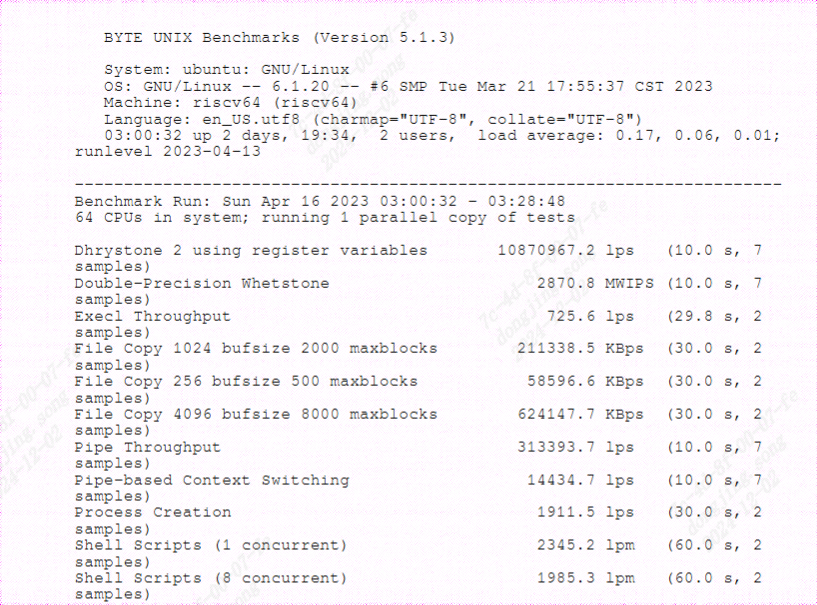

unixbench
------------------

unixbench工具介绍
>>>>>>>>>>>>>>>>>>>>>>>

``unixbench`` 是一个用于测试unix系统性能的工具,测试的结果是一个指数值。
这个值是测试系统的测试结果与一个基线系统测试结果比较得到的指数值。

``unixbench`` 由许多针对特定领域的单独测试组成,其包含的测试有:

- ``Dhrystone`` :侧重于字符串处理,测试单位时间内跑了多少次Dhrystone程序,其指标单位为DMIPS/MHz,MIPS是Million Instructions Per Second的缩写
- ``Whetstone`` :测量浮点运算的速度和效率,由8个模块组件,每个模块循环一定次数,执行一种基本运算,测试结果是每组循环的平均时间和所有循环的平均KWIPS值(Thousands of Whetstone Instruction mixes Per Second)
- ``execl Throughput`` :测量每秒可执行的 execl 调用数
- ``File Copy`` :测量使用各种缓冲区大小将数据从一个文件传输到另一个文件的速率
- ``Pipe Throughput`` :进程将 512 个字节写入管道并将其读回的次数
- ``Pipe-based Context Switching`` :测量两个进程可以通过管道交换递增整数的次数
- ``Process Creation`` :测量进程可以fork和reap一个立即退出的子进程的次数(内存带宽)
- ``Shell Scripts`` :测量进程每分钟可以启动和reap一组 1、2、4 和 8 个 shell 脚本并发副本的次数
- ``System Call Overhead`` :重复调用 getpid,估计进入和离开 os 内核的成本
- ``Graphical Tests`` :提供 2D 和 3D 图形测试

更多信息可参考(https://github.com/kdlucas/byte-unixbench)

BYTE UNIX Benchmark工具使用方法
>>>>>>>>>>>>>>>>>>>>>>>>>>>>>>>>>>>>

详细步骤
^^^^^^^^^^^^^^^^

.. code:: bash

   git clone https://github.com/kdlucas/byte-unixbench
   cd byte-unixbench/UnixBench

   # 运行测试
   ./Run

命令格式： ``Run [ -q | -v ] [-i <n> ] [-c <n> [-c <n> ...]] [test ...]``

参数介绍：

- ``-q``  以安静模式运行。

- ``-v``  在详细模式下运行。

- ``-i <count>``  对每个测试运行<count>迭代，较慢的测试使用<count>为3，但至少为1。默认值为10（慢速测试为3）。

- ``-c <n>``  并行运行每个测试的<n>个副本。

如果待测设备有多个CPU，默认行为是运行所选的测试两次，即先运行一个测试程序副本，然后再运行N个测试程序副本，其中N是CPU的数量。
这里也可以使用 ``-c`` 选项来指定确切的并行运行副本数。

参数和测试分数计算结果详情可查阅(https://www.alibabacloud.com/blog/unixbench-score-an-introduction_594677)

运行结果示例
^^^^^^^^^^^^^^^^

BYTE UNIX Benchmark结果
>>>>>>>>>>>>>>>>>>>>>>>>>>>>>>>>>>>>

测试环境:

- ``SG2042 EVB``
- ``32GB * 4 DDR``
- ``Fedora38``
- ``64 core C920@2.0GHz``

+-----------------+--------------------------------+
| parallel copies | System Benchmarks Index Score  |
+=================+================================+
| 1               | 399.3                          |
| 64              | 14584.4                        |
+-----------------+--------------------------------+