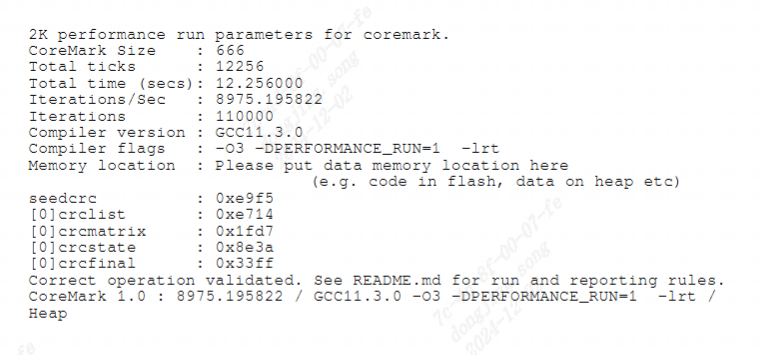

coremark
------------------

coremark工具介绍
>>>>>>>>>>>>>>>>>>

``Coremark`` 取代了过时的 ``Dhrystone`` 基准测试，包含以下算法的实现： ``列表处理`` (查找和排序）、 ``矩阵操作`` (常见的矩阵运算）、
状态机(确定输入流是否包含有效数字)和 ``CRC`` (循环冗余校验）。它设计用于在 8 位微控制器到 64 位微处理器的设备上运行。

与 ``Dhrystone`` 一样, ``CoreMark`` 体积小、便携、易于理解、免费，并显示单个数字基准分数。与 ``Dhrystone`` 不同，
``CoreMark`` 具有特定的运行和报告规则，旨在避免 ``Dhrystone`` 出现问题。例如, ``Dhrystone`` 的主要部分实际上暴露了
编译器优化工作负载的能力，而不是 MCU 或 CPU 的能力。因此, ``Dhrystone`` 作为编译器基准测试而不是硬件基准测试更具启发性。

coremark工具使用方法
>>>>>>>>>>>>>>>>>>>>>>>

测试方法 1
^^^^^^^^^^^^^^^^^

.. code:: bash

   git clone https://github.com/eembc/coremark.git
   cd coremark/
   ## 将目录下的linux64目录移植到自己的文件夹中
   vim core_portme.mak #将CC修改为riscv64-unknown-linux-gnu-gcc
   mkdir <platform>
   cp linux/* <platform>
   make PORT_DIR=<platform>  #编译生成coremark.rvexe
   ./coremark.rvexe #运行coremark.rvexe

测试方法 2
^^^^^^^^^^^^^^^^^

可以直接在待测设备上，下载 ``coremark`` 测试文件，然后在该设备上进行编译运行，具体步骤如下：

.. code:: bash

    git clone https://github.com/eembc/coremark.git
    cd coremark/
    # 使用 POSIX Threads API 编译在 1 个核心上执行的基准测试
    make clean
    make XCFLAGS="-DMULTITHREAD=1 -DUSE_PTHREAD -pthread"

    # 使用 POSIX Threads API 编译在 64 个核心上执行的基准测试
    make clean
    make XCFLAGS="-DMULTITHREAD=64 -DUSE_PTHREAD -pthrea

每次测试运行结束后，都会生成 ``run1.log`` ，在该文件中可以找到 ``coremark`` 测试结果。

具体使用方法参考(https://github.com/eembc/coremark)

运行结果示例
^^^^^^^^^^^^^^^^^

   单核Coremark测试结果

coremark测试结果
>>>>>>>>>>>>>>>>>>

测试环境:

- ``SG2042 EVB``
- ``32GB * 4 DDR``
- ``Fedora38``
- ``64 core C920@2.0GHz``

1 core测试结果如下

+-------------------+--------------------------------------------------------------+
| CoreMark Size     | 666                                                          |
+===================+==============================================================+
| Total ticks       | 12256                                                        |
+-------------------+--------------------------------------------------------------+
| Total time (secs) | 12.256000                                                    |
+-------------------+--------------------------------------------------------------+
| Iterations/Sec    | 8975.195822                                                  |
+-------------------+--------------------------------------------------------------+
| Iterations        | 110000                                                       |
+-------------------+--------------------------------------------------------------+
| Compiler version  | GCC11.3.0                                                    |
+-------------------+--------------------------------------------------------------+
| Compiler flags    | -O3 -DPERFORMANCE_RUN=1  -lrt                                |
+-------------------+--------------------------------------------------------------+
| CoreMark 1.0      | 8975.195822 / GCC11.3.0 -O3 -DPERFORMANCE_RUN=1  -lrt / Heap |
+-------------------+--------------------------------------------------------------+

64 cores测试结果如下

+-------------------+--------------------------------------------------------------------------------------------------------------------------------------------------+
| CoreMark Size     | 666                                                                                                                                              |
+===================+==================================================================================================================================================+
| Total ticks       | 13226                                                                                                                                            |
+-------------------+--------------------------------------------------------------------------------------------------------------------------------------------------+
| Total time (secs) | 13.226000                                                                                                                                        |
+-------------------+--------------------------------------------------------------------------------------------------------------------------------------------------+
| Iterations/Sec    | 532284.893392                                                                                                                                    |
+-------------------+--------------------------------------------------------------------------------------------------------------------------------------------------+
| Iterations        | 7040000                                                                                                                                          |
+-------------------+--------------------------------------------------------------------------------------------------------------------------------------------------+
| Compiler version  | GCC13.2.1 20230728 (Red Hat 13.2.1-1)                                                                                                            |
+-------------------+--------------------------------------------------------------------------------------------------------------------------------------------------+
| Compiler flags    | -O2 -DMULTITHREAD=64 -DUSE_PTHREAD -pthread -DPERFORMANCE_RUN=1  -lrt                                                                            |
+-------------------+--------------------------------------------------------------------------------------------------------------------------------------------------+
| Parallel PThreads | 64                                                                                                                                               |
+-------------------+--------------------------------------------------------------------------------------------------------------------------------------------------+
| CoreMark 1.0      | 532284.893392 / GCC13.2.1 20230728 (Red Hat 13.2.1-1) -O2 -DMULTITHREAD=64 -DUSE_PTHREAD -pthread -DPERFORMANCE_RUN=1  -lrt / Heap / 64:PThreads |
+-------------------+--------------------------------------------------------------------------------------------------------------------------------------------------+