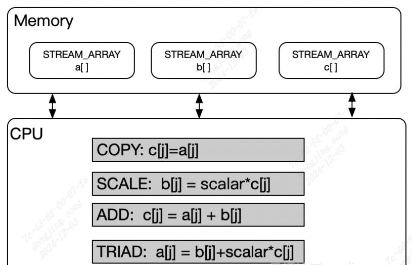
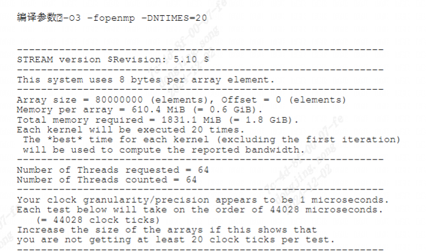

stream
------------------

stream工具介绍
>>>>>>>>>>>>>>>>>>>

``Stream`` 测试是内存测试中业界公认的内存带宽性能测试基准工具。
Stream算法将某个内存块之间的数据读取出来,经过简单的运算放入另一个内存块。
从而可以得到： ``内存带宽=搬运的内存大小/耗时``

共有4种测试模式: ``copy`` , ``Scale`` , ``Add`` , ``Triad`` 

stream工具使用方法
>>>>>>>>>>>>>>>>>>>

详细步骤
^^^^^^^^^^^^^^^^^

.. code:: bash

    git clone https://github.com/jeffhammond/STREAM.git

    # 编译基准测试代码
    gcc -O3 -fopenmp -DSTREAM_ARRAY_SIZE=80000000 -DNTIMES=20 stream.c -o stream

    # 运行基准测试
    ./stream

在编译时，需要使用参数 ``-DSTREAM_ARRAY_SIZE`` 指定 ``Array size`` 的大小。
如果 ``Array size`` 较小时，cpu会直接从cache里存取数据，而不是从DDR中获取，这会导致测试DDR带宽性能测试结果失真。

根据测试代码中的说明，可以通过待测设备的 L3 cache 大小来计算参数 ``-DSTREAM_ARRAY_SIZE`` 的 **最小值**，计算公式如下：

 :math:`DSTREAM\_ARRAY\_SIZE = Cache * 4 * CPU路数 / 8 * 10^6`

公式中， ``Cache`` 的单位是 ``MB``。

根据上面的公式，可以计算如下两个示例的取值：

1. 一个L3 cache为8MB的单核设备进行当前测试时，参数 ``-DSTREAM_ARRAY_SIZE`` 的最小值应为 4 million（4*10^6）。

2. 一个L3 cache为20MB的双核设备进行当前测试时，参数 ``-DSTREAM_ARRAY_SIZE`` 的最小值应为 20 million（20*10^6）。

参数说明:

1.  ``-fopenmp`` ：启用OpenMP,适应多处理器环境,更能得到内存带宽实际最大值。开启后,程序默认运行线程为CPU线程数

2. ``-DSTREAM_ARRAY_SIZE`` ：用于指定在程序中使用的数组大小(单位为double, 8个byte)。

3. ``-DNTIMES`` ：设置执行的次数，并从这些结果中选最优值。

运行结果示例
^^^^^^^^^^^^^^^^^

stream测试结果
>>>>>>>>>>>>>>>>

测试环境:

- ``SG2042 EVB``
- ``32GB * 4 DDR``
- ``Fedora38``
- ``64 core C920@2.0GHz``

+-----------+--------------------------+--------------------------+---------------------------+----------------------------+
| test mode | one-way sg2042(80000000) | two-way sg2042(80000000) | two-way sg2042(120000000) | two-way sg2042(130000000)  |
+===========+==========================+==========================+===========================+============================+
| Copy      | 37630.3 MB/s             | 42875.2 MB/s             | 56618.8 MB/s              | 55719.4 MB/s               |
+-----------+--------------------------+--------------------------+---------------------------+----------------------------+
| Scale     | 37922.4 MB/s             | 48084.3 MB/s             | 56078.3 MB/s              | 55865.7 MB/s               |
+-----------+--------------------------+--------------------------+---------------------------+----------------------------+
| Add       | 39089.5 MB/s             | 48242.4 MB/s             | 60680.1 MB/s              | 56768.5 MB/s               |
+-----------+--------------------------+--------------------------+---------------------------+----------------------------+
| Triad     | 38931.9 MB/s             | 49829.9 MB/s             | 60917.6 MB/s              | 58713.7 MB/s               |
+-----------+--------------------------+--------------------------+---------------------------+----------------------------+
