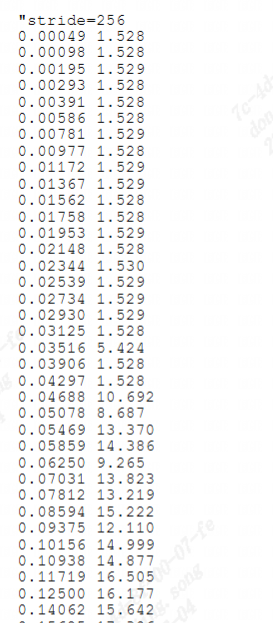

cache bench
------------------

cache bench工具介绍
>>>>>>>>>>>>>>>>>>>

``phoronix Test Suite`` 是是一个基于PHP的测试工具,只需要系统安装了PHP就能够完成整个测试,
可以用来对比性能。针对Linux,Solaris,macOS,Windows以及BSD系统,提供了复杂测试和benchmarking平台。
所有的测试都是可重现,易于使用以及支持全自动执行。Phoronix Test Suite是遵循GNU GPLv3 开源软件。

cache bench工具使用方法
>>>>>>>>>>>>>>>>>>>>>>>

详细步骤
^^^^^^^^^^^^^^^^^

使用开源工具 `Phoronix Test Suite <https://github.com/phoronix-test-suite/phoronix-test-suite/>`__
步骤参考(https://cloud-atlas.readthedocs.io/zh-cn/latest/performance/performance_tools/phoronix_test_suite/pts_startup.html)
下面的树莓派的测试步骤演示

.. code:: bash

   #环境准备
   sudo apt install -y php7.4-cli php7.4-xml

   #下载测试组件
   curl -LO https://phoronix-test-suite.com/releases/phoronix-test-suite-10.8.3.tar.gz
   tar -xvf phoronix-test-suite-10.8.3.tar.gz
   cd phoronix-test-suite

   #完成安装
   ./phoronix-test-suite system-info <<-END
   y
   n
   n
   END

   #列出建议测试项
   ./phoronix-test-suite list-recommended-tests 

   #测试需要root权限，建议不要在系统目录完成测试:
   #配置运行环境
   PHORONIX_CONFIG_PATH="/var/lib/phoronix-test-suite"
   sudo mkdir -p $PHORONIX_CONFIG_PATH/test-suites/local/raspberrypi

   #创建配置文件:
   tee suite-definition.xml <<EOF
   <?xml version="1.0"?>
   <!--Phoronix Test Suite v9.6.1-->
   <PhoronixTestSuite>
   <SuiteInformation>
      <Title>RaspberryPi</Title>
      <Version>1.0.0</Version>
      <TestType>System</TestType>
      <Description>General system tests for the Raspberry Pi.</Description>
      <Maintainer>Jeff Geerling</Maintainer>
   </SuiteInformation>
   <Execute>
      <Test>pts/encode-mp3</Test>
   </Execute>
   <Execute>
      <Test>pts/x264</Test>
   </Execute>
   <Execute>
      <Test>pts/phpbench</Test>
   </Execute>
   </PhoronixTestSuite>
   EOF

   sudo mv suite-definition.xml $PHORONIX_CONFIG_PATH/test-suites/local/raspberrypi/

   #执行
   sudo ./phoronix-test-suite benchmark raspberrypi

运行结果示例
^^^^^^^^^^^^^^^^^

cache bench测试结果
>>>>>>>>>>>>>>>>>>>>>>

测试环境:

- ``SG2042 EVB``
- ``32GB * 4 DDR``
- ``Fedora38``
- ``64 core C920@2.0GHz``

+-------------+-------------------+-----------------------+
| cache level | cache latency(ns) | cache latency(cycle)  |
+=============+===================+=======================+
| L1          | 1.69              | 3.38                  |
+-------------+-------------------+-----------------------+
| L2          | 3.98              | 7.96                  |
+-------------+-------------------+-----------------------+
| L3          | 11                | 22                    |
+-------------+-------------------+-----------------------+
