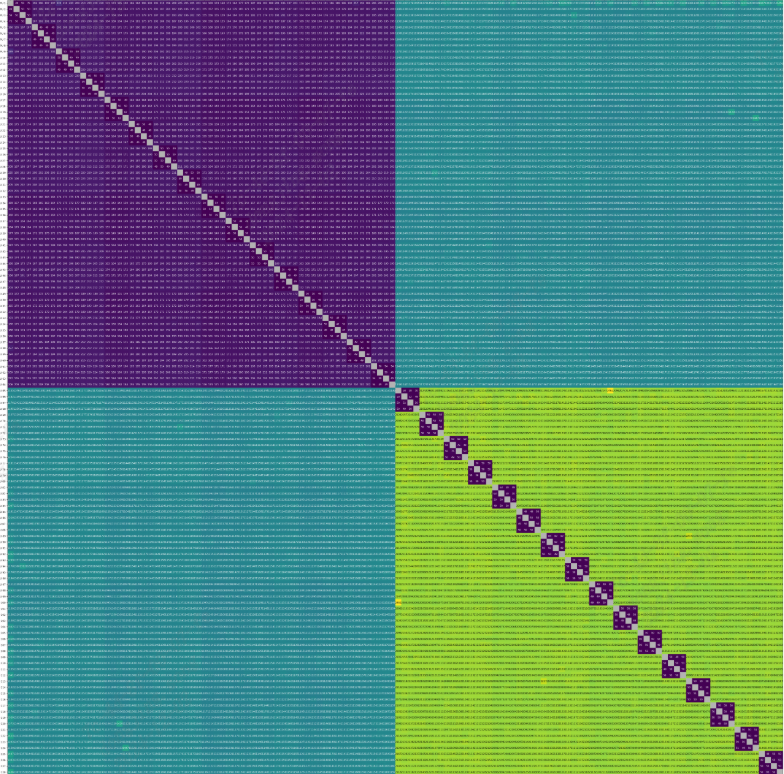

core-core latency
------------------

core-core latency工具介绍
>>>>>>>>>>>>>>>>>>>>>>>>>>>>>>>>>

将两个线程固定在两个不同的 ``CPU`` 内核上,我们可以让它们执行一系列 ``compare-exchange`` 操作,并测量延迟。

core-core latency工具使用方法
>>>>>>>>>>>>>>>>>>>>>>>>>>>>>>>>>

详细步骤
^^^^^^^^^^^^^^^^^

参考(https://wiki.sophgo.com/display/SW/SG2044-Core2Core-Latency)

.. code:: bash

   # 安装cargo
   # ubuntu
   sudo apt-get install cargo
   # openEuler
   sudo dnf install cargo

   # 安装 core-to-core-latency 工具
   cargo install core-to-core-latency

   # 安装后可执行文件在.cargo/bin目录中
   # 添加环境变量
   export PATH=~/.cargo/bin:$PATH

   #执行benchmark
   core-to-core-latency --csv > c2c-latency.csv

测试完成后，需要在另一台机器上使用pyhton进行绘图,可以执行以下操作。

.. code:: bash

   git clone https://github.com/nviennot/core-to-core-latency.git

   # 将在测试设备上生成的c2c-latency文件拷贝到当前电脑上
   # 并将其放入core-to-core-latency的results文件夹中
   cp c2c-latency.csv core-to-core-latency/results

   # 安装Jupyter notebook
   sudo apt-get install python3-notebook

   # 生成配置文件
   jupyter notebook --generate-config

   # 修改所生成的配置文件
   vim ~/.jupyter/jupyter_notebook_config.py
   # 修改方法如下：
   # change # c.NotebookApp.allow_origin = '' to c.NotebookApp.allow_origin = '*'
   # change # c.NotebookApp.ip = 'localhost' to c.NotebookApp.ip = '0.0.0.0'
   # remove the leading '#'

   # 安装 python 模块
   sudo apt-get install python3-pandas python3-numpy python3-matplotlib

   # 在 core-to-core-latency 目录下启动jupyter服务
   cd core-to-core-latency/
   jupyter notebook --no-browser

启动jupyter服务后，使用浏览器打开，启动jupyter服务时在终端打印出来的地址，
然后通过浏览器打开 ``core-to-core-latency/results/results.ipynb``

在Jupyter notebook中新建一个 cell，在其中输入相应内容，其中 ``cpu`` 后的字符串会作为生成图片的标题。
``fname`` 为刚才测试所生成的数据。

例如在新建的 cell 中输入：

.. code:: python

    cpu = "SG2044 EVB, dual-rank 128GB DDR, OpenEuler24.03 (LTS) Linux6.12.6, 64 core C920@2.8GHz"
    fname = "c2c-latency.csv"
    m = load_data(fname)
    show_heapmap(m, title=cpu)

然后在Jupyter中运行，使用测试数据生成图片。

Jupyter中的核心python代码如下：

.. code:: python

    import pandas as pd
    import numpy as np
    from matplotlib import pyplot as plt

    def load_data(filename):
        m = np.array(pd.read_csv(filename, header=None))
        return np.tril(m) + np.tril(m).transpose()

    def show_heapmap(m, title=None, subtitle=None, vmin=None, vmax=None, yticks=True, figsize=None):
        vmin = np.nanmin(m) if vmin is None else vmin
        vmax = np.nanmax(m) if vmax is None else vmax
        black_at = (vmin+3*vmax)/4
        subtitle = "Core-to-core latency" if subtitle is None else subtitle

        isnan = np.isnan(m)

        plt.rcParams['xtick.bottom'] = plt.rcParams['xtick.labelbottom'] = False
        plt.rcParams['xtick.top'] = plt.rcParams['xtick.labeltop'] = True

        figsize = np.array(m.shape)*0.3 + np.array([6,1]) if figsize is None else figsize
        fig, ax = plt.subplots(figsize=figsize, dpi=130)

        fig.patch.set_facecolor('w')

        plt.imshow(np.full_like(m, 0.7), vmin=0, vmax=1, cmap = 'gray') # for the alpha value
        plt.imshow(m, cmap = plt.cm.get_cmap('viridis'), vmin=vmin, vmax=vmax)

        fontsize = 9 if vmax >= 100 else 10

        for (i,j) in np.ndindex(m.shape):
            t = "" if isnan[i,j] else f"{m[i,j]:.1f}" if vmax < 10.0 else f"{m[i,j]:.0f}"
            c = "w" if m[i,j] < black_at else "k"
            plt.text(j, i, t, ha="center", va="center", color=c, fontsize=fontsize)

        plt.xticks(np.arange(m.shape[1]), labels=[f"{i+1}" for i in range(m.shape[1])], fontsize=9)
        if yticks:
            plt.yticks(np.arange(m.shape[0]), labels=[f"CPU {i+1}" for i in range(m.shape[0])], fontsize=9)
        else:
            plt.yticks([])

        plt.tight_layout()
        plt.title(f"{title}\n" +
                  f"{subtitle}\n" +
                  f"Min={vmin:0.1f}ns Median={np.nanmedian(m):0.1f}ns Max={vmax:0.1f}ns",
                  fontsize=11, linespacing=1.5)

    cpu = "SG2044 EVB, dual-rank 128GB DDR, OpenEuler24.03 (LTS) Linux6.12.6, 64 core C920@2.8GHz"
    fname = "c2c-latency.csv"
    m = load_data(fname)
    show_heapmap(m, title=cpu)

运行结果示例
^^^^^^^^^^^^^^^^^

core-core latency测试结果
>>>>>>>>>>>>>>>>>>>>>>>>>>>>>>>>>

从所生成的图片中，可以分析出一定的测试结果。

- 同一clust指的是图中深紫色方块的部分，可以使用肉眼看下同一方块内的最大值和最小值，作为同一clust的值。
- 同一chip指的是非同一clust，也即是深紫色外围。使用同样的方法获取同一chip的最大、最小值。

测试环境:

- ``SG2042 EVB``
- ``32GB * 4 DDR``
- ``Fedora38``
- ``64 core C920@2.0GHz``

+----------------+---------------+----------------+
| the same Clust | the same Chip | different chip |
+================+===============+================+
| 47~48ns        | 150~210ns     | 700~1000ns     |
+----------------+---------------+----------------+
