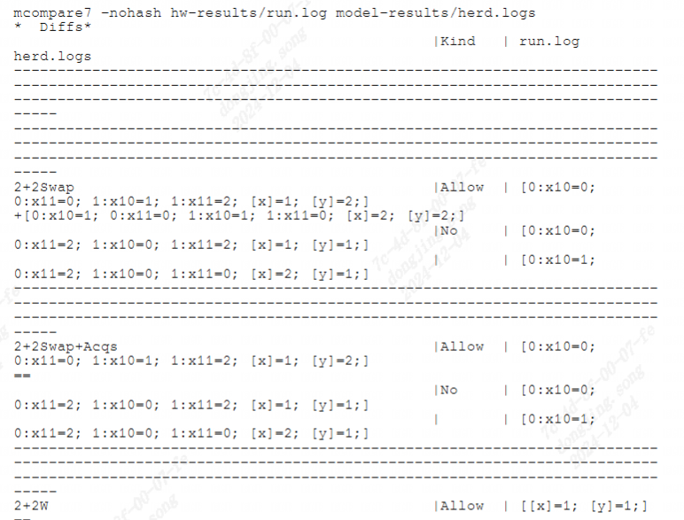

litmus
------------------

litmus工具介绍
>>>>>>>>>>>>>>>>>>>>>>>>>>>>>>>>>

``litmus test`` 是一个小型并行程序,可用于测试并行共享内存计算机的内存模型,参考(https://diy.inria.fr/doc/litmus.html)

litmus工具使用方法
>>>>>>>>>>>>>>>>>>>>>>>>>>>>>>>>>

详细步骤
^^^^^^^^^^^^^^^^^

参考(https://wiki.sophgo.com/pages/viewpage.action?pageId=45417111)

测试准备

`RISCV Litmus 标准测试仓库 <https://github.com/litmus-tests/litmus-tests-riscv>`__

安装工具

-  ``herdtools7``:编译Litmus的的过程需要使用herdtools7工具,根据herdtools7说明文档安装,其中可能需要安装Ocaml
   和Opam 等包管理工具

.. code:: bash

   sudo apt-get install opam
   opam init && opam update && opam upgrade
   opam install herdtools7

交叉编译 ``litmus-tests-riscv``

.. code:: bash

   git clone https://github.com/litmus-tests/litmus-tests-riscv
   cd litmus-tests-riscv
   make hw-tests CORES=8 GCC=/usr/bin/riscv64-linux-gnu-gcc -j 4

riscv系统运行测试程序

.. code:: bash

   cp litmus-tests-riscv/hw-tests   RP-RAMDISK
   run  riscv linux 
   cd litmus-tests-riscv/hw-tests
   ./run.sh
   cp run*log to remote host

解析运行结果

.. code:: bash

   cp  run*log litmus-tests-riscv/hw-tests
   cd litmus-tests-riscv
   make merge-hw-tests
   make compare-hw-flat
   make compare-hw-herd

运行结果示例
^^^^^^^^^^^^^^^^^

litmus测试结果
>>>>>>>>>>>>>>>>>>>>>>>>>>>>>>>>>

测试环境：

- ``SG2042 EVB``
- ``32GB * 4 DDR``
- ``Fedora38``
- ``64 core C920@2.0GHz``

结论:满足real-time性能需求