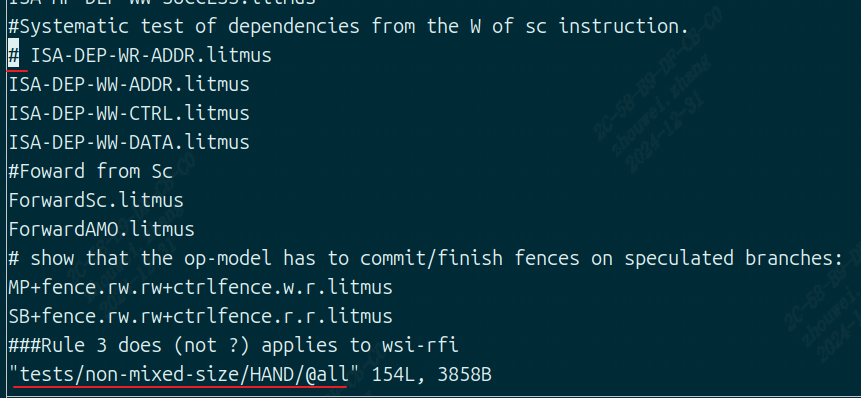
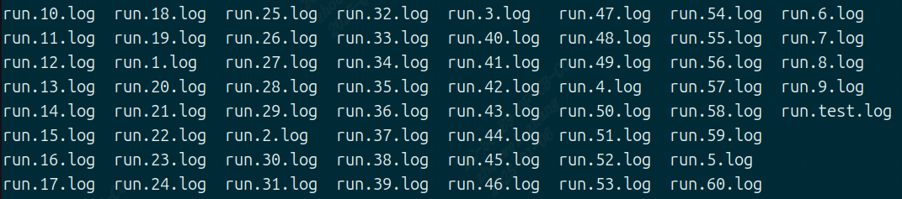

litmus
------------------

litmus工具介绍
>>>>>>>>>>>>>>>>>>>>>>>>>>>>>>>>>

``litmus test`` 是一个小型并行程序,可用于测试并行共享内存计算机的内存模型,参考(https://diy.inria.fr/doc/litmus.html)

litmus工具使用方法
>>>>>>>>>>>>>>>>>>>>>>>>>>>>>>>>>

详细步骤(ubuntu)
^^^^^^^^^^^^^^^^^

参考(https://wiki.sophgo.com/pages/viewpage.action?pageId=45417111)

测试准备

`RISCV Litmus 标准测试仓库 <https://github.com/litmus-tests/litmus-tests-riscv>`__

安装工具

-  ``herdtools7``:编译Litmus的的过程需要使用herdtools7工具,根据herdtools7说明文档安装,其中可能需要安装Ocaml
   和Opam 等包管理工具

.. code:: bash

   sudo apt-get install opam
   opam init && opam update && opam upgrade
   opam install herdtools7

交叉编译 ``litmus-tests-riscv``

.. code:: bash

   git clone https://github.com/litmus-tests/litmus-tests-riscv
   cd litmus-tests-riscv
   make hw-tests CORES=8 GCC=/usr/bin/riscv64-linux-gnu-gcc -j 4

riscv系统运行测试程序

.. code:: bash

   cp litmus-tests-riscv/hw-tests   RP-RAMDISK
   run  riscv linux 
   cd litmus-tests-riscv/hw-tests
   ./run.sh
   cp run*log to remote host

解析运行结果

.. code:: bash

   cp  run*log litmus-tests-riscv/hw-tests
   cd litmus-tests-riscv
   make merge-hw-tests
   make compare-hw-flat
   make compare-hw-herd

详细步骤(openEuler)
^^^^^^^^^^^^^^^^^^^^

.. code:: bash

    # 安装依赖
    sudo dnf groupinstall "Development Tools"
    sudo dnf install m4 curl git gcc g++ make unzip bubblewrap ocaml

在openEuler中，不能直接安装opam，可以直接从github上下载。
例如在 `页面 <https://github.com/ocaml/opam/releases/tag/2.3.0>`_ 中可找到相应安装包，复制该安装包地址。

这里得到的链接地址为： ``https://github.com/ocaml/opam/releases/download/2.3.0/opam-2.3.0-riscv64-linux``

然后执行如下命令：

.. code:: bash

    # 下载
    curl -L -o opam https://github.com/ocaml/opam/releases/download/2.3.0/opam-2.3.0-riscv64-linux

    # 添加权限，移动文件
    chmod +x opam
    sudo mv opam /usr/local/bin/

    # 检查是否安装成功
    opam --version

    # 使用 opam 安装herdtools7
    opam init
    opam update
    opam install herdtools7

    # 下载litmus-tests-riscv
    git clone https://github.com/litmus-tests/litmus-tests-riscv.git

另外由于 ``ISA-DEP-WR-ADDR`` 测试无法在risc-v系统上运行，需要将其去除。
将文件 ``litmus-tests-riscv/tests/non-mixed-size/HAND/@all`` 中 ``ISA-DEP-WR-ADDR.litmus`` 处前加一个 ``#`` 做注释。

如下图所示

.. code:: bash

    cd litmus-test-riscv
    # 编译测试文件
    # 注意将 GCC= 后面的路径，替换成当前系统上gcc的路径
    make hw-tests CORES=8 GCC=/usr/bin/riscv64-openEuler-linux-gcc -j

    # 运行测试
    cd hw-tests
    ./run.sh

该项测试时间较久（估计四五天左右）。
测试完成后，确保 litmus-tests-riscv/hw-tests 目录下有如下文件：

然后进入 litmus-tests-riscv 目录，对测试结果进行分析

.. code:: bash

    cd litmus-tests-riscv
    make merge-hw-tests
    make compare-hw-flat
    make compare-hw-herd

运行结果示例
^^^^^^^^^^^^^^^^^

.. figure:: litmus.png
   :alt: litmus benchmark
   :scale: 60
   :align: center

litmus测试结果
>>>>>>>>>>>>>>>>>>>>>>>>>>>>>>>>>

测试环境：

- ``SG2042 EVB``
- ``32GB * 4 DDR``
- ``Fedora38``
- ``64 core C920@2.0GHz``

结论:满足real-time性能需求