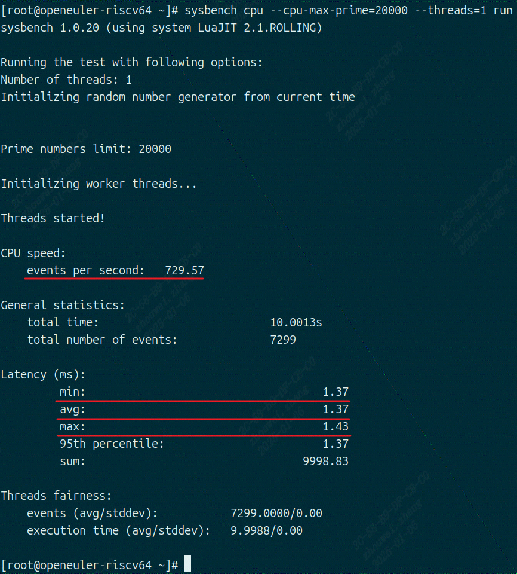

sysbench
------------------

sysbench工具介绍
>>>>>>>>>>>>>>>>>>>>>>>>>>>>>>>>>

参考(https://en.wikipedia.org/wiki/Sysbench)
``sysbench`` 是一个专为Linux系统设计的可编写脚本的多线程基准测试工具,最常用于数据库基准测试。
也可用于创建不涉及数据库服务器进行常规测试的任意复杂工作负载。

可以运行命令行标志或 shell 脚本中指定的基准测试

- ``cpu`` :CPU performance test
- ``fileio`` :File I/O test
- ``memory`` :Memory speed test
- ``mutex`` :Mutex performance test
- ``threads`` : Threads subsystem performance test

sysbench工具使用方法
>>>>>>>>>>>>>>>>>>>>>>>>>>>>>>>>>

详细步骤
^^^^^^^^^^^^^^^^^

.. code:: bash

   sudo apt install sysbench
   sysbench [options] [test] [command]
   sysbench cpu --cpu-max-prime=20000 run #测试 CPU 计算质数的性能
   sysbench memory --memory-block-size=1M --memory-total-size=10G run #测试内存读取和写入的性能
   sysbench fileio --file-total-size=10G prepare
   sysbench fileio --file-total-size=10G run
   sysbench fileio --file-total-size=10G cleanup #测试文件 I/O 性能，包括准备、运行和清理步骤。

   #测试 MySQL 数据库的只读性能
   sysbench oltp_read_only --db-driver=mysql --mysql-host=localhost 
            --mysql-user=root --mysql-password=your_password --tables=10 --table-size=10000 prepare
   sysbench oltp_read_only --db-driver=mysql 
            --mysql-host=localhost --mysql-user=root --mysql-password=your_password run
   sysbench oltp_read_only --db-driver=mysql 
            --mysql-host=localhost --mysql-user=root --mysql-password=your_password cleanup

运行结果示例
^^^^^^^^^^^^^^^^^

sysbench测试结果
>>>>>>>>>>>>>>>>>>>>>>>>>>>>>>>>>

测试结果
^^^^^^^^^^^

测试环境

- ``SG2042 EVB``
- ``32GB * 4 DDR``
- ``Fedora38``
- ``64 core C920@2.0GHz``

+---------------------+--------------+
| performance metrics | test result  |
+=====================+==============+
| events per seconds  | 76559.75     |
+---------------------+--------------+
| latency avg         | 0.83ms       |
+---------------------+--------------+
| latency max         | 64.85ms      |
+---------------------+--------------+
| latency min         | 0.82ms       |
+---------------------+--------------+