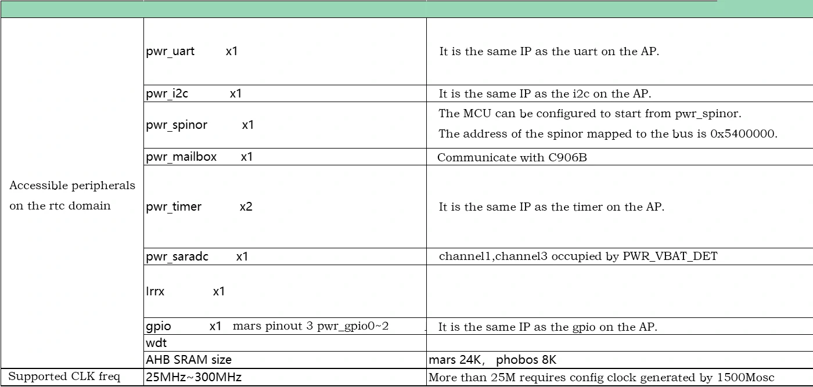

# 8051 Core Quick Start Guide

## Introduction
The CPU used by Soc of SG200X series contains an 8051 core. The 8051 subsystem is located in a module that is independently powered by the RTC. The subsystem is configured with an 8051, an I2C/UART/SPI NOR/SD controller, a Timer/WDT, an interrupt management, and a Mailbox IP. The system software can use the 8051 to manage wake-up conditions and wake up the system while it is in sleep mode, and communicate with external devices through peripheral controllers.

For more information on 8051 basic knowledge, please refer to the website [link](https://developer.arm.com/documentation/101655/0961/8051-Instruction-Set-Manual) and datasheet d8051_db.pdf 。

## Compilation
First download toolkit: [link](https://drive.sophgo.vip/d/s/xqXclRfyKDaakLiEnFPrLjlLbGB111sp/k_u_pWsNbKIhYtqe5TxcvxDBkQawKfNd-o73gz9JEPgs).
Then unzip it, and it should contian following documents:
├── sdcc
├── tools
├── firmware.zip

run:
```
cd sdcc/mars/project/base_project
make clean && make
```
After successful compilation, the compiled firmware `mars_mcu_fw.bin` can be found in `sdcc/mars/project/base_project/output`.

### How to load firmware
First unzip the zip package: firmware.zip which contains firmware and tools.

Ⅰ. Load firmware in 8051-SRAM:

1. Copy `8051_up`, `mars_mcu_fw.bin`, and `blink.sh` into `/mnt/data`, and grant execution and read permissions.

2. Execute `8051_up` to automatically update the firmware and start the 8051 core.

3. Execute `blink.sh`. This script will send data to the 8051 core and cause the blue LED to flash (please confirm that /mnt/system/blink.sh has been removed before executing this script).

> Note: The 8051 kernel firmware cannot exceed 8KB when running this method. Exceeding the limit may cause it to not run.

Ⅱ. Load firmware in DDR memory:

1. Change the memory allocation in the SDK and modify `build/boards/[chip model]/[board config]/memmap.py` .
Add the following content in MemoryMap:
```C
# ==============
# 8051
# ==============
CHIP8051_SIZE = 512 * SIZE_1K
CHIP8051_ADDR = DRAM_BASE + DRAM_SIZE - CHIP8051_SIZE
```

Modify the following content:
```C
# ==============
# C906L FreeRTOS
# ==============
FREERTOS_SIZE = 768 * SIZE_1K
# FreeRTOS is after 8051
FREERTOS_ADDR = CHIP8051_ADDR - FREERTOS_SIZE
FSBL_C906L_START_ADDR = FREERTOS_ADDR
```
The modified code should be as shown in the figure:
[](https://imgse.com/i/pFIxZ3d)

1. Recompile the firmware and burn it to the EVB board.

2. Copy `8051_up`, `mars_mcu_fw.bin`, `blink.sh`, and `8051_boot_cfg.ini` into `/mnt/data`, and grant execution and read permissions.

3. Execute `8051_up` to automatically update the firmware and start the 8051 core.

4. Execute blink.sh. This script will send information to the 8051 core and cause the blue LED to flash (please confirm that /mnt/system/blink.sh has been removed before executing this script).

#### Update tool 8051_up
This tool is used to load the bin firmware into memory and start the 8051 core. If the tool in firmware.zip is not available, it's usually due to compiler version difference and you can recompile it to fix this issue.
Please make sure you have obtained official SDK package first and initialized the configuration based on the chip and architecture, so that we can do the cross compilation.
```sh
cd tools/8051_up
make
```w2
Then you could use this new tool to boot 8051 core.

### How to customize DDR memory size
If you want to customize the DDR memory size of 8051 to store firmware, please modify:
```
CHIP8051_SIZE = 512 * SIZE_1K
```
in which 512 is the custom size, and modify the address in 8051_boot_cfg.ini to be the custom address.

The SG2002 address calculation formula is "2147483648+256*1048576-[custom size]*1024".

The SG2000 address calculation formula is "2147483648+ 512*1048576-[custom size]*1024".

(note that when filling the address to config file, it must be converted into a hexadecimal address 0xXXXXXXX.)

## SDCC Compiler
SDCC is a cross-compiler whose target CPU is 8051 and it is used to compile 8051 core related code.

### 8051 on-chip resources
#### Peripheral resources
##### 8051 comes with peripherals
1. Three 16bit Timers.
2. One uart, multiplexed `PWR_UART_RX/PWR_UART_TX`.

##### rtc domain peripherals
8051 is generally used in low-power scenarios. The rtc domain will not lose power during poweroff/suspend, which is a no die domain. Therefore, the peripherals used by 8051 in most cases are on the rtc domain. The peripheral table of rtc domain is as follows:


##### AP on-chip peripherals
8051 can access 0x0 ~ 0xFFFFFFFF when the AP is powered on. In theory, all peripherals on the AP side can be accessed. However, whether the interrupt signal of the corresponding peripheral device can be transmitted to 8051, you need to check the aptortc interrupt table.

#### Interrupt controller
##### Hardware structure
The interrupt control of 8051 is divided into three parts:
1. 8051 on-chip interrupt.
2. Peripheral interrupt signal on rtc.
3. The AP side interrupt.

The interrupt numbers and supported interrupt types defined by 8051 are used as shown in the following table:


The peripheral interrupt signal on the rtc can be packaged and connected to the 8051 through external interrupt 0 and external interrupt 1, which can be understood as sharing the `int0_n` and `int1_n` interrupt lines. As shown in the figure below, `irq_ap2rtc[1:0]` handles interrupt events on the AP.


The interrupt event on the AP side is ORed through `0x3000250` and `0x3000254`, and the interrupt on the AP side is packaged and transmitted to `irq_ap2rtc[0]`. The interrupt event on the AP side is packaged and transmitted to `irq_ap2rtc[1]` through `0x3000260` and `0x3000264`.
> TIP: Please refer to sheet "toptortc" in "sg200x_interrupt.xlsx" for supported interrupt types and corresponding ap interrupt number.

##### Interrupt the configuration process
1. Configure interrupt events and enable corresponding interrupts.
2. `0x3000248 = 0x01` enables rtc2ap bus conversion.
3. Check the bit corresponding to the interrupt number enable `rtcsys_ap2rtc_irq0_sigen0/rtcsys_ap2rtc_irq0_sigen1` or `rtcsys_ap2rtc_irq1_sigen0/rtcsys_ap2rtc_irq1_sigen1`.
4. enable `irq_ap2rtc[0]` or enable `irq_ap2rtc[1]`.
5. enable `int0_n` or enable `int1_n` .
6. After the interrupt response enters the external interrupt processing function, check `dw_ictl` or reg `0x502507c` status to see if it is due to the `irq_ap2rtc[0]` or `irq_ap2rtc[1]` event response. If so, further check `rtcsys_ap2rtc_irq0_status0/crtcsys_ap2rtc_irq0_status1` or `rtcsys_ap2rtc_irq1_status0/rtcsys_ap2rtc_irq1_status1`  to view which AP interrupt event has been triggered.

Interrupt control example:
```C
#if TEST_APTORTC_ICTL

static int __xdata aptortc_count = 0;
int test_aptortc_gpioa_isr(char irqn, int *priv)
{
    write_robot(0x0302004c, 0x8000);
    printf("gpio0 interrupt\n");
    aptortc_count++;
}

void test_aptortc_irq()
{
    printf("test aptortc irq\n");
    write_robot(0x03020004, 0x100c0020);    //Set gpioA gpio15 as output
    write_robot(0x03001908, 0x44);          //Switch pinmux to pull-up
    write_robot(0x03020030, 0xa000);        //Enable interrupts
    write_robot(0x03020038, 0x8000);        //Set up edge triggering

    ap2rtc_irq_init();
    ap2rtc_request_irq(17, test_aptortc_gpioa_isr, NULL);

    ap2rtc_irq_unmask(17);
    dw_ictl_unmask(IRQ_AP2RTC0_INTR);
    irq_enable();

    printf("REG_51_INT1_SRC_MASK: 0x%081x\n", read_robot(REG_51_INT1_SRC_MASK));
    EX0 = 1;
    EX1 = 1;
    EA = 1;
    while(aptortc_count == 0)
        printf("gpioA irq 0x3020040 = %x, aptortc_irq status = %x\n",read_robot(0x3020040),read_robot(0x3000258));

    printf("aptortc_count = %d\n",aptortc_count);
    irq_disable();
}
#endif
```

### 8051 address mapping and startup method
The 8051 core address space is divided into the following three parts:
1. `Program memory`:Internal rom(64K)+External rom(64K~4M by code banking).
2. `Data memory`:Internal ram(256byte)+External ram(64K~4G).
3. `Special register`(128byte).


> TIP: 8051 itself does not come with externel rom and externel ram. What is expressed here is the bus addressability. In the system, externel rom and externel rom are mapped to the memory on the chip through 0x5025020 and 0x5025024 or sfr (0xfd, 0xfc), such as AHB SRAM, TPU SRAM, DDR, SPINOR address space.

#### 8051 module responsible for address mapping
1. `u_mcu_8051_iram`。
2. `u_mcu_8051_sfr_wp`(Responsible for the conversion of SFR to AHB bus.)
3. `u_mcu_8051_xdata_wp`(Responsible for mapping externel rom and externel ram).

The conversion from SFR to AHB bus is mainly used to read and write registers. In the code, robot_read and robot_write are through this interface.

The 8051 address line has a bit width of 16 bits and the data line has a bit width of 8 bits. The XDATA interface maps externel rom and externel ram to 32-bit address space such as AHB SRAM, TPU SRAM, DDR and SPINOR.

#### Notes on address mapping and startup methods
1. sg200x need to configure `reg_51_rom_addr_def = 1` in `0x5025020`.

2. 8051 irom can only be mapped to AHB SRAM by default. You can modify `reg_51irom_ioffset[4:0]` in `0x5025024` to configure the offset of the first address on AHB SRAM.The first address is `0x5200000 + reg_51irom_ioffset[4:0] * 2KB`. Only when `reg_51_mem_ea_n = 1` (the configured externel rom does not exist), the mcu will start from the irom. If the irom address is exceeded, it will go to the externel rom to fetch address.When `reg_51_mem_ea_n = 0`, it starts from externel rom and does not use irom.

3. The first address of externel rom can be mapped to AHB SRAM, TPU SRAM, DDR and SPINOR address space. The `reg_51xdata_ioffset0[20:0]` of `0x5025020` can be configured to determine the mapping address. The first address of externel rom is `reg_51xdata_ioffset0[20:0] * 2KB`.

4. The first address of Externel ram can be mapped to AHB SRAM, TPU SRAM, DDR, and can be configured with `reg_51xdata_doffset0[20:0]` or `SFR(0xfd, 0xfc)`.

5. If `reg_51xdata_doffset0[20:0]` is configured, the first address of the external ram is `reg_51xdata_doffset0[20:0] * 2KB`. At this time,` sfr 0xfc = 0, 0xfd = 0` must be set, and the address of `reg_51xdata_doffset0[20:0]` and `SFR` must be configured at the same time. It is the superimposed effect of the two.

6. When `reg_51xdata_doffset0[20:0] = 0`, configure `SFR{0xfd,0xfc}`, then the first address of externel ram is `SFR{0xfd,0xfc} * 64KB` .

> TIP: Since most 8051 are used in low-power consumption scenarios, most of the startup methods are that both program memory and data memory are mapped to AHB SRAM.

#### Modify the division of external rom and external ram
Modify the `MakeFile` in the SDCC code directory `sdcc/mars/project/base_project`:
```MakeFile
# ------------------------------------------------------
# Memory Layout

# PRG Size = 4K Bytes
CODE_SIZE = --code-loc 0x0000 --code-size 0x1F00

# INT-MEM Size = 256 Bytes
#IRAM_SIZE = --idata-loc 0x0000  --iram-size 256

# EXT-MEM Size = 32K Bytes
XRAM_SIZE = --xram-loc 0x1900 --xram-size 0x400

# ------------------------------------------------------
# MCS51 Options
```
Modify `CODE_SIZE`, `XRAM_SIZE` to change the size of external rom and external ram.

> TIP: AHB SRAM register size is 8KB. When using AHB SRAM as external rom, be careful not to allocate more than 8KB memory.

### SFR register
The SFR (Special Function Register) is located at 80H~FFH. SFR registers are divided into two categories, one is the SFR register that comes with the 8051, and the other is the extended SFR register. The complete SFR register can be found at d8051_db.pdf 。

#### Implementation of robot_write and robot_read
The following figure shows the relevant SFR registers that implement `robot_write` and `robot_read` :


`robot_write` :
1. Set `reg_51robot_size` 、 `reg_51robot_adr` 、 reg_`51robot_wd 、`reg_51robot_we = 1` 。

2. `reg_51robot_fire` is set to 1 during writing, please poll this register until `reg_51robot_fire == 0`.

`robot_read` :
1. Set `reg_51robot_size` 、 `reg_51robot_adr` 、`reg_51robot_we = 0 `。

2. `reg_51robot_fire` is set to 1 during reading, please poll this register until `reg_51robot_fire == 0`.

3. Read data from `reg_51robot_rd`.

