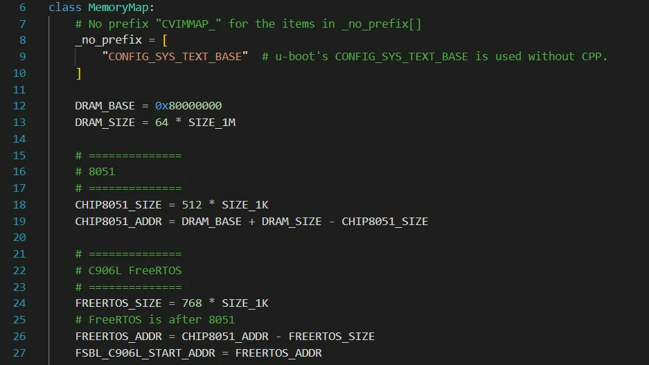
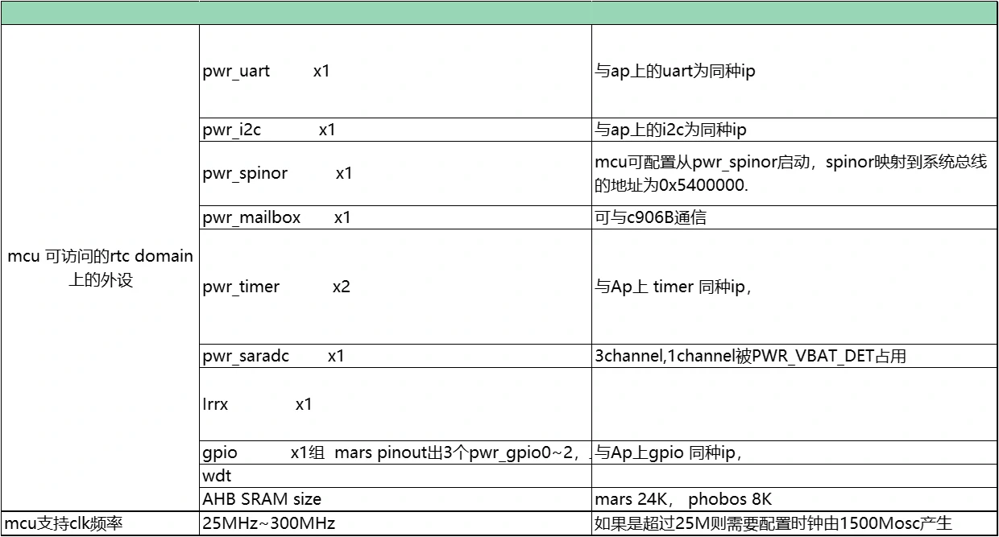
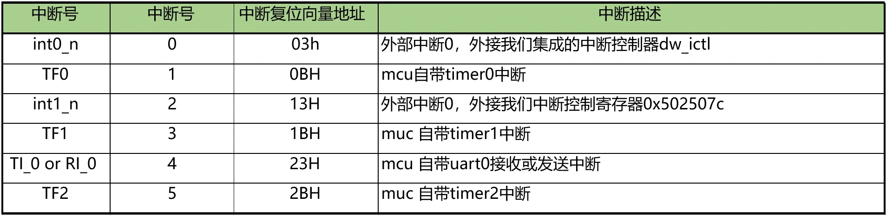

# 8051核启用指南

## 介绍
SG200X处理器中包含一个8051核，8051 子系统位于由 RTC 独立供电的模块中。 该子系统配置有 8051、I2C/UART/SPI NOR/SD 控制器、定时器/WDT、中断管理和 Mailbox IP。系统软件可以使用 8051 管理唤醒条件并在睡眠模式下唤醒系统，并通过外设控制器与外部设备通信。

关于更多8051基础知识的补充可以查阅网址 [link](https://developer.arm.com/documentation/101655/0961/8051-Instruction-Set-Manual) 和数据手册 d8051_db.pdf。

## 编译
首先下载相关工具包：[link](https://drive.sophgo.vip/d/s/xqXclRfyKDaakLiEnFPrLjlLbGB111sp/k_u_pWsNbKIhYtqe5TxcvxDBkQawKfNd-o73gz9JEPgs)并进行解压，工具包目录结构为
├── sdcc
├── tools
├── firmware.zip

执行：
```
cd sdcc/mars/project/base_project
make clean && make
```
编译成功后在 `sdcc/mars/project/base_project/output` 中可以找到编译好的固件 `mars_mcu_fw.bin` 。

### 加载固件方法
将固件及工具解压：firmware.zip。

一、在8051-SRAM中加载固件:

1. 将`8051_up`、`mars_mcu_fw.bin`、`blink.sh`拷入`/mnt/data`，并赋予执行和读取权限。

2. 执行`8051_up`自动更新固件并启动8051核。

3. 执行`blink.sh`，该脚本会向8051核心发送信息，使蓝色LED闪烁（在执行该脚本前请确认 `/mnt/system/blink.sh` 已经被移除）。

> 注意：该方法运行时8051内核固件不能超过8KB，超过可能造成不运行。

二、在DDR内存中加载固件:

1. 更改SDK中内存分配，修改 `build/boards/[chip model]/[board config]/memmap.py` 。

在MemoryMap中添加以下内容:
```C
# ==============
# 8051
# ==============
CHIP8051_SIZE = 512 * SIZE_1K
CHIP8051_ADDR = DRAM_BASE + DRAM_SIZE - CHIP8051_SIZE
```
修改以下内容：
```C
# ==============
# C906L FreeRTOS
# ==============
FREERTOS_SIZE = 768 * SIZE_1K
# FreeRTOS is after 8051
FREERTOS_ADDR = CHIP8051_ADDR - FREERTOS_SIZE
FSBL_C906L_START_ADDR = FREERTOS_ADDR
```
修改后的代码应如图所示：


2. 重新编译固件并烧录到开发板。

3. 将`8051_up`、`mars_mcu_fw.bin`、`blink.sh`、`8051_boot_cfg.ini`拷入`/mnt/data`，并赋予执行和读取权限。

4. 执行`8051_up`自动更新固件并启动8051核。

5. 执行blink.sh，该脚本会向8051核心发送信息，使蓝色LED闪烁（在执行该脚本前请确认 /mnt/system/blink.sh 已经被移除）。

#### 更新8051_up工具
此工具用于将bin固件加载到内存并启动8051核，若您发现在firmware.zip中的8051_up不可用，这通常是源于编译器版本差异，您可以选择重新编译。
请确保先获取了官方SDK，并根据芯片及架构进行了初始化配置，以确保能够重新进行交叉编译。
```sh
cd tools/8051_up
make
```
新的工具则会出现在目录下。

### 自定义DDR内存大小

如果想自定义8051存放固件的DDR内存大小，请修改：
```
CHIP8051_SIZE = 512 * SIZE_1K
```
其中，512为自定义大小，并修改8051_boot_cfg.ini中地址为自定义地址。

SG2002地址计算公式为 "2147483648+256*1048576-[自定义大小]*1024" 。

SG2000地址计算公式为 "2147483648+512*1048576-[自定义大小]*1024" 。

(注意地址填写时必须转换成16进制地址0xXXXXXXX。)


## SDCC编译器
SDCC是一个目标CPU为8051的交叉编译器，用于编译8051核相关代码。

### 8051片上资源
#### 外设资源
##### 8051 IP自带外设
1. 3个16bit Timer。
2. 1个uart，复用`PWR_UART_RX/PWR_UART_TX`。

##### rtc domain外设
8051一般使用在低功耗场景，rtc domain 在 poweroff/suspend 时候不会掉电, 即为 no die domain ,所以8051大部分情况使用的外设都在 rtc domain 上。rtc domain 的外设表有如下：


##### AP片上外设
8051在AP不掉电的情况下可访问 0x0 ~ 0xFFFFFFFF ，理论上AP侧的外设都可以访问，但是对应外设的中断信号是否能传到8051，需要查看 aptortc 中断表。

#### 中断控制器
##### 硬件结构
8051的中断控制分为三部分：
1. 8051片上中断。
2. rtc上的外设中断信号。
3. AP侧中断。

8051 IP定义的中断号和支持的中断类型，使用到的如下表所示：


rtc上的外设中断信号，可以通过 外部中断0 和 外部中断1 打包接入8051，可以理解为共用 `int0_n `， `int1_n` 中断线。如下图所示,其中 `irq_ap2rtc[1:0]`处理AP上的中断事件。


AP侧的中断事件通过 `0x3000250` ， `0x3000254` 作或逻辑运算，打包AP侧的中断传输至 `irq_ap2rtc[0]` ， 通过 `0x3000260` ， `0x3000264` 打包ap侧中断事件传输到传输至 `irq_ap2rtc[1]`。
> 提示： AP侧中断事件enable和查看status请查阅《reg_top_misc.xlsx》, 支持的中断类型和对应ap中断中断编号请查阅 《cv180x_interrupt.xlsx》中sheet “toptortc”。

##### 中断配置流程
1. 配置IP的中断事件并使能对应中断。

2. `0x3000248 = 0x01`使能 rtc2ap 总线转换。

3. 查看对应中断号enable `rtcsys_ap2rtc_irq0_sigen0/rtcsys_ap2rtc_irq0_sigen1`或`rtcsys_ap2rtc_irq1_sigen0/ rtcsys_ap2rtc_irq1_sigen1`对应的bit。

4. enable `irq_ap2rtc[0]` 或 enable `irq_ap2rtc[1]` 。

5. enable `int0_n` 或 enable `int1_n` 。

6. 中断响应进入外部中断处理函数后，查看 `dw_ictl` 或reg `0x502507c` status，是否是由于 `irq_ap2rtc[0]` 或 `irq_ap2rtc[1]` 事件响应，如果是，再往下查看 `rtcsys_ap2rtc_irq0_status0/crtcsys_ap2rtc_irq0_status1` 或 `rtcsys_ap2rtc_irq1_status0/rtcsys_ap2rtc_irq1_status1` 查看是响应的AP中断事件的哪一个。

中断控制实例：
```C
#if TEST_APTORTC_ICTL

static int __xdata aptortc_count = 0;
int test_aptortc_gpioa_isr(char irqn, int *priv)
{
    write_robot(0x0302004c, 0x8000);
    printf("gpio0 interrupt\n");
    aptortc_count++;
}

void test_aptortc_irq()
{
    printf("test aptortc irq\n");
    write_robot(0x03020004, 0x100c0020);    //设置gpioA gpio15为输出
    write_robot(0x03001908, 0x44);          //切换pinmux为上拉
    write_robot(0x03020030, 0xa000);        //使能中断
    write_robot(0x03020038, 0x8000);        //设置边缘触发

    ap2rtc_irq_init();
    ap2rtc_request_irq(17, test_aptortc_gpioa_isr, NULL);

    ap2rtc_irq_unmask(17);
    dw_ictl_unmask(IRQ_AP2RTC0_INTR);
    irq_enable();

    printf("REG_51_INT1_SRC_MASK: 0x%081x\n", read_robot(REG_51_INT1_SRC_MASK));
    EX0 = 1;
    EX1 = 1;
    EA = 1;
    while(aptortc_count == 0)
        printf("gpioA irq 0x3020040 = %x, aptortc_irq status = %x\n",read_robot(0x3020040),read_robot(0x3000258));

    printf("aptortc_count = %d\n",aptortc_count);
    irq_disable();
}
#endif
```
### 8051地址映射和启动方式
8051核地址空间分为以下三部分：
1. `Program memory`:Internal rom(64K)+External rom(64K~4M by code banking)。
2. `Data memory`:Internal ram(256byte)+External ram(64K~4G)。
3. `Special register`(128byte)。


> 提示：8051本身不自带externel rom、externel ram，这里表述的是总线可寻址能力，在系统中通过 0x5025020 和 0x5025024 或 sfr(0xfd，0xfc) 把 externel rom ， externel rom 映射到芯片上的存储器如AHB SRAM, TPU SRAM, DDR,SPINOR地址空间。

#### 8051 IP负责地址映射的模块
1. `u_mcu_8051_iram`。
2. `u_mcu_8051_sfr_wp`(负责SFR到AHB总线的转换)。
3. `u_mcu_8051_xdata_wp`(负责映射externel rom和externel ram)。

SFR到AHB总线的转换主要用来读写寄存器，在代码中 robot_read , robot_write 就是通过此接口。

8051地址线位宽16bit，数据线位宽8bit， XDATA 接口把 externel rom 和 externel ram 映射到32bit的存储空间如AHB SRAM、TPU SRAM,DDR和SPINOR。

#### 关于地址映射和启动方式的注意事项
1. sg200x需要配置 `0x5025020` 中 `reg_51_rom_addr_def = 1`。

2. 8051 irom默认只能映射到AHB SRAM,可修改 `0x5025024` 中 `reg_51irom_ioffset[4:0]` 配置首地址在AHB SRAM上的偏移量。首地址为 `0x5200000 + reg_51irom_ioffset[4:0] * 2KB` 。只有在 `reg_51_mem_ea_n = 1`（配置externel rom不存在）时，mcu才会从irom启动，超过irom地址则去externel rom取指。`reg_51_mem_ea_n = 0`时则从externel rom启动，不使用irom。

3. externel rom首地址可以映射到AHB SRAM，TPU SRAM， DDR和SPINOR地址空间, 可配置 `0x5025020` 的 `reg_51xdata_ioffset0[20:0]` 确定映射地址，externel rom的首地址为在 `reg_51xdata_ioffset0[20:0] * 2KB`。

4. Externel ram的首地址可以映射到AHB SRAM，TPU SRAM，DDR，可配置 `reg_51xdata_doffset0[20:0]` 或 `SFR(0xfd, 0xfc)` 。

5. 如果配置 `reg_51xdata_doffset0[20:0]` 此时externel ram的首地址为 `reg_51xdata_doffset0[20:0] * 2KB` ，此时必须设置 `sfr 0xfc = 0 ， 0xfd = 0 `。 `reg_51xdata_doffset0[20:0]` 和 `SFR` 同时配置地址会是两者之和的叠加效果。

6. `reg_51xdata_doffset0[20:0] = 0`，配置`SFR{0xfd,0xfc}`,则externel ram的首地址为 `SFR{0xfd,0xfc} * 64KB` 。

> 提示: 由于大部分情况8051是应用在低功耗场景，所以启动方式绝大多是program memory和data memory都映射到AHB SRAM。

#### 修改external rom和external ram的划分
修改SDCC代码目录 `sdcc/mars/project/base_project` 下 `MakeFile` :
```MakeFile
# ------------------------------------------------------
# Memory Layout

# PRG Size = 4K Bytes
CODE_SIZE = --code-loc 0x0000 --code-size 0x1F00

# INT-MEM Size = 256 Bytes
#IRAM_SIZE = --idata-loc 0x0000  --iram-size 256

# EXT-MEM Size = 32K Bytes
XRAM_SIZE = --xram-loc 0x1900 --xram-size 0x400

# ------------------------------------------------------
# MCS51 Options
```
修改 `CODE_SIZE` , `XRAM_SIZE` 以变更external rom和external ram的大小。

> 提示：AHB SRAM寄存器大小8KB，在使用AHB SRAM作为external rom时注意内存分配不要大于8KB。

### SFR 寄存器
SFR特殊功能寄存器也称专用寄存器，位于80H~FFH。SFR寄存器分为两类，一类是8051自带的SFR寄存器，另一类是扩展的SFR寄存器，完整的SFR寄存器可查阅 d8051_db.pdf 。

#### robot_write 和 robot_read 的实现
下图是实现 robot_write 和 robot_read 的相关SFR寄存器：


`robot_write` :
1. 设置 `reg_51robot_size` 、 `reg_51robot_adr` 、 reg_`51robot_wd 、`reg_51robot_we = 1` 。

2. 写入过程中 `reg_51robot_fire` 被置1，轮询该寄存器直到 `reg_51robot_fire == 0` 。

`robot_read` :
1. 设置 `reg_51robot_size` 、 `reg_51robot_adr` 、`reg_51robot_we = 0 `。

2. 读取过程中 `reg_51robot_fire` 被置1，轮询该寄存器直到 `reg_51robot_fire == 0 `。

3. 从 `reg_51robot_rd` 读取数据。

