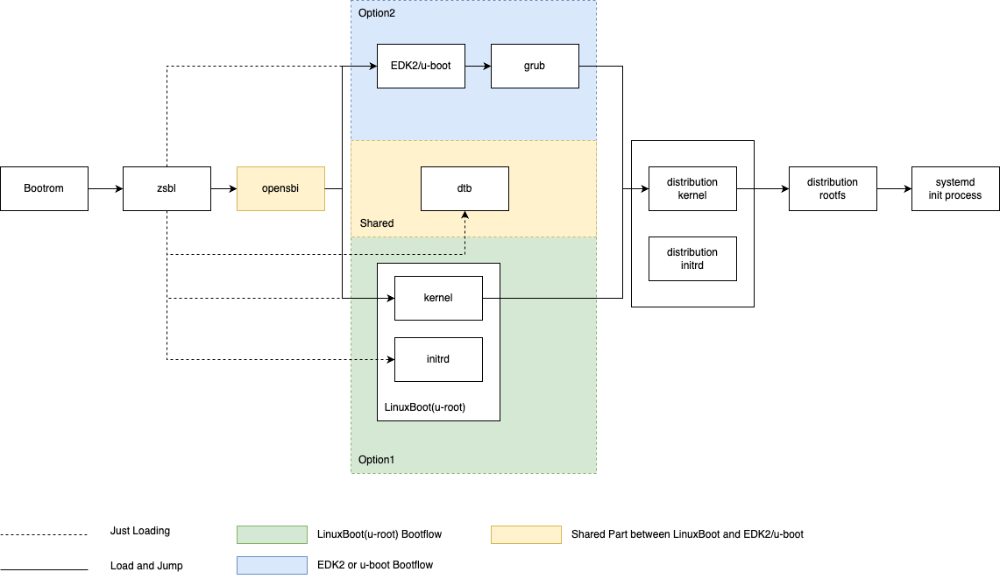

================
SG2042 Boot Flow
================

1. Fip.bin
2. ZSBL (Zero Stage Bootloader): Code in the ROM of the board to initial DDR, CPU and Ethernet. Then load OpneSBI and U-Boot.
3. OpenSBI (RISC-V Open Source Supervisor Binary Interface): The goal of the OpenSBI project is to provide an open-source reference implementation of the RISC-V SBI specifications for platform-specific firmwares executing in M-mode. An OpenSBI implementation can be easily extended by RISC-V platform and system-on-chip vendors to fit a particular hardware configuration.
4. conf.ini: configuration file used to choose next bootloader.
5. LinuxBoot: LinuxBoot is a firmware for modern servers that replaces specific firmware functionality like the UEFI DXE phase with a Linux kernel and runtime.
6. U-Boot (Universal Bootloader): Its primary role is to facilitate the booting process of the embedded device. 
7. GRUB2  (GRand Unified Bootloader version 2): It is responsible for loading and transferring control to an operating system kernel software (such as Linux or GNU Mach). The kernel, in turn, initializes the rest of the operating system (e.g. a GNU system).
8. Kernel

