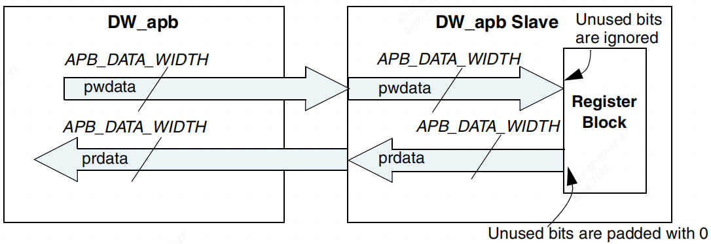

GPIO
=====

Registers
---------

This section describes the programmable registers of the DW_apb_gpio.

Bus Interface
^^^^^^^^^^^^^

The DW_apb_gpio peripheral has a standard AMBA 2.0 APB interface for reading and writing the interna registers. This peripheral supports APB data bus widths of 8, 16, or 32 bits, which is set with the
APB_DATA_WIDTH parameter.

Figure 1 shows the read/write busses between the DW_apb and the APB slave.

        Relationship Between DW_apb and Slave Data Widths 

Register Memory Map
^^^^^^^^^^^^^^^^^^^

Table 1 shows the memory map for the DW_apb_gpio peripheral.

.. table:: Memory Map of DW_apb_gpio

   +-----------------+--------+------------+----+--------------------------------------------+
   | Name            | Address| width      | R/W| Description                                |
   +                 +        +            +    +                                            + 
   |                 | Offset |            |    |                                            |
   +-----------------+--------+------------+----+--------------------------------------------+
   | gpio_swporta_dr | 0x00   | See        | R/W| Port A data register                       |
   |                 |        |            |    +                                            +
   |                 |        | Description|    | Width: GPIO_PWIDTH_A                       |
   |                 |        |            |    +                                            +
   |                 |        |            |    | Reset Value: GPIO_SWPORTA_RESET            |
   +-----------------+--------+------------+----+--------------------------------------------+
   | gpio_swporta_ddr| 0x04   | See        | R/W| Port A data direction register             |
   |                 |        |            |    +                                            +
   |                 |        | Description|    | Width: GPIO_PWIDTH_A                       |
   |                 |        |            |    +                                            +
   |                 |        |            |    | Reset Value: GPIO_DFLT_DIR_A (for all bits)|
   +-----------------+--------+------------+----+--------------------------------------------+
   | gpio_swporta_ctl| 0x08   | See        | R/W| Port A data source register                |
   |                 |        |            |    +                                            +
   |                 |        | Description|    | Width: 1 bit if GPIO_PORTA_SINGLE          |
   |                 |        |            |    +                                            +
   |                 |        |            |    | _CTL = 1, or GPIO_PWIDTH_A otherwise       |
   |                 |        |            |    +                                            +
   |                 |        |            |    | Reset Value: GPIO_DFLT_SRC_A               |
   |                 |        |            |    +                                            +
   |                 |        |            |    | Bit is repeated GPIO_PWIDTH_A times if     |
   |                 |        |            |    +                                            +
   |                 |        |            |    | GPIO_PORTA_SINGLE_CTL = 0                  |
   +-----------------+--------+------------+----+--------------------------------------------+
   | gpio_swporta_dr | 0x0c   | See        | R/W| Port B data register                       |
   |                 |        |            |    +                                            +
   |                 |        | Description|    | Width: GPIO_PWIDTH_B                       |
   |                 |        |            |    +                                            +
   |                 |        |            |    | Reset Value: GPIO_SWPORTB_RESET            |
   +-----------------+--------+------------+----+--------------------------------------------+
   | gpio_swporta_ddr| 0x10   | See        | R/W| Port B data direction register             |
   |                 |        |            |    +                                            +
   |                 |        | Description|    | Width: GPIO_PWIDTH_B                       |
   |                 |        |            |    +                                            +
   |                 |        |            |    | Reset Value: GPIO_DFLT_DIR_B (for all bits)|
   +-----------------+--------+------------+----+--------------------------------------------+
   | gpio_swportb_ctl| 0x14   | See        | R/W| Port B data source register                |
   |                 |        |            |    +                                            +
   |                 |        | Description|    | Width: 1 bit if GPIO_PORTB_SINGLE          |
   |                 |        |            |    +                                            +
   |                 |        |            |    | _CTL = 1, or GPIO_PWIDTH_B otherwise       |
   |                 |        |            |    +                                            +
   |                 |        |            |    | Reset Value: GPIO_DFLT_SRC_B               |
   |                 |        |            |    +                                            +
   |                 |        |            |    | Bit is repeated GPIO_PWIDTH_B times if     |
   |                 |        |            |    +                                            +
   |                 |        |            |    | GPIO_PORTB_SINGLE_CTL = 0                  |
   +-----------------+--------+------------+----+--------------------------------------------+
   | gpio_swportc_dr | 0x18   | See        | R/W| Port C data register                       |
   |                 |        |            |    +                                            +
   |                 |        | Description|    | Width: GPIO_PWIDTH_C                       |
   |                 |        |            |    +                                            +
   |                 |        |            |    | Reset Value: GPIO_SWPORTC_RESET            |
   +-----------------+--------+------------+----+--------------------------------------------+  

.. table:: 

   +-----------------+--------+------------+----+--------------------------------------------+
   | gpio_swportc_ddr| 0x1c   | See        | R/W| Port C data direction register             |
   |                 |        |            |    +                                            +
   |                 |        | Description|    | Width: GPIO_PWIDTH_C                       |
   |                 |        |            |    +                                            +
   |                 |        |            |    | Reset Value: GPIO_DFLT_DIR_C (for all bits)|
   +-----------------+--------+------------+----+--------------------------------------------+
   | gpio_swportc_ctl| 0x20   | See        | R/W| Port C data source register                |
   |                 |        |            |    +                                            +
   |                 |        | Description|    | Width: 1 bit if GPIO_PORTC_SINGLE          |
   |                 |        |            |    +                                            +
   |                 |        |            |    | _CTL = 1, or GPIO_PWIDTH_C otherwise       |
   |                 |        |            |    +                                            +
   |                 |        |            |    | Reset Value: GPIO_DFLT_SRC_C               |
   |                 |        |            |    +                                            +
   |                 |        |            |    | Bit is repeated GPIO_PWIDTH_C times if     |
   |                 |        |            |    +                                            +
   |                 |        |            |    | GPIO_PORTC_SINGLE_CTL = 0                  |
   +-----------------+--------+------------+----+--------------------------------------------+
   | gpio_swportd_dr | 0x24   | See        | R/W| Port D data register                       |
   |                 |        |            |    +                                            +
   |                 |        | Description|    | Width: GPIO_PWIDTH_D                       |
   |                 |        |            |    +                                            +
   |                 |        |            |    | Reset Value: GPIO_SWPORTD_RESET            |
   +-----------------+--------+------------+----+--------------------------------------------+
   | gpio_swportd_ddr| 0x28   | See        | R/W| Port D data direction register             |
   |                 |        |            |    +                                            +
   |                 |        | Description|    | Width: GPIO_PWIDTH_D                       |
   |                 |        |            |    +                                            +
   |                 |        |            |    | Reset Value: GPIO_DFLT_DIR_D (for all bits)|
   +-----------------+--------+------------+----+--------------------------------------------+
   | gpio_swportd_ctl| 0x2c   | See        | R/W| Port D data source register                |
   |                 |        |            |    +                                            +
   |                 |        | Description|    | Width: 1 bit if GPIO_PORTD_SINGLE          |
   |                 |        |            |    +                                            +
   |                 |        |            |    | _CTL = 1, or GPIO_PWIDTH_D otherwise       |
   |                 |        |            |    +                                            +
   |                 |        |            |    | Reset Value: GPIO_DFLT_SRC_D               |
   |                 |        |            |    +                                            +
   |                 |        |            |    | Bit is repeated GPIO_PWIDTH_D times if     |
   |                 |        |            |    +                                            +
   |                 |        |            |    | GPIO_PORTD_SINGLE_CTL = 0                  |
   +-----------------+--------+------------+----+--------------------------------------------+
   | gpio_inten      | 0x30   | See        | R/W| Interrupt enable register                  |
   |                 |        |            |    +                                            +
   |                 |        | Description|    | Width: GPIO_PWIDTH_A                       |
   |                 |        |            |    +                                            +
   |                 |        |            |    | Reset Value: 0x0                           |
   +-----------------+--------+------------+----+--------------------------------------------+
   | gpio_intmask    | 0x34   | See        | R/W| Interrupt mask register                    |
   |                 |        |            |    +                                            +
   |                 |        | Description|    | Width: GPIO_PWIDTH_A                       |
   |                 |        |            |    +                                            +
   |                 |        |            |    | Reset Value: 0x0                           |
   +-----------------+--------+------------+----+--------------------------------------------+ 
   | gpio_inttype    | 0x38   | See        | R/W| Interrupt level register                   |
   |                 |        |            |    +                                            +
   | _level          |        | Description|    | Width: GPIO_PWIDTH_A                       |
   |                 |        |            |    +                                            +
   |                 |        |            |    | Reset Value: 0x0                           |
   +-----------------+--------+------------+----+--------------------------------------------+

.. table:: 

   +-----------------+--------+------------+----+--------------------------------------------+
   | gpio_int        | 0x3c   | See        | R/W| Interrupt polarity register                |
   |                 |        |            |    +                                            +
   | _polarity       |        | Description|    | Width: GPIO_PWIDTH_A                       |
   |                 |        |            |    +                                            +
   |                 |        |            |    | Reset Value: 0x0                           |
   +-----------------+--------+------------+----+--------------------------------------------+
   | gpio_intstatus  | 0x40   | See        | R  | Interrupt status of Port A                 |
   |                 |        |            |    +                                            +
   |                 |        | Description|    | Width: GPIO_PWIDTH_A                       |
   |                 |        |            |    +                                            +
   |                 |        |            |    | Reset Value: 0x0                           |
   +-----------------+--------+------------+----+--------------------------------------------+
   | gpio_raw        | 0x44   | See        | R  | Raw interrupt status of Port A (premasking)|
   |                 |        |            |    +                                            +
   | _intstatus      |        | Description|    | Width: GPIO_PWIDTH_A                       |
   |                 |        |            |    +                                            +
   |                 |        |            |    | Reset Value: 0x0                           |
   +-----------------+--------+------------+----+--------------------------------------------+
   | gpio_debounce   | 0x48   | See        | R/W| Debounce enable register                   |
   |                 |        |            |    +                                            +
   |                 |        | Description|    | Width: GPIO_PWIDTH_A                       |
   |                 |        |            |    +                                            +
   |                 |        |            |    | Reset Value: 0x0                           |
   +-----------------+--------+------------+----+--------------------------------------------+
   | gpio_porta_eoi  | 0x4c   | See        | W  | Port A clear interrupt register            |
   |                 |        |            |    +                                            +
   |                 |        | Description|    | Width: GPIO_PWIDTH_A                       |
   |                 |        |            |    +                                            +
   |                 |        |            |    | Reset Value: 0x0                           |
   +-----------------+--------+------------+----+--------------------------------------------+
   | gpio_ext_porta  | 0x50   | See        | R  | Port A clear interrupt register            |
   |                 |        |            |    +                                            +
   |                 |        | Description|    | Width: GPIO_PWIDTH_A                       |
   |                 |        |            |    +                                            +
   |                 |        |            |    | Reset Value: 0x0                           |
   +-----------------+--------+------------+----+--------------------------------------------+
   | gpio_ext_portb  | 0x54   | See        | R  | Port B external port register              |
   |                 |        |            |    +                                            +
   |                 |        | Description|    | Width: GPIO_PWIDTH_B                       |
   |                 |        |            |    +                                            +
   |                 |        |            |    | Reset Value: 0x0                           |
   +-----------------+--------+------------+----+--------------------------------------------+  
   | gpio_ext_portc  | 0x58   | See        | R  | Port C external port register              |
   |                 |        |            |    +                                            +
   |                 |        | Description|    | Width: GPIO_PWIDTH_C                       |
   |                 |        |            |    +                                            +
   |                 |        |            |    | Reset Value: 0x0                           |
   +-----------------+--------+------------+----+--------------------------------------------+
   | gpio_ext_portd  | 0x5c   | See        | R  | Port D external port register              |
   |                 |        |            |    +                                            +
   |                 |        | Description|    | Width: GPIO_PWIDTH_D                       |
   |                 |        |            |    +                                            +
   |                 |        |            |    | Reset Value: 0x0                           |
   +-----------------+--------+------------+----+--------------------------------------------+
   | gpio_ls_sync    | 0x60   | 1 bit      | R/W| Level-sensitive synchronization enable     |
   |                 |        |            |    +                                            +
   |                 |        |            |    | Register                                   |
   |                 |        |            |    +                                            +
   |                 |        |            |    | Reset Value: 0x0                           |
   +-----------------+--------+------------+----+--------------------------------------------+

.. table::

   +-----------------+--------+------------+----+--------------------------------------------+
   | gpio_id_code    | 0x64   | See        | R  | ID code register                           |
   |                 |        |            |    +                                            +
   |                 |        | Description|    | Width: GPIO_ID_WIDTH                       |
   |                 |        |            |    +                                            +
   |                 |        |            |    | Reset Value: GPIO_ID_NUM                   |
   +-----------------+--------+------------+----+--------------------------------------------+
   | gpio_int        | 0x68   | See        | R/W| Interrupt both edge type                   |
   |                 |        |            |    +                                            +
   | _bothedge       |        | Description|    | Width: GPIO_PWIDTH_A                       |
   |                 |        |            |    +                                            +
   |                 |        |            |    | Reset Value: 0x0                           |
   +-----------------+--------+------------+----+--------------------------------------------+
   | gpio_ver_id_code| 0x6c   | 32 bits    | R  | Component Version register                 |
   |                 |        |            |    +                                            +
   |                 |        |            |    | Reset Value: See the Releases table in     |
   |                 |        |            |    +                                            +
   |                 |        |            |    | the Release Notes                          |
   +-----------------+--------+------------+----+--------------------------------------------+
   | gpio_config_reg1| 0x74   | 32 bits    | R  | Configuration Register 1                   |
   |                 |        |            |    +                                            +
   |                 |        |            |    | Reset Value: Reset value depends on        |
   |                 |        |            |    +                                            +
   |                 |        |            |    | configuration parameters.                  |
   +-----------------+--------+------------+----+--------------------------------------------+
   | gpio_config_reg2| 0x70   | 32 bits    | R  | Configuration Register 2                   |
   |                 |        |            |    +                                            +
   |                 |        |            |    | Reset Value: Reset value depends on        |
   |                 |        |            |    +                                            +
   |                 |        |            |    | configuration parameters.                  |
   +-----------------+--------+------------+----+--------------------------------------------+

Register and Field Descriptions
^^^^^^^^^^^^^^^^^^^^^^^^^^^^^^^

The following sections contain the memory diagrams and field descriptions for the individual registers.

gpio_swporta_dr
"""""""""""""""

- Name:Port A Data Register

- Size:GPIO_PWIDTH_A

- Address Offset:0x00

- Read/write access:read/write  

.. table:: 

   +-------------------+------------+------+-------------------------------------------------------------------+
   | Bits              | Name       | R/W  | Description                                                       |
   +===================+============+======+===================================================================+
   | 31:GPIO_PWIDTH_A  | Reserved, read as zero                                                                |
   +-------------------+------------+------+-------------------------------------------------------------------+
   | GPIO_PWIDTH_A–1:0 | Port A Data| R/W  | Values written to this register are output on the I/O signals for |
   +                   +            +      +                                                                   +
   |                   | Register   |      | Port A if the corresponding data direction bits for Port A are set|                    
   +                   +            +      +                                                                   +
   |                   |            |      | to Output mode and the corresponding control bit for Port A is    |
   +                   +            +      +                                                                   +
   |                   |            |      | set to Software mode. The value read back is equal to the last    |
   +                   +            +      +                                                                   +
   |                   |            |      | value written to this register.                                   |
   +                   +            +      +                                                                   +
   |                   |            |      | Reset Value: GPIO_SWPORTA_RESET                                   |
   +-------------------+------------+------+-------------------------------------------------------------------+

gpio_swporta_ddr
""""""""""""""""

- Name:Port A Data Direction Register

- Size:GPIO_PWIDTH_A

- Address Offset:0x04

- Read/write access:read/write

.. table:: 

   +-------------------+------------+------+-------------------------------------------------------------------+
   | Bits              | Name       | R/W  | Description                                                       |
   +===================+============+======+===================================================================+
   | 31:GPIO_PWIDTH_A  | Reserved, read as zero                                                                |
   +-------------------+------------+------+-------------------------------------------------------------------+
   | GPIO_PWIDTH_A–1:0 | Port A Data| R/W  | Values written to this register independently control the         |
   +                   +            +      +                                                                   +
   |                   | Direction  |      | direction of the corresponding data bit in Port A. The default    |
   +                   +            +      +                                                                   +
   |                   | Register   |      | direction can be configured as input or output after system       |
   +                   +            +      +                                                                   +
   |                   |            |      | reset through the GPIO_DFLT_DIR_A parameter.                      |
   +                   +            +      +                                                                   +
   |                   |            |      | 0 – Input (default)                                               |
   +                   +            +      +                                                                   +
   |                   |            |      | 1 – Output                                                        |
   +                   +            +      +                                                                   +
   |                   |            |      | Reset Value: GPIO_DFLT_DIR_A                                      |
   +-------------------+------------+------+-------------------------------------------------------------------+

gpio_swporta_ctl
""""""""""""""""

- Name:Port A Data Source

- Size:1 bit wide if GPIO_PORTA_SINGLE_CTL = 1 
  
       GPIO_PWIDTH_A bits wide if GPIO_PORTA_SINGLE_CTL = 0

- Address Offset:0x08

- Read/write access:read/write

.. table::

   +-------------------+------------+------+-------------------------------------------------------------------+
   | Bits              | Name       | R/W  | Description                                                       |
   +===================+============+======+===================================================================+
   | 0                 | Port A Data| R/W  | The data and control source for a signal can come from either     |
   +                   +            +      +                                                                   +
   | -or-              | Source     |      | software or hardware; this bit selects between them.The default   |
   +                   +            +      +                                                                   +
   | 0:GPIO_PWIDTH_A-1 |            |      | source is configurable through the GPIO_DFLT_SRC_A configuration  |
   +                   +            +      +                                                                   +
   |                   |            |      | parameter.                                                        |
   +                   +            +      +                                                                   +
   |                   |            |      | 0 – Software mode (default)                                       |
   +                   +            +      +                                                                   +
   |                   |            |      | 1 – Hardware mode                                                 |
   +                   +            +      +                                                                   +
   |                   |            |      | If GPIO_PORTA_SINGLE_CTL = 0, the register will contain one bit   |
   +                   +            +      +                                                                   +
   |                   |            |      | for each bit of the signal. Upon reset in this case,the value of  |
   +                   +            +      +                                                                   +
   |                   |            |      | GPIO_DFLT_SRC_A is replicated across all bits of the signal so    |
   +                   +            +      +                                                                   +
   |                   |            |      | that all bits power up with the same operating mode. Furthermore, |
   +                   +            +      +                                                                   +
   |                   |            |      | the default source of each bit of the signal can subsequently be  |
   +                   +            +      +                                                                   +
   |                   |            |      | changed by writing to the corresponding bit of this register.     |
   +                   +            +      +                                                                   +
   |                   |            |      | This register is not available unless GPIO_HW_PORTA = 1.          |
   +                   +            +      +                                                                   +
   |                   |            |      | Reset Value: If GPIO_PORTA_SINGLE_CTL = 1, then the reset value is|
   +                   +            +      +                                                                   +
   |                   |            |      | GPIO_DFLT_SRC_A.                                                  |
   +                   +            +      +                                                                   +
   |                   |            |      | If GPIO_PORTA_SINGLE_CTL = 0, then the reset value is             |
   +                   +            +      +                                                                   +
   |                   |            |      | {GPIO_PWIDTH_A{GPIO_DFLT_SRC_A in each bit}}.                     |
   +-------------------+------------+------+-------------------------------------------------------------------+

gpio_swportb_dr
"""""""""""""""

- Name:Port B Data Register

- Size:GPIO_PWIDTH_B

- Address Offset:0x0c

- Read/write access:read/write
 
.. table::

   +-------------------+------------+------+-------------------------------------------------------------------+
   | Bits              | Name       | R/W  | Description                                                       |
   +===================+============+======+===================================================================+
   | 31:GPIO_PWIDTH_B  | Reserved, read as zero                                                                |
   +-------------------+------------+------+-------------------------------------------------------------------+
   | GPIO_PWIDTH_B–1:0 | Port B Data| R/W  | Values written to this register are output on the I/O signals for |
   +                   +            +      +                                                                   +
   |                   | Register   |      | Port B if the corresponding data direction bits for Port B are    |
   +                   +            +      +                                                                   +
   |                   |            |      | set to Output mode and the corresponding control bit for          |
   +                   +            +      +                                                                   +
   |                   |            |      | Port B is set to Software mode. The value read back is equal      |
   +                   +            +      +                                                                   +
   |                   |            |      | to the last value written to this register.                       |
   +                   +            +      +                                                                   +
   |                   |            |      | Reset Value: GPIO_SWPORTB_RESET                                   |
   +-------------------+------------+------+-------------------------------------------------------------------+

gpio_swportb_ddr
""""""""""""""""

- Name:Port B Data Register

- Size:GPIO_PWIDTH_B

- Address Offset:0x10

- Read/write access:read/write

.. table::

   +-------------------+------------+------+-------------------------------------------------------------------+
   | Bits              | Name       | R/W  | Description                                                       |
   +===================+============+======+===================================================================+
   | 31:GPIO_PWIDTH_B  | Reserved, read as zero                                                                |
   +-------------------+------------+------+-------------------------------------------------------------------+
   | GPIO_PWIDTH_B–1:0 | Port B Data| R/W  | Values written to this register independently control the         |
   +                   +            +      +                                                                   +
   |                   | Direction  |      | direction of the corresponding data bit in Port B. The default    |
   +                   +            +      +                                                                   +
   |                   |            |      | direction can be configured as input or output after system       |
   +                   +            +      +                                                                   +
   |                   |            |      | reset through the GPIO_DFLT_DIR_B parameter.                      |
   +                   +            +      +                                                                   +
   |                   |            |      | 0 – Input (default)                                               |
   +                   +            +      +                                                                   +
   |                   |            |      | 1 – Output                                                        |
   +                   +            +      +                                                                   +
   |                   |            |      | Reset Value: GPIO_DFLT_DIR_B                                      |
   +-------------------+------------+------+-------------------------------------------------------------------+

gpio_swportb_ctl
""""""""""""""""

- Name:Port B Data Register

- Size:1 bit wide if GPIO_PORTB_SINGLE_CTL = 1

       GPIO_PWIDTH_B bits wide if GPIO_PORTB_SINGLE_CTL = 0

- Address Offset:0x14

- Read/write access:read/write

.. table::

   +-------------------+------------+------+-------------------------------------------------------------------+
   | Bits              | Name       | R/W  | Description                                                       |
   +===================+============+======+===================================================================+
   | 0                 | Port B Data| R/W  | The data and control source for a signal can come from either     |
   +                   +            +      +                                                                   +
   | -or-              | Source     |      | software or hardware; this bit selects between them.The default   |
   +                   +            +      +                                                                   +
   | 0:GPIO_PWIDTH_B-1 |            |      | source is configurable through the GPIO_DFLT_SRC_B configuration  |
   +                   +            +      +                                                                   +
   |                   |            |      | parameter.                                                        |
   +                   +            +      +                                                                   +
   |                   |            |      | 0 – Software mode (default)                                       |
   +                   +            +      +                                                                   +
   |                   |            |      | 1 – Hardware mode                                                 |
   +                   +            +      +                                                                   +
   |                   |            |      | If GPIO_PORTA_SINGLE_CTL = 0, the register will contain one bit   |
   +                   +            +      +                                                                   +
   |                   |            |      | for each bit of the signal. Upon reset in this case,the value of  |
   +                   +            +      +                                                                   +
   |                   |            |      | GPIO_DFLT_SRC_B is replicated across all bits of the signal so    |
   +                   +            +      +                                                                   +
   |                   |            |      | that all bits power up with the same operating mode. Furthermore, |
   +                   +            +      +                                                                   +
   |                   |            |      | the default source of each bit of the signal can subsequently be  |
   +                   +            +      +                                                                   +
   |                   |            |      | changed by writing to the corresponding bit of this register.     |
   +                   +            +      +                                                                   +
   |                   |            |      | This register is not available unless GPIO_HW_PORTB = 1.          |
   +                   +            +      +                                                                   +
   |                   |            |      | Reset Value: If GPIO_PORTB_SINGLE_CTL = 1, then the reset value is|
   +                   +            +      +                                                                   +
   |                   |            |      | GPIO_DFLT_SRC_B.                                                  |
   +                   +            +      +                                                                   +
   |                   |            |      | If GPIO_PORTB_SINGLE_CTL = 0, then the reset value is             |
   +                   +            +      +                                                                   +
   |                   |            |      | {GPIO_PWIDTH_B{GPIO_DFLT_SRC_B in each bit}}.                     |
   +-------------------+------------+------+-------------------------------------------------------------------+

gpio_swportc_dr
"""""""""""""""

- Name:Port C Data Register

- Size:GPIO_PWIDTH_C

- Address Offset:0x18

- Read/write access:read/write
  
.. table::

   +-------------------+------------+------+-------------------------------------------------------------------+
   | Bits              | Name       | R/W  | Description                                                       |
   +===================+============+======+===================================================================+
   | 31:GPIO_PWIDTH_C  | Reserved, read as zero                                                                |
   +-------------------+------------+------+-------------------------------------------------------------------+
   | GPIO_PWIDTH_C–1:0 | Port C Data| R/W  | Values written to this register are output on the I/O signals for |
   +                   +            +      +                                                                   +
   |                   | Register   |      | Port C if the corresponding data direction bits for Port C are    |
   +                   +            +      +                                                                   +
   |                   |            |      | set to Output mode and the corresponding control bit for          |
   +                   +            +      +                                                                   +
   |                   |            |      | Port C is set to Software mode. The value read back is equal      |
   +                   +            +      +                                                                   +
   |                   |            |      | to the last value written to this register.                       |
   +                   +            +      +                                                                   +
   |                   |            |      | Reset Value: GPIO_SWPORTC_RESET                                   |
   +-------------------+------------+------+-------------------------------------------------------------------+

gpio_swportc_ddr 
""""""""""""""""

- Name:Port C Data Direction

- Size:GPIO_PWIDTH_C

- Address Offset:0x1c

- Read/write access:read/write

.. table::

   +-------------------+------------+------+-------------------------------------------------------------------+
   | Bits              | Name       | R/W  | Description                                                       |
   +===================+============+======+===================================================================+
   | 31:GPIO_PWIDTH_C  | Reserved, read as zero                                                                |
   +-------------------+------------+------+-------------------------------------------------------------------+
   | GPIO_PWIDTH_C–1:0 | Port C Data| R/W  | Values written to this register independently control the         |
   +                   +            +      +                                                                   +
   |                   | Direction  |      | direction of the corresponding data bit in Port C. The default    |
   +                   +            +      +                                                                   +
   |                   |            |      | direction can be configured as input or output after system       |
   +                   +            +      +                                                                   +
   |                   |            |      | reset through the GPIO_DFLT_DIR_C parameter.                      |
   +                   +            +      +                                                                   +
   |                   |            |      | 0 – Input (default)                                               |
   +                   +            +      +                                                                   +
   |                   |            |      | 1 – Output                                                        |
   +                   +            +      +                                                                   +
   |                   |            |      | Reset Value: GPIO_DFLT_DIR_C                                      |
   +-------------------+------------+------+-------------------------------------------------------------------+
  
gpio_swportc_ctl
""""""""""""""""

- Name:Port C Data Register

- Size:1 bit wide if GPIO_PORTC_SINGLE_CTL = 1

       GPIO_PWIDTH_C bits wide if GPIO_PORTC_SINGLE_CTL = 0

- Address Offset:0x20

- Read/write access:read/write

.. table::

   +-------------------+------------+------+-------------------------------------------------------------------+
   | Bits              | Name       | R/W  | Description                                                       |
   +===================+============+======+===================================================================+
   | 0                 | Port C Data| R/W  | The data and control source for a signal can come from either     |
   +                   +            +      +                                                                   +
   | -or-              | Source     |      | software or hardware; this bit selects between them.The default   |
   +                   +            +      +                                                                   +
   | 0:GPIO_PWIDTH_C-1 |            |      | source is configurable through the GPIO_DFLT_SRC_C configuration  |
   +                   +            +      +                                                                   +
   |                   |            |      | parameter.                                                        |
   +                   +            +      +                                                                   +
   |                   |            |      | 0 – Software mode (default)                                       |
   +                   +            +      +                                                                   +
   |                   |            |      | 1 – Hardware mode                                                 |
   +                   +            +      +                                                                   +
   |                   |            |      | If GPIO_PORTC_SINGLE_CTL = 0, the register will contain one bit   |
   +                   +            +      +                                                                   +
   |                   |            |      | for each bit of the signal. Upon reset in this case,the value of  |
   +                   +            +      +                                                                   +
   |                   |            |      | GPIO_DFLT_SRC_C is replicated across all bits of the signal so    |
   +                   +            +      +                                                                   +
   |                   |            |      | that all bits power up with the same operating mode. Furthermore, |
   +                   +            +      +                                                                   +
   |                   |            |      | the default source of each bit of the signal can subsequently be  |
   +                   +            +      +                                                                   +
   |                   |            |      | changed by writing to the corresponding bit of this register.     |
   +                   +            +      +                                                                   +
   |                   |            |      | This register is not available unless GPIO_HW_PORTC = 1.          |
   +                   +            +      +                                                                   +
   |                   |            |      | Reset Value: If GPIO_PORTC_SINGLE_CTL = 1, then the reset value is|
   +                   +            +      +                                                                   +
   |                   |            |      | GPIO_DFLT_SRC_C.                                                  |
   +                   +            +      +                                                                   +
   |                   |            |      | If GPIO_PORTC_SINGLE_CTL = 0, then the reset value is             |
   +                   +            +      +                                                                   +
   |                   |            |      | {GPIO_PWIDTH_C{GPIO_DFLT_SRC_C in each bit}}.                     |
   +-------------------+------------+------+-------------------------------------------------------------------+

gpio_swportd_dr
"""""""""""""""

- Name:Port D Data Register

- Size:GPIO_PWIDTH_D

- Address Offset:0x24

- Read/write access:read/write

.. table::

   +-------------------+------------+------+-------------------------------------------------------------------+
   | Bits              | Name       | R/W  | Description                                                       |
   +===================+============+======+===================================================================+
   | 31:GPIO_PWIDTH_D  | Reserved, read as zero                                                                |
   +-------------------+------------+------+-------------------------------------------------------------------+
   | GPIO_PWIDTH_D–1:0 | Port D Data| R/W  | Values written to this register are output on the I/O signals for |
   +                   +            +      +                                                                   +
   |                   | Register   |      | Port D if the corresponding data direction bits for Port D are    |
   +                   +            +      +                                                                   +
   |                   |            |      | set to Output mode and the corresponding control bit for          |
   +                   +            +      +                                                                   +
   |                   |            |      | Port D is set to Software mode. The value read back is equal      |
   +                   +            +      +                                                                   +
   |                   |            |      | to the last value written to this register.                       |
   +                   +            +      +                                                                   +
   |                   |            |      | 0 – Input (default)                                               |
   +                   +            +      +                                                                   +
   |                   |            |      | 1 – Output                                                        |
   +                   +            +      +                                                                   +
   |                   |            |      | Reset Value: GPIO_SWPORTD_RESET                                   |
   +-------------------+------------+------+-------------------------------------------------------------------+

gpio_swportd_ddr
""""""""""""""""

- Name:Port D Data Direction

- Size:GPIO_PWIDTH_D

- Address Offset:0x24

- Read/write access:read/write

.. table::

   +-------------------+------------+------+-------------------------------------------------------------------+
   | Bits              | Name       | R/W  | Description                                                       |
   +===================+============+======+===================================================================+
   | 31:GPIO_PWIDTH_D  | Reserved, read as zero                                                                |
   +-------------------+------------+------+-------------------------------------------------------------------+
   | GPIO_PWIDTH_D–1:0 | Port D Data| R/W  | Values written to this register independently control the         |
   +                   +            +      +                                                                   +
   |                   | Direction  |      | direction of the corresponding data bit in Port D. The default    |
   +                   +            +      +                                                                   +
   |                   |            |      | direction can be configured as input or output after system       |
   +                   +            +      +                                                                   +
   |                   |            |      | reset through the GPIO_DFLT_DIR_D parameter.                      |
   +                   +            +      +                                                                   +
   |                   |            |      | 0 – Input (default)                                               |
   +                   +            +      +                                                                   +
   |                   |            |      | 1 – Output                                                        |
   +                   +            +      +                                                                   +
   |                   |            |      | Reset Value: GPIO_DFLT_DIR_D                                      |
   +-------------------+------------+------+-------------------------------------------------------------------+

gpio_swportd_ctl
"""""""""""""""""

- Name:Port D Data Source

- Size:1 bit wide if GPIO_PORTD_SINGLE_CTL = 1

       GPIO_PWIDTH_D bits wide if GPIO_PORTD_SINGLE_CTL = 0

- Address Offset:0x2c

- Read/write access:read/write

.. table::

   +-------------------+------------+------+-------------------------------------------------------------------+
   | Bits              | Name       | R/W  | Description                                                       |
   +===================+============+======+===================================================================+
   | 0                 | Port D Data| R/W  | The data and control source for a signal can come from either     |
   +                   +            +      +                                                                   +
   | -or-              | Source     |      | software or hardware; this bit selects between them.The default   |
   +                   +            +      +                                                                   +
   | 0:GPIO_PWIDTH_D-1 |            |      | source is configurable through the GPIO_DFLT_SRC_D configuration  |
   +                   +            +      +                                                                   +
   |                   |            |      | parameter.                                                        |
   +                   +            +      +                                                                   +
   |                   |            |      | 0 – Software mode (default)                                       |
   +                   +            +      +                                                                   +
   |                   |            |      | 1 – Hardware mode                                                 |
   +                   +            +      +                                                                   +
   |                   |            |      | If GPIO_PORTD_SINGLE_CTL = 0, the register will contain one bit   |
   +                   +            +      +                                                                   +
   |                   |            |      | for each bit of the signal. Upon reset in this case,the value of  |
   +                   +            +      +                                                                   +
   |                   |            |      | GPIO_DFLT_SRC_D is replicated across all bits of the signal so    |
   +                   +            +      +                                                                   +
   |                   |            |      | that all bits power up with the same operating mode. Furthermore, |
   +                   +            +      +                                                                   +
   |                   |            |      | the default source of each bit of the signal can subsequently be  |
   +                   +            +      +                                                                   +
   |                   |            |      | changed by writing to the corresponding bit of this register.     |
   +                   +            +      +                                                                   +
   |                   |            |      | This register is not available unless GPIO_HW_PORTD = 1.          |
   +                   +            +      +                                                                   +
   |                   |            |      | Reset Value: If GPIO_PORTD_SINGLE_CTL = 1, then the reset value is|
   +                   +            +      +                                                                   +
   |                   |            |      | GPIO_DFLT_SRC_D.                                                  |
   +                   +            +      +                                                                   +
   |                   |            |      | If GPIO_PORTD_SINGLE_CTL = 0, then the reset value is             |
   +                   +            +      +                                                                   +
   |                   |            |      | {GPIO_PWIDTH_D{GPIO_DFLT_SRC_D in each bit}}.                     |
   +-------------------+------------+------+-------------------------------------------------------------------+

gpio_inten
"""""""""""

- Name:Interrupt enable

- Size:GPIO_PWIDTH_A

       This register is available only if Port A is configured to generate interrupts 
       
       (GPIO_PORTA_INTR = Include (1))

- Address Offset:0x30

- Read/write access:read/write

.. table::

   +-------------------+------------+------+-------------------------------------------------------------------+
   | Bits              | Name       | R/W  | Description                                                       |
   +===================+============+======+===================================================================+
   | 31:GPIO_PWIDTH_A  | Reserved, read as zero                                                                |
   +-------------------+------------+------+-------------------------------------------------------------------+
   | GPIO_PWIDTH_A–1:0 | Interrupt  | R/W  | Allows each bit of Port A to be configured for interrupts. By     |
   +                   +            +      +                                                                   +
   |                   | enable     |      | default the generation of interrupts is disabled. Whenever a 1    |
   +                   +            +      +                                                                   +
   |                   |            |      | is written to a bit of this register, it configures the           |
   +                   +            +      +                                                                   +
   |                   |            |      | corresponding bit on Port A to become an interrupt; otherwise,    |
   +                   +            +      +                                                                   +
   |                   |            |      | Port A operates as a normal GPIO signal. Interrupts are           |
   +                   +            +      +                                                                   +
   |                   |            |      | disabled on the corresponding bits of Port A if the               |
   +                   +            +      +                                                                   +
   |                   |            |      | corresponding data direction register is set to Output or if      |
   +                   +            +      +                                                                   +
   |                   |            |      | Port A mode is set to Hardware.                                   |
   +                   +            +      +                                                                   +
   |                   |            |      | 0 – Configure Port A bit as normal GPIO signal (default)          |
   +                   +            +      +                                                                   +
   |                   |            |      | 1 – Configure Port A bit as interrupt                             |
   +                   +            +      +                                                                   +
   |                   |            |      | Reset Value: 0x0                                                  |
   +-------------------+------------+------+-------------------------------------------------------------------+

gpio_intmask 
""""""""""""

- Name:Interrupt mask

- Size:GPIO_PWIDTH_A

       This register is available only if Port A is configured to generate interrupts

       (GPIO_PORTA_INTR = Include (1))

- Address Offset:0x34

- Read/write access:read/write 

.. table::

   +-------------------+------------+------+-------------------------------------------------------------------+
   | Bits              | Name       | R/W  | Description                                                       |
   +===================+============+======+===================================================================+
   | 31:GPIO_PWIDTH_A  | Reserved, read as zero                                                                |
   +-------------------+------------+------+-------------------------------------------------------------------+
   | GPIO_PWIDTH_A–1:0 | Interrupt  | R/W  | Controls whether an interrupt on Port A can create an interrupt   |
   +                   +            +      +                                                                   +
   |                   | mask       |      | for the interrupt controller by not masking it. By default, all   |
   +                   +            +      +                                                                   +
   |                   |            |      | interrupts bits are unmasked. Whenever a 1 is written to a bit    |
   +                   +            +      +                                                                   +
   |                   |            |      | in this register, it masks the interrupt generation capability for|
   +                   +            +      +                                                                   +
   |                   |            |      | this signal; otherwise interrupts are allowed through. The        |
   +                   +            +      +                                                                   +
   |                   |            |      | unmasked status can be read as well as the resultant status       |
   +                   +            +      +                                                                   +
   |                   |            |      | after masking.                                                    |
   +                   +            +      +                                                                   +
   |                   |            |      | 0 – Interrupt bits are unmasked (default)                         |
   +                   +            +      +                                                                   +
   |                   |            |      | 1 – Mask interrupt                                                |
   +                   +            +      +                                                                   +
   |                   |            |      | Reset Value: 0x0                                                  |
   +-------------------+------------+------+-------------------------------------------------------------------+

gpio_inttype_level
"""""""""""""""""""

- Name:Interrupt level 

- Size:GPIO_PWIDTH_A

       This register is available only if Port A is configured to generate interrupts

       (GPIO_PORTA_INTR = Include (1))

- Address Offset:0x38

- Read/write access:read/write

.. table::

   +-------------------+------------+------+-------------------------------------------------------------------+
   | Bits              | Name       | R/W  | Description                                                       |
   +===================+============+======+===================================================================+
   | 31:GPIO_PWIDTH_A  | Reserved, read as zero                                                                |
   +-------------------+------------+------+-------------------------------------------------------------------+
   | GPIO_PWIDTH_A–1:0 | Interrupt  | R/W  | Controls the type of interrupt that can occur on Port A.          |
   +                   +            +      +                                                                   +
   |                   | level      |      | Whenever a 0 is written to a bit of this register, it configures  |
   +                   +            +      +                                                                   +
   |                   |            |      | the interrupt type to be level-sensitive; otherwise, it is        |
   +                   +            +      +                                                                   +
   |                   |            |      | edge-sensitive.                                                   |
   +                   +            +      +                                                                   +
   |                   |            |      | 0 – Level-sensitive (default)                                     |
   +                   +            +      +                                                                   +
   |                   |            |      | 1 – Edge-sensitive                                                |
   +                   +            +      +                                                                   +
   |                   |            |      | Reset Value: 0x0                                                  |
   +-------------------+------------+------+-------------------------------------------------------------------+

gpio_int_polariy
""""""""""""""""

- Name:Interrupt polarity

- Size:GPIO_PWIDTH_A

       This register is available only if Port A is configured to generate interrupts

       (GPIO_PORTA_INTR = Include (1))

- Address Offset:0x3c

- Read/write access:read/write

.. table::

   +-------------------+------------+------+-------------------------------------------------------------------+
   | Bits              | Name       | R/W  | Description                                                       |
   +===================+============+======+===================================================================+
   | 31:GPIO_PWIDTH_A  | Reserved, read as zero                                                                |
   +-------------------+------------+------+-------------------------------------------------------------------+
   | GPIO_PWIDTH_A–1:0 | Interrupt  | R/W  | Controls the polarity of edge or level sensitivity that can occur |
   +                   +            +      +                                                                   +
   |                   | polarity   |      | on input of Port A. Whenever a 0 is written to a bit of this      |
   +                   +            +      +                                                                   +
   |                   |            |      | register, it configures the interrupt type to falling-edge or     |
   +                   +            +      +                                                                   +
   |                   |            |      | active-low sensitive; otherwise, it is rising-edge or active-high |
   +                   +            +      +                                                                   +
   |                   |            |      | sensitive.                                                        |
   +                   +            +      +                                                                   +
   |                   |            |      | 0 – Active-low (default)                                          |
   +                   +            +      +                                                                   +
   |                   |            |      | 1 – Active-high                                                   |
   +                   +            +      +                                                                   +
   |                   |            |      | Reset Value: 0x0                                                  |
   +-------------------+------------+------+-------------------------------------------------------------------+

gpio_intstatus
""""""""""""""

- Name:Interrupt status

- Size:GPIO_PWIDTH_A

       This register is available only if Port A is configured to generate interrupts

       (GPIO_PORTA_INTR = Include (1))

- Address Offset:0x40

- Read/write access:read

.. table::

   +-------------------+------------+------+-------------------------------------------------------------------+
   | Bits              | Name       | R/W  | Description                                                       |
   +===================+============+======+===================================================================+
   | 31:GPIO_PWIDTH_A  | Reserved, read as zero                                                                |
   +-------------------+------------+------+-------------------------------------------------------------------+
   | GPIO_PWIDTH_A–1:0 | Interrupt  | R    | Interrupt status of Port A                                        |
   +                   +            +      +                                                                   +
   |                   | status     |      | Reset Value: 0x0                                                  |
   +-------------------+------------+------+-------------------------------------------------------------------+

gpio_raw_intstatus
""""""""""""""""""

- Name:Raw interrupt status

- Size:GPIO_PWIDTH_A

       This register is available only if Port A is configured to generate interrupts

       (GPIO_PORTA_INTR = Include (1))

- Address Offset:0x44

- Read/write access:read

.. table::

   +-------------------+------------+------+-------------------------------------------------------------------+
   | Bits              | Name       | R/W  | Description                                                       |
   +===================+============+======+===================================================================+
   | 31:GPIO_PWIDTH_A  | Reserved, read as zero                                                                |
   +-------------------+------------+------+-------------------------------------------------------------------+
   | GPIO_PWIDTH_A–1:0 | Raw Interru| R    | Raw interrupt of status of Port A (premasking bits)               |
   +                   +            +      +                                                                   +
   |                   | -pt status |      | Reset Value: 0x0                                                  |
   +-------------------+------------+------+-------------------------------------------------------------------+

gpio_debounce
""""""""""""""

- Name:Debounce enable

- Size:GPIO_PWIDTH_A

       This register is available only if Port A is configured to generate interrupts

       (GPIO_PORTA_INTR = Include (1)) and when the debounce logic is included 

       (GPIO_DEBOUNCE = Include (1)).

- Address Offset:0x48

- Read/write access:read/write

.. table::

   +-------------------+------------+------+-------------------------------------------------------------------+
   | Bits              | Name       | R/W  | Description                                                       |
   +===================+============+======+===================================================================+
   | 31:GPIO_PWIDTH_A  | Reserved, read as zero                                                                |
   +-------------------+------------+------+-------------------------------------------------------------------+
   | GPIO_PWIDTH_A–1:0 | Debounce   | R/W  | Controls whether an external signal that is the source            |
   +                   +            +      +                                                                   +
   |                   | enable     |      | of an interrupt needs to be debounced to remove any               |
   +                   +            +      +                                                                   +
   |                   |            |      | spurious glitches. Writing a 1 to a bit in this register          |
   +                   +            +      +                                                                   +
   |                   |            |      | enables the debouncing circuitry. A signal must be valid          |
   +                   +            +      +                                                                   +
   |                   |            |      | for two periods of an external clock before it is internally      |
   +                   +            +      +                                                                   +
   |                   |            |      | processed.                                                        |
   +                   +            +      +                                                                   +
   |                   |            |      | 0 – No debounce (default)                                         |
   +                   +            +      +                                                                   +
   |                   |            |      | 1 – Enable debounce                                               |
   +                   +            +      +                                                                   +
   |                   |            |      | Reset Value: 0x0                                                  |
   +-------------------+------------+------+-------------------------------------------------------------------+

gpio_porta_eoi
""""""""""""""

- Name:Clear interrupt

- Size:GPIO_PWIDTH_A

       This register is available only if Port A is configured to generate interrupts

       (GPIO_PORTA_INTR = Include (1)).

- Address Offset:0x4c

- Read/write access:write

.. table::

   +-------------------+------------+------+-------------------------------------------------------------------+
   | Bits              | Name       | R/W  | Description                                                       |
   +===================+============+======+===================================================================+
   | 31:GPIO_PWIDTH_A  | Reserved, read as zero                                                                |
   +-------------------+------------+------+-------------------------------------------------------------------+
   | GPIO_PWIDTH_A–1:0 | Clear      | W    | Controls the clearing of edge type interrupts from Port A.        |
   +                   +            +      +                                                                   +
   |                   | interrupt  |      | When a 1 is written into a corresponding bit of this register, the|
   +                   +            +      +                                                                   +
   |                   |            |      | interrupt is cleared. All interrupts are cleared when Port A is   |
   +                   +            +      +                                                                   +
   |                   |            |      | not configured for interrupts.                                    |
   +                   +            +      +                                                                   +
   |                   |            |      | 0 – No interrupt clear (default)                                  |
   +                   +            +      +                                                                   +
   |                   |            |      | 1 – Clear interrupt                                               |
   +                   +            +      +                                                                   +
   |                   |            |      | Reset Value: 0x0                                                  |
   +-------------------+------------+------+-------------------------------------------------------------------+
 
gpio_ext_porta
""""""""""""""

- Name:External Port A

- Size:GPIO_PWIDTH_A

- Address Offset:0x50

- Read/write access:read

.. table::

   +-------------------+------------+------+-------------------------------------------------------------------+
   | Bits              | Name       | R/W  | Description                                                       |
   +===================+============+======+===================================================================+
   | 31:GPIO_PWIDTH_A  | Reserved, read as zero                                                                |
   +-------------------+------------+------+-------------------------------------------------------------------+
   | GPIO_PWIDTH_A–1:0 | External   | R    | This register always reflects the signals value on the External   |
   +                   +            +      +                                                                   +
   |                   | Port A     |      | Port A                                                            |
   +                   +            +      +                                                                   +
   |                   |            |      | Reset Value: 0x0                                                  |
   +-------------------+------------+------+-------------------------------------------------------------------+

gpio_ext_portb
""""""""""""""

- Name:External Port B

- Size:GPIO_PWIDTH_B

- Address Offset:0x54

- Read/write access:read

.. table::

   +-------------------+------------+------+-------------------------------------------------------------------+
   | Bits              | Name       | R/W  | Description                                                       |
   +===================+============+======+===================================================================+
   | 31:GPIO_PWIDTH_B  | Reserved, read as zero                                                                |
   +-------------------+------------+------+-------------------------------------------------------------------+
   | GPIO_PWIDTH_B–1:0 | External   | R    | This register always reflects the signals value on the External   |
   +                   +            +      +                                                                   +
   |                   | Port B     |      | Port B                                                            |
   +                   +            +      +                                                                   +
   |                   |            |      | Reset Value: 0x0                                                  |
   +-------------------+------------+------+-------------------------------------------------------------------+

gpio_ext_portc
""""""""""""""

- Name:External Port C

- Size:GPIO_PWIDTH_C

- Address Offset:0x58

- Read/write access:read

.. table::

   +-------------------+------------+------+-------------------------------------------------------------------+
   | Bits              | Name       | R/W  | Description                                                       |
   +===================+============+======+===================================================================+
   | 31:GPIO_PWIDTH_C  | Reserved, read as zero                                                                |
   +-------------------+------------+------+-------------------------------------------------------------------+
   | GPIO_PWIDTH_C–1:0 | External   | R    | This register always reflects the signals value on the External   |
   +                   +            +      +                                                                   +
   |                   | Port C     |      | Port C                                                            |
   +                   +            +      +                                                                   +
   |                   |            |      | Reset Value: 0x0                                                  |
   +-------------------+------------+------+-------------------------------------------------------------------+
  
gpio_ext_portd
"""""""""""""""

- Name:External Port D

- Size:GPIO_PWIDTH_D

- Address Offset:0x5c

- Read/write access:read
  
.. table::

   +-------------------+------------+------+-------------------------------------------------------------------+
   | Bits              | Name       | R/W  | Description                                                       |
   +===================+============+======+===================================================================+
   | 31:GPIO_PWIDTH_D  | Reserved, read as zero                                                                |
   +-------------------+------------+------+-------------------------------------------------------------------+
   | GPIO_PWIDTH_D–1:0 | External   | R    | This register always reflects the signals value on the External   |
   +                   +            +      +                                                                   +
   |                   | Port D     |      | Port D                                                            |
   +                   +            +      +                                                                   +
   |                   |            |      | Reset Value: 0x0                                                  |
   +-------------------+------------+------+-------------------------------------------------------------------+

gpio_ls_sync
""""""""""""

- Name:Synchronization level

- Size:1 bit

- Address Offset:0x60

- Read/write access:

    read/write when Port A is configured to generate interrupts (GPIO_PORTA_INTR = 1)

    read-only when GPIO_PORTA_INTR = 0
  
.. table::

   +-------------------+------------+------+-------------------------------------------------------------------+
   | Bits              | Name       | R/W  | Description                                                       |
   +===================+============+======+===================================================================+
   | 0                 | Synchroniza| R/W  | Writing a 1 to this register results in all level-sensitive       |
   +                   +            +      +                                                                   +
   |                   | -tion      |      | interrupts being synchronized to pclk_intr.                       |
   +                   +            +      +                                                                   +
   |                   | level      |      | 0 – No synchronization to pclk_intr (default)                     |
   +                   +            +      +                                                                   +
   |                   |            |      | 1 – Synchronize to pclk_intr                                      |
   +                   +            +      +                                                                   +
   |                   |            |      | Reset Value: 0x0                                                  |
   +-------------------+------------+------+-------------------------------------------------------------------+

gpio_id_code
""""""""""""

- Name:GPIO ID code

- Size:GPIO_ID_WIDTH

- Address Offset:0x64

- Read/write access:read

.. table::

   +-------------------+------------+------+-------------------------------------------------------------------+
   | Bits              | Name       | R/W  | Description                                                       |
   +===================+============+======+===================================================================+
   | 31:GPIO_ID_WIDTH  | Reserved, read as zero                                                                |
   +-------------------+------------+------+-------------------------------------------------------------------+
   | GPIO_ID_WIDTH–1:0 | GPIO ID    | R    | This is a user-specified code that a system can read. It can      |
   +                   +            +      +                                                                   +
   |                   | code       |      | be used for chip identification, and so on.                       |
   +                   +            +      +                                                                   +
   |                   |            |      | ** Reset Value: ** GPIO_ID_NUM                                    |
   +-------------------+------------+------+-------------------------------------------------------------------+

gpio_int_bothedge
"""""""""""""""""

- Name:Interrupt both edge type

- Size:GPIO_PWIDTH_A

       This register is available only if PORT A is configured to generate interrupts

       (GPIO_PORTA_INTR = Include(1)) and interrupt detection is configured to generate on both

       rising and falling edges of external input signal (GPIO_INT_BOTH_EDGE = Include(1)).

- Address Offset:0x68

- Read/write access:read/write

.. table::

   +-------------------+------------+------+-------------------------------------------------------------------+
   | Bits              | Name       | R/W  | Description                                                       |
   +===================+============+======+===================================================================+
   | 31:GPIO_PWIDTH_A  | Reserved, read as zero                                                                |
   +-------------------+------------+------+-------------------------------------------------------------------+ 
   | GPIO_PWIDTH_A–1:0 | Interrupt  | R/W  | Controls the edge type of interrupt that can occur on Port A.     |
   +                   +            +      +                                                                   +
   |                   | both edge  |      | Whenever a particular bit is programmed to 1, it enables the      |
   +                   +            +      +                                                                   +
   |                   | type       |      | generation of interrupts on both the rising edge and the          |
   +                   +            +      +                                                                   +
   |                   |            |      | falling edge of an external input signal corresponding to that    |
   +                   +            +      +                                                                   +
   |                   |            |      | bit on port A.                                                    |
   +                   +            +      +                                                                   +
   |                   |            |      | The values programmed in the registers gpio_intype_level          |
   +                   +            +      +                                                                   +
   |                   |            |      | and gpio_int_polarity for this particular bit are not             |
   +                   +            +      +                                                                   +
   |                   |            |      | considered when the corresponding bit of this register is set     |
   +                   +            +      +                                                                   +
   |                   |            |      | to 1.                                                             |
   +                   +            +      +                                                                   +
   |                   |            |      | Whenever a particular bit is programmed to 0, the interrupt       |
   +                   +            +      +                                                                   +
   |                   |            |      | type depends on the value of the corresponding bits in the        |
   +                   +            +      +                                                                   +
   |                   |            |      | gpio_inttype_level and gpio_int_polarity registers.               |
   +                   +            +      +                                                                   +
   |                   |            |      | 0 – Active-low (default)                                          |
   +                   +            +      +                                                                   +
   |                   |            |      | 1 – Active-high                                                   |
   +                   +            +      +                                                                   +
   |                   |            |      | Reset Value: 0x0                                                  |
   +-------------------+------------+------+-------------------------------------------------------------------+

gpio_ver_id_code
""""""""""""""""

- Name:GPIO Component Version

- Size:32 bits

- Address Offset:0x6c

- Read/write access:read

.. table::

   +-------------------+------------+------+-------------------------------------------------------------------+
   | Bits              | Name       | R/W  | Description                                                       |
   +===================+============+======+===================================================================+
   | 31:0              | GPIO       | R    | ASCII value for each number in the version, followed by*.For      |
   +                   +            +      +                                                                   +
   |                   | Component  |      | example 32_30_31_2A represents the version 2.01*                  |
   +                   +            +      +                                                                   +
   |                   | Version    |      | Reset Value: See the releases table in the Release Notes          |
   +-------------------+------------+------+-------------------------------------------------------------------+

gpio_config_reg1
""""""""""""""""

- Name:GPIO Configuration Register 1

- Size:32 bits

- Address Offset:0x74

- Read/write access:read

This register is present when the configuration parameter GPIO_ADD_ENCODED_PARAMS is set to True. If this parameter is set to False, this register reads back zero (0).

.. table::

   +------+-------------------------+----+----------------------------------------------------------+
   | Bits | Name                    | R/W| Description                                              |
   +------+-------------------------+----+----------------------------------------------------------+
   | 31:22| Reserved                | R  | Reserved                                                 |
   +------+-------------------------+----+----------------------------------------------------------+
   | 21   | INTERRUPT_BOTH_EDGE_TYPE| R  | The value of this register is derived from the           |
   +      +                         +    +                                                          +
   |      |                         |    | GPIO_INT_BOTH_EDGE configuration parameter.              |
   +      +                         +    +                                                          +
   |      |                         |    | 0 = Exclude                                              |
   +      +                         +    +                                                          +
   |      |                         |    | 1 = Include                                              | 
   +------+-------------------------+----+----------------------------------------------------------+
   | 20:16| ENCODED_ID_WIDTH        | R  | The value of this register is equal to                   |
   +      +                         +    +                                                          +
   |      |                         |    | GPIO_ID_WIDTH-1.                                         |
   +------+-------------------------+----+----------------------------------------------------------+
   | 15   | GPIO_ID                 | R  | The value of this register is derived from the GPIO_ID   |
   +      +                         +    +                                                          +
   |      |                         |    | configuration parameter.                                 |
   +      +                         +    +                                                          +
   |      |                         |    | 0 = Exclude                                              |
   +      +                         +    +                                                          +
   |      |                         |    | 1 = Include                                              |
   +------+-------------------------+----+----------------------------------------------------------+
   | 14   | ADD_ENCODED_PARAMS      | R  | The value of this register is derived from the           |
   +      +                         +    +                                                          +
   |      |                         |    | GPIO_ADD_ENCODED_PARAMS configuration parameter.         |
   +      +                         +    +                                                          +
   |      |                         |    | 0 = False                                                |
   +      +                         +    +                                                          +
   |      |                         |    | 1 = True                                                 |
   +------+-------------------------+----+----------------------------------------------------------+
   | 13   | DEBOUNCE                | R  | The value of this register is derived from the           |
   +      +                         +    +                                                          +
   |      |                         |    | GPIO_DEBOUNCE configuration parameter.                   |
   +      +                         +    +                                                          +
   |      |                         |    | 0 = Exclude                                              |
   +      +                         +    +                                                          +
   |      |                         |    | 1 = Include                                              |
   +------+-------------------------+----+----------------------------------------------------------+
   | 12   | PORTA_INTR              | R  | The value of this register is derived from the           |
   +      +                         +    +                                                          +
   |      |                         |    | GPIO_PORTA_INTR configuration parameter.                 |
   +      +                         +    +                                                          +
   |      |                         |    | 0 = Exclude                                              |
   +      +                         +    +                                                          +
   |      |                         |    | 1 = Include                                              |
   +------+-------------------------+----+----------------------------------------------------------+
   | 11   | HW_PORTD                | R  | The value of this register is derived from the           |
   +      +                         +    +                                                          +
   |      |                         |    | GPIO_HW_PORTD configuration parameter.                   |
   +      +                         +    +                                                          +
   |      |                         |    | 0 = Exclude                                              |
   +      +                         +    +                                                          +
   |      |                         |    | 1 = Include                                              |
   +------+-------------------------+----+----------------------------------------------------------+

.. table::

   +------+-------------------------+----+----------------------------------------------------------+
   | 10   | HW_PORTC                | R  | The value of this register is derived from the           |
   +      +                         +    +                                                          +
   |      |                         |    | GPIO_HW_PORTC configuration parameter.                   |
   +      +                         +    +                                                          +
   |      |                         |    | 0 = Exclude                                              |
   +      +                         +    +                                                          +
   |      |                         |    | 1 = Include                                              |
   +------+-------------------------+----+----------------------------------------------------------+ 
   | 9    | HW_PORTB                | R  | The value of this register is derived from the           |
   +      +                         +    +                                                          +
   |      |                         |    | GPIO_HW_PORTB configuration parameter.                   |
   +      +                         +    +                                                          +
   |      |                         |    | 0 = Exclude                                              |
   +      +                         +    +                                                          +
   |      |                         |    | 1 = Include                                              |
   +------+-------------------------+----+----------------------------------------------------------+
   | 8    | HW_PORTA                | R  | The value of this register is derived from the           |
   +      +                         +    +                                                          +
   |      |                         |    | GPIO_HW_PORTA configuration parameter.                   |
   +      +                         +    +                                                          +
   |      |                         |    | 0 = Exclude                                              |
   +      +                         +    +                                                          +
   |      |                         |    | 1 = Include                                              |
   +------+-------------------------+----+----------------------------------------------------------+
   | 7    | PORTD_SINGLE_CTL        | R  | The value of this register is derived from the           |
   +      +                         +    +                                                          +
   |      |                         |    | GPIO_PORTD_SINGLE_CTL configuration parameter.           |
   +      +                         +    +                                                          +
   |      |                         |    | 0 = False                                                |
   +      +                         +    +                                                          +
   |      |                         |    | 1 = True                                                 |
   +------+-------------------------+----+----------------------------------------------------------+
   | 6    | PORTC_SINGLE_CTL        | R  | The value of this register is derived from the           |
   +      +                         +    +                                                          +
   |      |                         |    | GPIO_PORTC_SINGLE_CTL configuration parameter.           |
   +      +                         +    +                                                          +
   |      |                         |    | 0 = False                                                |
   +      +                         +    +                                                          +
   |      |                         |    | 1 = True                                                 |
   +------+-------------------------+----+----------------------------------------------------------+
   | 5    | PORTB_SINGLE_CTL        | R  | The value of this register is derived from the           |
   +      +                         +    +                                                          +
   |      |                         |    | GPIO_PORTB_SINGLE_CTL configuration parameter.           |
   +      +                         +    +                                                          +
   |      |                         |    | 0 = False                                                |
   +      +                         +    +                                                          +
   |      |                         |    | 1 = True                                                 |
   +------+-------------------------+----+----------------------------------------------------------+

.. table:: 

   +------+-------------------------+----+----------------------------------------------------------+
   | 4    | PORTA_SINGLE_CTL        | R  | The value of this register is derived from the           |
   +      +                         +    +                                                          +
   |      |                         |    | GPIO_PORTA_SINGLE_CTL configuration parameter.           |
   +      +                         +    +                                                          +
   |      |                         |    | 0 = False                                                |
   +      +                         +    +                                                          +
   |      |                         |    | 1 = True                                                 |
   +------+-------------------------+----+----------------------------------------------------------+
   | 3:2  | NUM_PORTS               | R  | The value of this register is derived from the           |
   +      +                         +    +                                                          +
   |      |                         |    | GPIO_NUM_PORT configuration parameter.                   |
   +      +                         +    +                                                          +
   |      |                         |    | 0x0 = 1                                                  |
   +      +                         +    +                                                          +
   |      |                         |    | 0x1 = 2                                                  |
   +      +                         +    +                                                          +
   |      |                         |    | 0x2 = 3                                                  |
   +      +                         +    +                                                          +
   |      |                         |    | 0x3 = 4                                                  |
   +------+-------------------------+----+----------------------------------------------------------+
   | 1:0  | APB_DATA_WIDTH          | R  | The value of this register is derived from the           |
   +      +                         +    +                                                          +
   |      |                         |    | GPIO_APB_DATA_WIDTH configuration parameter.             |
   +      +                         +    +                                                          +
   |      |                         |    | 0x0 = 8 bits                                             |
   +      +                         +    +                                                          +
   |      |                         |    | 0x1 = 16 bits                                            |
   +      +                         +    +                                                          +
   |      |                         |    | 0x2 = 32 bits                                            |
   +      +                         +    +                                                          +
   |      |                         |    | 0x3 = Reserved                                           |
   +------+-------------------------+----+----------------------------------------------------------+

gpio_config_reg2
""""""""""""""""

- Name:GPIO Configuration Register 2

- Size:32 bits

- Address Offset:0x70

- Read/write access:read

This register is a read-only register that is present when the configuration parameter GPIO_ADD_ENCODED_PARAMS is set to True. If this configuration is set to False, then this register reads back 0.

.. table::

   +------+-------------------------+----+----------------------------------------------------------+
   | Bits | Name                    | R/W| Description                                              |
   +------+-------------------------+----+----------------------------------------------------------+
   | 31:20| Reserved                | R  | Reserved                                                 |
   +------+-------------------------+----+----------------------------------------------------------+
   | 19:15| ENCODED_ID_PWIDTH_D     | R  | The value of this register is equal to GPIO_PWIDTH_D-1.  |
   +------+-------------------------+----+----------------------------------------------------------+
   | 14:10| ENCODED_ID_PWIDTH_C     | R  | The value of this register is equal to GPIO_PWIDTH_C-1.  |
   +------+-------------------------+----+----------------------------------------------------------+
   | 9:5  | ENCODED_ID_PWIDTH_B     | R  | The value of this register is equal to GPIO_PWIDTH_B-1.  |
   +------+-------------------------+----+----------------------------------------------------------+
   | 4:0  | ENCODED_ID_PWIDTH_A     | R  | The value of this register is equal to GPIO_PWIDTH_A-1.  |
   +------+-------------------------+----+----------------------------------------------------------+

