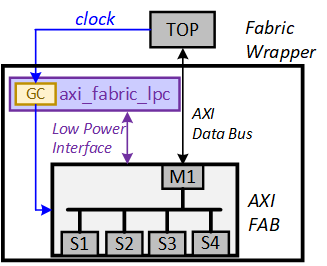

Low Power
=========

SG2042 implements dynamic and static clock gating for power saving.

This page is mainly for dynamic clock gating.

Fabric Auto Clock Gating
----------------------------

SG2042 uses the Low Power Controller (LPC) to dynamically clock gate Fabric Components:

- The Clock originally assigned to the Fabric and its downstream Register Slice passes through the clock-gate logic in the LPC first. Registers can be configured to bypass these clocks without performing any operation.

- LPC can send low-power requests to the Fabric through LPI (Low Power Interface) after N cycles are not transmitted on the Fabric bus (N is register configurable). If the Fabric responds to the request, The LPC will gate the clock.

- Once there is an upstream transmission (LPC finds awvalid, arvalid pulls up), LPC will open the clock.

        Fabric Auto Clock Gating 

Low Power Interface Signals
------------------------------

.. table:: low power inferface signals
         
   +----------+-------------------+----------------------------------------------------------------------------+
   | Signal   | Source            | Description                                                                |
   +==========+===================+============================================================================+
   | CSYSREQ  | Clock controller  | Low power requirements of the system. This signal is a request from the    |
   |          |                   | system clock controller to enter a low power state.                        |
   +----------+-------------------+----------------------------------------------------------------------------+ 
   | CSYSACK  | Peripheral device | Confirm the low power requirements. The signal is a low power request from |
   |          |                   | the peripheral confirming the system.                                      |
   +----------+-------------------+----------------------------------------------------------------------------+
   | CACTIVE  | Peripheral device | The clock works. This signal indicates that the peripheral needs its clock |
   |          |                   | signal:1=Need a peripheral clock 0=No peripheral clock required            |
   +----------+-------------------+----------------------------------------------------------------------------+

Address of LPC Registers
----------------------------

All registers that control clock gate are in sys ctrl:

Among them:

All LPCS are divided into two different domains, and all interfaces in the domain are controlled by a corresponding register.For example, a register in the top clk domain controls all the LPC interfaces in the top clk domain.

.. table:: related lpc

  +----------------------+-------------------------------------------------+
  | Clock Domain         | Related LPC                                     | 
  +======================+=================================================+ 
  | top clk domain       | Fab_lpc7                                        | 
  |                      |                                                 |
  |                      | Fab_lpc8                                        |
  |                      |                                                 |   
  |                      | Fab_lpc9                                        |
  |                      |                                                 |
  |                      | Fab_lpc10                                       |
  |                      |                                                 |
  |                      | Fab_lpc11                                       |
  |                      |                                                 |  
  |                      | Fab_lpc12                                       |
  |                      |                                                 |
  |                      | Fab_lpc13                                       | 
  |                      |                                                 |
  |                      | Fab_lpc14                                       |
  |                      |                                                 |
  |                      | Fab_lpc15                                       |
  +----------------------+-------------------------------------------------+
  | hsperi clk domain    | Fab_lpc1                                        |
  |                      |                                                 |
  |                      | Fab_lpc2                                        |
  |                      |                                                 |
  |                      | Fab_lpc3                                        |
  |                      |                                                 |
  |                      | Fab_lpc4                                        |
  |                      |                                                 |
  |                      | Fab_lpc5                                        |
  |                      |                                                 |
  |                      | Fab_lpc6                                        |
  |                      |                                                 |
  |                      | Fab_lpc16                                       | 
  |                      |                                                 | 
  |                      | Fab_lpc17                                       |
  |                      |                                                 |
  +----------------------+-------------------------------------------------+

.. table:: address of lpc registers

  +--------------------------+-----------------------------------------------+
  | Register                 | Address                                       |
  +==========================+===============================================+ 
  | top_fab_gate_enable	     | address=0x7030010000+0x20:[bit 0]             |
  +--------------------------+-----------------------------------------------+ 
  | hsperi_fab_gate_enable   | address=0x7030010000+0x20:[bit 1]             |
  +--------------------------+-----------------------------------------------+ 
  | top_fab_gate_cnt_cycle   | address=0x7030010000+0x24:[bit:(07:00)]       |
  +--------------------------+-----------------------------------------------+
  | hsperi_fab_gate_cnt_cycle| address=0x7030010000+0x24:[bit:(15:08)]       |
  +--------------------------+-----------------------------------------------+
  | Note: LPC control of AP is not supported                                 |
  +--------------------------+-----------------------------------------------+

Program Guide
------------------

- set the value in top/hsperi/ap_fab_gate_cnt_cycle register 

- set the auto enable of the reg_auto_gate_ena register

- if the bus have no data to transfer,and after the cnt cycle , the fabric will be gate. if the bus is transferring data , the LPC wait the idle of the bus and gate

