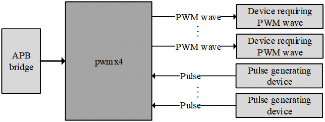
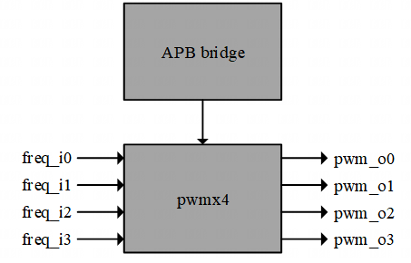
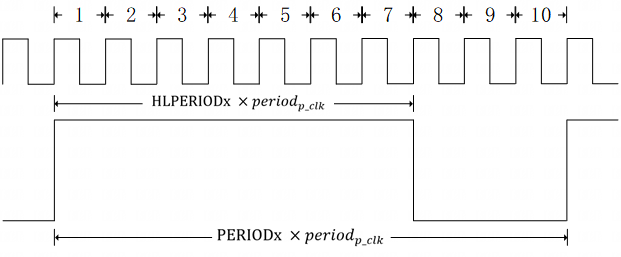
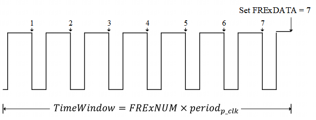
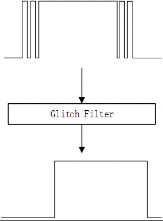
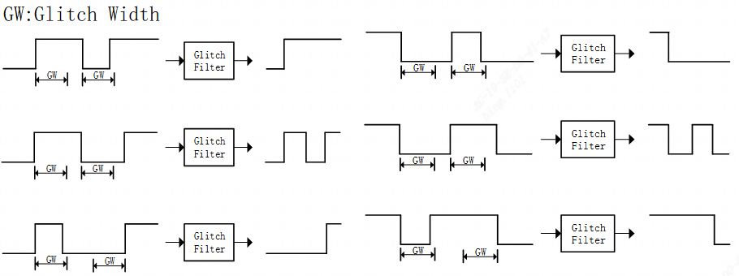
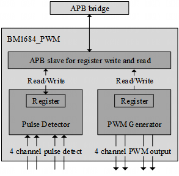
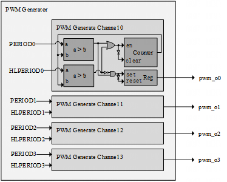
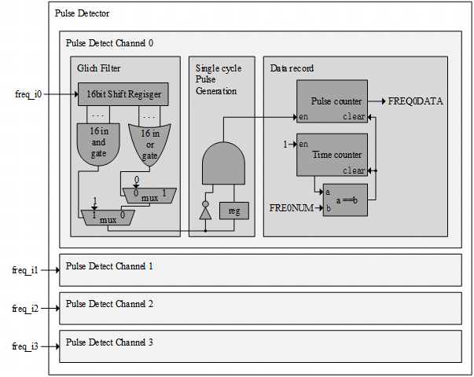
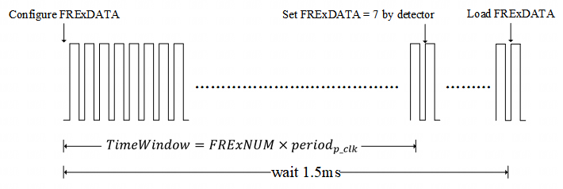

PWM and Fan
===========

Overview
---------

The pwmx4 contains two functions:

- Generate PWM waveforms.

- Detect the number of pulses over a period of time.

Figure 1 provides the overview of pwmx4. All control of the pwmx4 is performed via the APB interface.

        pwmx4 Overview

Features and Parameters
^^^^^^^^^^^^^^^^^^^^^^^

The pwmx4 provides the following features:

- 4 PWM wave output channel.

- 4 Pulse detect channel.

- Ability to filter glitch that may be included in the pulse.

- All configurations and results are read and written via the APB interface.

Terms and Abbreviations
^^^^^^^^^^^^^^^^^^^^^^^

PWM    Pulse-width modulation

Top Interface
-------------

Interface Signal Description
^^^^^^^^^^^^^^^^^^^^^^^^^^^^

Figure 2 illustrates the top connection of the module.

        Connection Overview

The detailed signals and their description are shown in Table 1.

.. table:: Top Interface

   +--------------+-----+--------------+-------------------------------------------------------------------+
   | Name         | I/O | Connection   | Description                                                       |
   +==============+=====+==============+===================================================================+
   | APB Signal                                                                                            |
   +--------------+-----+--------------+-------------------------------------------------------------------+
   | p_clk        | I	| APB bridge   | Clock from APB bridge. The only clock source of this module.      |
   +--------------+-----+--------------+-------------------------------------------------------------------+
   | p_resetn     | I	| APB bridge   | Async reset (active low) from APB bridge. The only reset source of|
   |              |     |              +                                                                   +
   |              |     |              | this module                                                       |
   +--------------+-----+--------------+-------------------------------------------------------------------+
   | p_enable	  | I   | APB bridge   | APB enable signal.                                                |
   +--------------+-----+--------------+-------------------------------------------------------------------+
   | p_write	  | I	| APB bridge   | APB write signal.                                                 |
   +--------------+-----+--------------+-------------------------------------------------------------------+
   | p_sel        | I   | APB bridge   | APB sel signal.                                                   |
   +--------------+-----+--------------+-------------------------------------------------------------------+
   | p_addr[5:0]  | I	| APB bridge   | APB address signal. Connected to the lower 6 bits of the APB      |
   |              |     |              +                                                                   +
   |              |     |              | address bus. The lowest 2 bits are not used.                      |
   +--------------+-----+--------------+-------------------------------------------------------------------+
   | p_wdata[31:0]| I	| APB bridge   | APB write data signal.                                            |
   +--------------+-----+--------------+-------------------------------------------------------------------+
   | p_rdata[31:0]| O	| APB bridge   | APB read data signal.                                             |
   +--------------+-----+--------------+-------------------------------------------------------------------+
   | Output Signal                                                                                         |
   +--------------+-----+--------------+-------------------------------------------------------------------+
   | pwm_o0	  | O	| PWM receiver | PWM channel 0 output.                                             |
   +--------------+-----+--------------+-------------------------------------------------------------------+
   | pwm_o1       | O 	| PWM receiver | PWM channel 1 output.                                             |
   +--------------+-----+--------------+-------------------------------------------------------------------+
   | pwm_o2	  | O	| PWM receiver | PWM channel 2 output.                                             |
   +--------------+-----+--------------+-------------------------------------------------------------------+
   | pwm_o3	  | O	| PWM receiver | PWM channel 3 output.                                             |
   +--------------+-----+--------------+-------------------------------------------------------------------+
   | Input Signal                                                                                          |
   +--------------+-----+--------------+-------------------------------------------------------------------+
   | freq_i0      | I	| Pulse source | Pulse detect channel 0 input.                                     |
   +--------------+-----+--------------+-------------------------------------------------------------------+
   | freq_i1      | I	| Pulse source | Pulse detect channel 1 input.                                     |
   +--------------+-----+--------------+-------------------------------------------------------------------+
   | freq_i2	  | I	| Pulse source | Pulse detect channel 2 input.                                     |
   +--------------+-----+--------------+-------------------------------------------------------------------+
   | freq_i3	  | I	| Pulse source | Pulse detect channel 3 input.                                     |
   +--------------+-----+--------------+-------------------------------------------------------------------+

Integration Requirement
-----------------------

Synchronization of clock and reset
^^^^^^^^^^^^^^^^^^^^^^^^^^^^^^^^^^

p_clk is the only clock signal for this module.

p_resetn is the only reset signal for this module. There is no synchronization of reset_n inside the module. Therefore, p_resetn needs to be synchronized outside the module with p_clk.

Function Description
--------------------

The pwmx4 contains two functions:

- Generate PWM waveforms.

- Detect the number of pulses over a period of time.

PWM generation
^^^^^^^^^^^^^^

The generation of PWM waves is controlled by two registers, PERIODx and HLPERIODx. Where x can be 0, 1, 2, 3, corresponding to 4 PWM channels. Figure 3 shows how registers PERIODx and HLPERIODx affect the PWM waveform.

        The effect of registers on PWM waves

Period of PWM
"""""""""""""

The period of the output PWM wave is

.. math::

     \ period_{PWM} = PERIODx \times period_{p\_clk}

The range of PERIODx is 3 to 4294967295.

**Attention:** The register PERIODx can be written to all values in the range of 0 to 4294967295, but only the above range is legal. Exceeding this range may result in no output waveform or output waveform frequency error.

Duty Cycle of PWM
"""""""""""""""""

The duty cycle of the PWM wave is

.. math::

     \ DutyCycle= \dfrac{HLPERIODx}{PERIODx}

The range of HLPERIODx is 2 to 4294967295.

**Attention:** The register HLPERIODx can be written to all values in the range of 0 to 4294967295 and must be smaller than the corresponding PERIODx, but only the above range is legal. Exceeding this range may result in no output waveform or output waveform frequency error.

Pulse detection
---------------

The time of each pulse detection is controlled by the register FRExNUM, and the result is written to the FRExDATA register after each detection count is completed. The pulse detection circuit will always work cyclically.Figure 4 shows how FRExNUM affects the pulse detection time and how FRExDATA records the detection count results. Where x can be 0, 1, 2, 3, corresponding to 4 pulse detection channels.

The signal is passed through Glitch Filter to eliminate glitch before it is detected and counted.

        The effect of registers on Pulse Detection

Time Window
^^^^^^^^^^^
The time window width of one pulse detection is

.. math::

     \ TimeWindow = FRExNUM \times period_{p\_clk}

The range of FRExNUM is 1 to 4294967295.

Attention: The register FRExNUM cannot be set to 0, otherwise the FRExDATA value will always be 0. But this does not mean that the circuit stops working, the circuit will continue to work and the power consumption will not decrease.

Glitch Filter
^^^^^^^^^^^^^

Pulse Detection Filters the input signal using the Glitch filter before counting the pulses. Figure 5 shows the role of Glitch Filter.

        The role of Glitch Filter

Any pulse narrower than GlitchWidth is defined as a glitch.Where

.. math::

     \ GlitchWidth = 16 \times period_{p\_clk}

The Glitch filter considers all pulses with a width greater than or equal to Glitchwidth to be valid, and the rest are glitch. And the glitch in the input signal will be removed and output.

Figure 6 shows how the glitch filter works according to GlitchWidth.

        The operation of the glitch filter on the rising and falling edge of the pulse

**Attention 1:** The width of the pulse must be greater than GlitchWidth to pass the glitch filter and be detected and counted.

**Attention 2:** A glitch with a width greater than GlitchWidth cannot be removed.

Internal Blocks
---------------

Partition Overview
^^^^^^^^^^^^^^^^^^

The pwmx4 contains three modules internally, of which PWM Generator and Pulse Detector implement PWM waveform generation and pulse detection respectively. APB slave is used to read and write the internal registers of the other two modules. The implementation of the APB slave will be omitted below.

Figure 7 shows the internal parathion of pwmx4:

        The microarchitecture of pwmx4

PWM Generator Module
^^^^^^^^^^^^^^^^^^^^

The PWM Generator provides 4 channels of PWM waveform output with frequency and duty cycle controlled by registers PERIODx and HLPERIODx. Where x can be 0, 1, 2, 3, corresponding to 4 channels. Figure 8 shows the microarchitecture of the PWM generator.

        The microarchitecture of the PWM generator

Pulse Detector Module
^^^^^^^^^^^^^^^^^^^^^

The Pulse Detector provides 4 channels of pulse detection input. The time window length of one test is configured by FREQxNUM, and the count result is automatically loaded into FREQxDATA. Where x can be 0, 1, 2, 3, corresponding to 4 channels.

The signal of each input pulse detection channel will enter the glitch filter first. The behavior of the glitch filter is detailed in the function description. This filter is based on a 16-bit shift register.

The signal processed by the glitch filter is converted to a single p_clk clock cycle pulse using a single-cycle pulse generator. This single-cycle pulse signal is used to enable the counter to complete the counting of the pulses.

When a frequently enabled counter is used for pulse detection, the detection result will be written to FREQxDATA when it reaches the time window length.

Figure 9 shows the microarchitecture of the pulse detector.

        The microarchitecture of the pulse detector

Register Definition
-------------------

Memory Mapped Registers Summary
^^^^^^^^^^^^^^^^^^^^^^^^^^^^^^^

.. table:: Memory Mapped Registers Summary

     =======    =============   ============    =========
     Offset     Register Name   Default         Attribute
     =======    =============   ============    =========
     0x0000	HLPERIOD0	32’h00000000	RW
     0x0004	PERIOD0	        32’h00000000	RW
     0x0008	HLPERIOD1	32’h00000000	RW
     0x000C	PERIOD1	        32’h00000000	RW
     0x0010	HLPERIOD2	32’h00000000	RW
     0x0014	PERIOD2	        32’h00000000	RW
     0x0018	HLPERIOD3	32’h00000000	RW
     0x001C	PERIOD3	        32’h00000000	RW
     0x0020	FREQ0NUM	32’h00000000	RW
     0x0024	FERQ0DATA	32’h00000000	RO
     0x0028	FREQ1NUM	32’h00000000	RW
     0x002C	FERQ1DATA	32’h00000000	RO
     0x0030	FREQ2NUM	32’h00000000	RW
     0x0034	FERQ2DATA	32’h00000000	RO
     0x0038	FREQ3NUM	32’h00000000	RW
     0x003C	FERQ3DATA	32’h00000000	RO
     =======    =============   ============    =========

Register Description
^^^^^^^^^^^^^^^^^^^^

HLPERIOD0(0x0000)
"""""""""""""""""

.. table:: HLPERIOD0(0x0000)

     +-----+----------+--------------+----------------------------------------------------------------------------+
     | Bit | Attribute| Default      | Description                                                                |
     +=====+==========+==============+============================================================================+
     | 31:0| RW       | 32’h00000000 | The time that the PWM wave inchannel 0 remains high for one cycle. The     |
     |     |          |              +                                                                            +
     |     |          |              | actual duration is p_clk clock period multiplied by this register value.   |
     +-----+----------+--------------+----------------------------------------------------------------------------+

PERIOD0(0x0004)
"""""""""""""""

.. table:: PERIOD0(0x0004)

     +-----+----------+-------------+-------------------------------------------------------------------+
     | Bit | Attribute| Default     | Description                                                       |
     +=====+==========+=============+===================================================================+
     | 31:0| RW       | 32’h00000000| The PWM wave period of channel 0 based on p_clk. The actual period|
     |     |          |             +                                                                   +
     |     |          |             | is the p_clk period multiplied by this register value.            |
     +-----+----------+-------------+-------------------------------------------------------------------+

HLPERIOD1(0x0008)
"""""""""""""""""

.. table:: HLPERIOD1(0x0008)

     +-----+----------+--------------+------------------------------------------------------------------------+
     | Bit | Attribute| Default      | Description                                                            |
     +=====+==========+==============+========================================================================+
     | 31:0| RW       | 32’h00000000 | The time that the PWM wave in channel 1 remains high for one cycle.The |
     |     |          |              +                                                                        +
     |     |          |              | actual duration is p_clk clock period multiplied by this register value|
     +-----+----------+--------------+------------------------------------------------------------------------+

PERIOD1(0x000C)
"""""""""""""""

.. table:: PERIOD1(0x000C)

     +-----+----------+--------------+------------------------------------------------------------------------+
     | Bit | Attribute| Default      | Description                                                            |
     +=====+==========+==============+========================================================================+
     | 31:0| RW       | 32’h00000000 | The PWM wave period of channel 1 based on p_clk. The actual            |
     |     |          |              +                                                                        +
     |     |          |              | period is the p_clk period multiplied by this register value.          |
     +-----+----------+--------------+------------------------------------------------------------------------+

HLPERIOD2(0x0010)
"""""""""""""""""

.. table:: HLPERIOD2(0x0010)

     +-----+----------+--------------+------------------------------------------------------------------------+
     | Bit | Attribute| Default      | Description                                                            |
     +=====+==========+==============+========================================================================+
     | 31:0| RW       | 32’h00000000 | The time that the PWM wave in channel 2 remains high for one cycle.The |
     |     |          |              +                                                                        +
     |     |          |              | actual duration is p_clk clock period multiplied by this register value|
     +-----+----------+--------------+------------------------------------------------------------------------+

PERIOD2(0x0014)
"""""""""""""""

.. table:: PERIOD2(0x0014)

     +-----+----------+--------------+------------------------------------------------------------------------+
     | Bit | Attribute| Default      | Description                                                            |
     +=====+==========+==============+========================================================================+
     | 31:0| RW       | 32’h00000000 | The PWM wave period of channel 2 based on p_clk. The actual            |
     |     |          |              +                                                                        +
     |     |          |              | period is the p_clk period multiplied by this register value.          |
     +-----+----------+--------------+------------------------------------------------------------------------+

HLPERIOD3(0x0018)
"""""""""""""""""

.. table:: HLPERIOD3(0x0018)

     +-----+----------+--------------+------------------------------------------------------------------------+
     | Bit | Attribute| Default      | Description                                                            |
     +=====+==========+==============+========================================================================+
     | 31:0| RW       | 32’h00000000 | The PWM wave period of channel 2 based on p_clk. The actual            |
     |     |          |              +                                                                        +
     |     |          |              | period is the p_clk period multiplied by this register value.          |
     +-----+----------+--------------+------------------------------------------------------------------------+

PERIOD3(0x001C)
"""""""""""""""

.. table:: PERIOD3(0x001C)

     +-----+----------+--------------+------------------------------------------------------------------------+
     | Bit | Attribute| Default      | Description                                                            |
     +=====+==========+==============+========================================================================+
     | 31:0| RW       | 32’h00000000 | The PWM wave period of channel 3 based on p_clk. The actual            |
     |     |          |              +                                                                        +
     |     |          |              | period is the p_clk period multiplied by this register value.          |
     +-----+----------+--------------+------------------------------------------------------------------------+

FREQ0NUM(0x0020)
""""""""""""""""

.. table:: FREQ0NUM(0x0020)

     +-----+----------+--------------+----------------------------------------------------------------------------+
     | Bit | Attribute| Default      | Description                                                                |
     +=====+==========+==============+============================================================================+
     | 31:0| RW       | 32’h00000000 | The length of time used for the pulse detection channel 0. The actual      |
     |     |          |              +                                                                            +
     |     |          |              | length of time is the value of this register multiplied by the p_clk period|
     +-----+----------+--------------+----------------------------------------------------------------------------+

FEQ0DATA(0x0024)
""""""""""""""""

.. table:: FEQ0DATA(0x0024)

     +-----+----------+--------------+------------------------------------------------------------------------+
     | Bit | Attribute| Default      | Description                                                            |
     +=====+==========+==============+========================================================================+
     | 31:0| RO       | 32’h00000000 | The number of pulses detected by pulse detection channel 0             |
     |     |          |              +                                                                        +
     |     |          |              | within the length of time defined by register FRE0NUM.                 |
     +-----+----------+--------------+------------------------------------------------------------------------+

FREQ1NUM(0x0028)
""""""""""""""""

.. table:: FREQ1NUM(0x0028)

     +-----+----------+--------------+----------------------------------------------------------------------------+
     | Bit | Attribute| Default      | Description                                                                |
     +=====+==========+==============+============================================================================+
     | 31:0| RW       | 32’h00000000 | The length of time used for the pulse detection channel 1. The actual      |
     |     |          |              +                                                                            +
     |     |          |              | length of time is the value of this register multiplied by the p_clk period|
     +-----+----------+--------------+----------------------------------------------------------------------------+

FEQ1DATA(0x002C)
""""""""""""""""

.. table:: FEQ1DATA(0x002C)

     +-----+----------+--------------+------------------------------------------------------------------------+
     | Bit | Attribute| Default      | Description                                                            |
     +=====+==========+==============+========================================================================+
     | 31:0| RO       | 32’h00000000 | The number of pulses detected by pulse detection channel 1             |
     |     |          |              +                                                                        +
     |     |          |              | within the length of time defined by register FRE1NUM.                 |
     +-----+----------+--------------+------------------------------------------------------------------------+

FREQ2NUM(0x0030)
""""""""""""""""

.. table:: FREQ2NUM(0x0030)

     +-----+----------+--------------+----------------------------------------------------------------------------+
     | Bit | Attribute| Default      | Description                                                                |
     +=====+==========+==============+============================================================================+
     | 31:0| RW       | 32’h00000000 | The length of time used for the pulse detection channel 2. The actual      |
     |     |          |              +                                                                            +
     |     |          |              | length of time is the value of this register multiplied by the p_clk period|
     +-----+----------+--------------+----------------------------------------------------------------------------+

FEQ2DATA(0x0034)
""""""""""""""""

.. table:: FEQ2DATA(0x0034)

     +-----+----------+--------------+------------------------------------------------------------------------+
     | Bit | Attribute| Default      | Description                                                            |
     +=====+==========+==============+========================================================================+
     | 31:0| RO       | 32’h00000000 | The number of pulses detected by pulse detection channel 1             |
     |     |          |              +                                                                        +
     |     |          |              | within the length of time defined by register FRE1NUM.                 |
     +-----+----------+--------------+------------------------------------------------------------------------+

FREQ3NUM(0x0038)
""""""""""""""""

.. table:: FREQ3NUM(0x0038)

     +-----+----------+--------------+----------------------------------------------------------------------------+
     | Bit | Attribute| Default      | Description                                                                |
     +=====+==========+==============+============================================================================+
     | 31:0| RW       | 32’h00000000 | The length of time used for the pulse detection channel 3. The actual      |
     |     |          |              +                                                                            +
     |     |          |              | length of time is the value of this register multiplied by the p_clk period|
     +-----+----------+--------------+----------------------------------------------------------------------------+

FEQ3DATA(0x003C)
""""""""""""""""

.. table:: FEQ3DATA(0x003C)

     +-----+----------+--------------+------------------------------------------------------------------------+
     | Bit | Attribute| Default      | Description                                                            |
     +=====+==========+==============+========================================================================+
     | 31:0| RO       | 32’h00000000 | The number of pulses detected by pulse detection channel 3             |
     |     |          |              +                                                                        +
     |     |          |              | within the length of time defined by register FRE3NUM.                 |
     +-----+----------+--------------+------------------------------------------------------------------------+

Software Program Guide
----------------------

The PWM generation and pulse detection functions are independent of each other. The following two sections will explain how to use these two functions.

PWM generation
^^^^^^^^^^^^^^

Reset State
"""""""""""
After reset, the output of the PWM channel is always high.

And the value of PERIODx is 0x00000000.

The value of HLPERIODx is 0x00000000.

Start PWM
"""""""""

The steps to start the PWM waveform output on one channel are as follows:

1.Configure PERIODx. The calculation formula for this value is given in Function Description.

2.Configure HLPERIODx. The calculation formula for this value is given in Function Description.
The PWM wave output does not stop until if is no other operation.

        The effect of registers on PWM waves

Pull High
"""""""""

The steps to stop the PWM wave output and pull the output high are as follows:

1.Configure PERIODx to 0x00000000.

2.Configure HLPERIODx to 0x00000000.

Pull Low
""""""""

The steps to stop the PWM wave output and pull the output low are as follows:

3.Configure HLPERIODx to 0x00000001.

4.Configure PERIODx to 0x00000000.

Example of starting PWM
"""""""""""""""""""""""

Assume that the current p_clk frequency is 100M, that is, its period is 10 ns.

The PWM wave frequency that needs to be output is 10M, that is, its period is 100ns.

The duty cycle required for the PWM wave is 70 percent.

The channel that needs to output the PWM wave is channel 0.

According to the formula given by the function description, you can get a PERIODx value of 10, and a HLPERIODx value of 7.

The steps to start the PWM wave on channel 0 are as follows:

1.Configure PERIODx to 0x0000000a.

2.Configure HLPERIODx to 0x00000007.

        An example of generating a PWM wave

Pulse detection
^^^^^^^^^^^^^^^

Reset State
"""""""""""

After reset, the value of FERQxNUM is 0x00000000.

The value of FREQxDATA is 0x00000000

Start pulse detection
"""""""""""""""""""""

The steps to start a pulse detection are as follows:

1.Configure FREQxNUM. The calculation formula for this value is given in Function Description.

2.Wait for a while until the test is completed at least once. This time must be long enough to ensure that at least one time window is run after the registers in the module are configured.

3.Reads the value in FREQxDATA, which is the number of pulses detected in a time window.
Pulse detection cannot be turned off. If you need to clear the value in FREQxDATA, you can set FREQxNUM to 0.

An example of starting pulse detection
""""""""""""""""""""""""""""""""""""""

Assume that the current p_clk frequency is 100M, that is, its period is 10 ns.

The time window width required for pulse detection is 1 ms.

Use channel 0 for pulse detection.

According to the formula given by the function description, the value of FREQ0NUM is 100000.

The steps to start a pulse detection are as follows:

1.Configure FREQ0NUM to 0x000186A0.

2.Wait for a while to ensure that the module runs for more than 1 ms after the register is written. For example, you can wait for 1.5ms under normal conditions.

3.Reads the value in FREQ0DATA.

Figure 12 shows the process of this example.

        An example of pulse detection

Known Issues and Future Work
----------------------------

TBD
