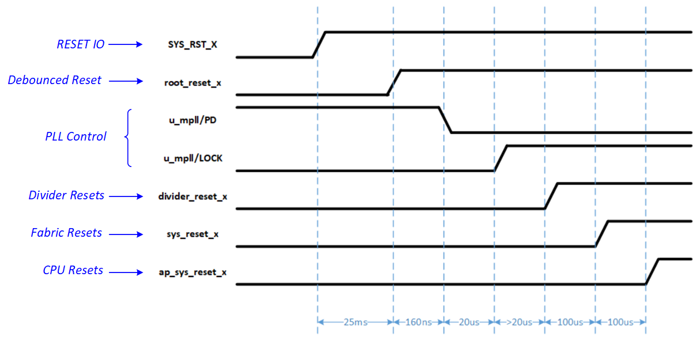
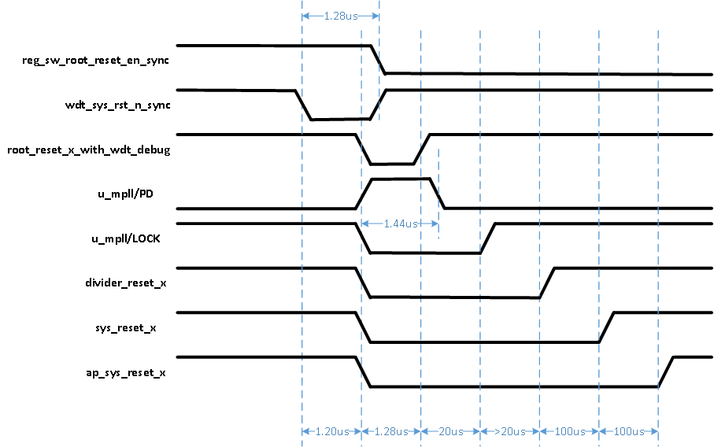

Reset
======

SG2042 Reset Overview and Sequence
-------------------------------------

SG2042 system reset is controlled by two chip IO: SYS_RST_X and PWR_BUTTON (reserved in SG2042, tie 1). These IOs all have schmitt trigger to improve the signal quality.

When SYS_RST_X is asserted (pull low), SG2042 will start the reset sequence as shown below.

External system reset is first debounced by slow clock for about 30ms to further avoid false reset caused by glitch on the signal input.

This 30ms also ensure the reference clock input of PLL goes stable after chip power on, which needs at least 1ms.

When the root reset release is released, the PLL will get out of power down mode and start to work.

Note that as we have BISR (built-in-self-repair) in SG2042, only after BISR operation finishes, will the chip continue following sequence.

Reset for clock divider, reset for the system and reset for the AP will be released one by one after all PLLs are locked .

        image2021

During chip runtime, multiple sources are able to trigger the global reset: watch dog reset and ARM warm reset.

These resets may assert PLL power down, reset for clock divider, reset for the system and reset for the AP/RP active. The whole chip will be reset under this condition, except tiny logic related to REFCLK, IO reset.

These software resets must be active for at least 1us before take effect to ensure PLL is reset correctly.

        wdt reset 

Soft Reset
-------------

Every module in SG2042 owns a dedicated soft reset control bit for software usage.The relevant register information is as follows.

The base address is listed in table :ref:`mmap_table`, RESET device.

.. table:: Software Reset Register 0 (0x00000000)

    =====   =========   =======     ===========
    Bits    Attribute   Default     Description
    =====   =========   =======     ===========
    31      RW          0x1         Software Reset for uart2 (Active Low) 
    30      RW          0x1         Software Reset for uart1 (Active Low) 
    29      RW          0x1         Software Reset for uart0 (Active Low) 
    28      RW          0x1         Software Reset for sd (Active Low) 
    27      RW          0x1         Software Reset for emmc (Active Low) 
    26      RW          0x1         Software Reset for eth0 (Active Low) 
    25      RW          0x1         Software Reset for lpc (Active Low) 
    24      RW          0x1         Software Reset for sf1 (Active Low) 
    23      RW          0x1         Software Reset for sf0 (Active Low) 
    22      RW          0x1         Software Reset for axi_sram1 (Active Low) 
    21      RW          0x1         Software Reset for axi_sram0 (Active Low) 
    20      RW          0x1         Software Reset for pwm (Active Low) 
    19      RW          0x1         Software Reset for gpio2 (Active Low) 
    18      RW          0x1         Software Reset for gpio1 (Active Low) 
    17      RW          0x1         Software Reset for gpio0 (Active Low) 
    16      RW          0x1         Software Reset for i2c3 (Active Low) 
    15      RW          0x1         Software Reset for i2c2 (Active Low) 
    14      RW          0x1         Software Reset for i2c1 (Active Low) 
    13      RW          0x1         Software Reset for i2c0 (Active Low) 
    12      RW          0x1         Software Reset for ahb_rom1 (Active Low) 
    11      RW          0x1         Software Reset for ahb_rom0 (Active Low) 
    10      RW          0x1         Software Reset for wdt (Active Low) 
    9       RW          0x1         Software Reset for timer (Active Low) 
    8       RW          0x1         Software Reset for rtc (Active Low) 
    7       RW          0x1         Software Reset for efuse1 (Active Low) 
    6       RW          0x1         Software Reset for efuse0 (Active Low) 
    5       RW          0x1         Software Reset for sysdma (Active Low) 
    4       RW          0x1         Software Reset for hsdma (Active Low) 
    3       RW          0x1         Software Reset for rp_sys cmn (Active Low) 
    2       RW          0x1         Software Reset for rp_sys low speed logic (Active Low) 
    1       RW          0x0         Software Reset for rp_sys cpu (Active Low) 
    0       RW          0x1         Software Reset for ap_sys (Active Low) 
    =====   =========   =======     =========== 

.. table:: Software Reset Register 1 (0x00000004)

    =====   =========   =======     =========== 
    Bits    Attribute   Default     Description
    =====   =========   =======     ===========
    31      RW          0x1         Software Reset for RXU (Active Low)
    30      RW          0x1         Software Reset for RXU (Active Low)
    29      RW          0x1         Software Reset for RXU (Active Low)
    28      RW          0x1         Software Reset for RXU (Active Low)
    27      RW          0x1         Software Reset for RXU (Active Low)
    26      RW          0x1         Software Reset for RXU (Active Low)
    25      RW          0x1         Software Reset for RXU (Active Low)
    24      RW          0x1         Software Reset for RXU (Active Low)
    23      RW          0x1         Software Reset for RXU (Active Low)
    22      RW          0x1         Software Reset for RXU (Active Low)
    21      RW          0x1         Software Reset for RXU (Active Low)
    20      RW          0x1         Software Reset for RXU (Active Low)
    19      RW          0x1         Software Reset for RXU (Active Low)
    18      RW          0x1         Software Reset for RXU (Active Low)
    17      RW          0x1         Software Reset for RXU (Active Low)
    16      RW          0x1         Software Reset for RXU (Active Low)
    15      RW          0x1         Software Reset for RXU (Active Low)
    14      RW          0x1         Software Reset for RXU (Active Low)
    13      RW          0x1         Software Reset for RXU (Active Low)
    12      RW          0x1         Software Reset for fau2 (Active Low)
    11      RW          0x1         Software Reset for fau1 (Active Low)
    10      RW          0x1         Software Reset for fau0 (Active Low)
    9       RW          0x1         Software Reset for ddr3 (Active Low)
    8       RW          0x1         Software Reset for ddr2 (Active Low)
    7       RW          0x1         Software Reset for ddr1 (Active Low)
    6       RW          0x1         Software Reset for ddr0 (Active Low)
    5       RW          0x1         Software Reset for pcie1 (Active Low)
    4       RW          0x1         Software Reset for pcie0 (Active Low)
    3       RW          0x1         Software Reset for dbg_i2c (Active Low)
    2       RW          0x1         Software Reset for spi1 (Active Low)
    1       RW          0x1         Software Reset for spi0 (Active Low)
    0       RW          0x1         Software Reset for uart3 (Active Low)
    =====   =========   =======     ===========
 
.. table:: Software Reset Register 2 (0x00000008) 
   
    =====   =========   =======     ===========
    Bits    Attribute   Default     Description
    =====   =========   =======     ===========
    31:13   RW          NA          Reserved
    12      RW          0x1         Software Reset for RXU (Active Low) 
    11      RW          0x1         Software Reset for RXU (Active Low) 
    10      RW          0x1         Software Reset for RXU (Active Low) 
    9       RW          0x1         Software Reset for RXU (Active Low) 
    8       RW          0x1         Software Reset for RXU (Active Low) 
    7       RW          0x1         Software Reset for RXU (Active Low) 
    6       RW          0x1         Software Reset for RXU (Active Low) 
    5       RW          0x1         Software Reset for RXU (Active Low) 
    4       RW          0x1         Software Reset for RXU (Active Low) 
    3       RW          0x1         Software Reset for RXU (Active Low) 
    2       RW          0x1         Software Reset for RXU (Active Low) 
    1       RW          0x1         Software Reset for RXU (Active Low) 
    0       RW          0x1         Software Reset for RXU (Active Low) 
    =====   =========   =======     =========== 

