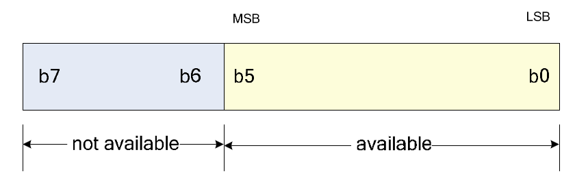
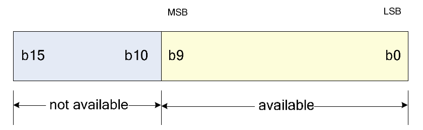

SPI Flash
=========

Register Definition
-------------------

.. table:: SPIFMC Register Summary

   =========  ========  ====================================  ===========  =====
   Offset     Name      Description                           Default      Width    
   =========  ========  ====================================  ===========  =====
   0x00~0x03  SPI_CTRL  SPI Control Register                  0x0008_C013  32bit
   0x04       CE_CTRL   CE Control Register                   0x00         8bit
   0x08~0x09  DLY_CTRL  Delay Control Register                0x0300       16bit
   0x0c       DMMR      DMMR Control Register                 0x01         8bit
   0x10~0x11  TRAN_CSR  Transfer Control and Status Register  0x3B00       16bit
   0x14~0x15  TRAN_NUM  Transfer Number Register              0x0000       16bit
   0x18~0x1b  FF_PORT   FIFO Port Register                    NA           32bit
   0x20       FF_PT     FIFO Pointer Register                 0x00         8bit
   0x28       INT_STS   Interrupt Status Register             0x00         8bit
   0x2c       INT_EN    Interrupt Enable Register             0x00         8bit
   =========  ========  ====================================  ===========  =====

SPI_CTRL,SPI Control(0x00~0x03)
^^^^^^^^^^^^^^^^^^^^^^^^^^^^^^^

default value:0x0008_C013

.. table:: SPI_CTRL

   =====  ========= =======  =================================
   Bit    Attribute Default  Description
   =====  ========= =======  =================================
   31:22  R(0)      10’b0    Reserved
   21     R(0)/W(1) 0        SRst: Soft Reset
   20     RW        0        LSBF: Least Significant Bit First
   19:16  RW        4’b1000  FrameLen
   15     RW        1        WpOL
   14     RW        1        HoldOL
   13     RW        0        CPOL
   12     RW        0        CPHA
   11     R(0)      0        Reserved
   10:0   RW        10’h13   SckDiv
   =====  ========= =======  =================================

SRst: Soft Reset
 
  Write 1 Resets each state machine and interrupt flag bit. If the system switches from SPI Flash boot, the controller switches from boot mode to common mode A soft reset should also be performed beforethe mode.
  
LSBF: Least Significant Bit First

  0: Frame MSB first
  
  1: Frame LSB first  

FrameLen: Frame Length

  FrameLen is the length of the sent and received frames (in bits). If FrameLen is 0, the frame length is 16 bits. Don't Supports frame length 1.

WpOL: WP Pin Output Level

  Output level value of WP pin.

HoldOL: HOLD Pin Output Level

  The output level of the HOLD pin.

CPOL: Clock Polarity

  0: The SCK is low when it is idle

  1: The SCK is high when it is idle

CPHA: Clock Phase

  0: SCK starts sampling data on the first clock edge after slice selection is valid

  1: After slice selection is valid, SCK starts sampling data along the second clock edge

  {CPOL, CPHA} consists of four operating modes of SPI, and its sequence diagram is shown in 5 SPI Mode

SckDiv:SPI Clock Divider

  SCK frequency = HCLK frequency / (2(SckDiv+ 1))

CE_CTRL,CE Control(0x04)
^^^^^^^^^^^^^^^^^^^^^^^^

default value: 0x00

.. table:: CE_CTRL

   =====  ========= =======  =================================
   Bit    Attribute Default  Description
   =====  ========= =======  =================================
   7:2    R(0)      0        Reserved
   1      RW        0        CEManualEn
   0      RW        0        CEManual
   =====  ========= =======  =================================

CEManualEn: CE Manual Enable

  0: The level of the CE pin is controlled by the hardware state machine

  1: The level of the CE pin is controlled by the CEManual register

CEManual:

  CEManual controls the level value of the CE pin. CEManual is only effective when CEManualEn is 1.

DLY_CTRL, Delay Control (0x08~0x09)
^^^^^^^^^^^^^^^^^^^^^^^^^^^^^^^^^^^

default value: 0x0300

.. table::  DLY_CTRL

   =====  ========= =======  =================================
   Bit    Attribute Default  Description
   =====  ========= =======  =================================
   15:12  R(0)      4’b0     Reserved
   11:8   RW        4’b0011  CET*
   7:4    R(0)      4’b0     Reserved
   3:0    RW        4’b0     FmIntvl
   =====  ========= =======  =================================
   
CET: CE Pre and Post Time

   CET controls how long the CE remains in force with respect to the first clock edge of SCK before atransmission begins and how long it remains in force with respect to the last clock edge of SCK afterthe transmission ends. This time is calculated as T = TSCK * (CET+1)

FmIntvl: Frame Interval

  FmIntvl controls the frame spacing of two adjacent frames of data: T = TSCK * FmIntvl (no SCK pulsewithin the frame spacing). When FmIntvl is 0, there is no frame spacing.
  
DMMR, Direct Memory Mapping Read (0x0C)
^^^^^^^^^^^^^^^^^^^^^^^^^^^^^^^^^^^^^^^

default value: 0x01

.. table:: DMMR

   =====  ========= =======  =================================
   Bit    Attribute Default  Description
   =====  ========= =======  =================================
   7:1    R(0)      7’b0     Reserved
   0      RW        1        DMMR
   =====  ========= =======  ================================= 

When the DMMR bit is 1, the read address on the AHB is mapped directly to the SPI Flash, and the controller automatically reads data from the SPI Flash address without software setting related commands and addresses. In this case, the SPI Flash can be used as ROM.

attention:

  1. When DMMR is 1, registers in IP can be written but not read;

  2. Before entering the DMMR mode, the software must be correctly configured with BusWidth, FastMode, CntnsRead and AddrBN registers.

TRAN_CSR,Transfer Control and Status Register (0x10~0x11)
^^^^^^^^^^^^^^^^^^^^^^^^^^^^^^^^^^^^^^^^^^^^^^^^^^^^^^^^^

default value: 0x3B00

.. table:: TRAN_CSR

   =====  ========= =======  =================================
   Bit    Attribute Default  Description
   =====  ========= =======  =================================
   15     R/W(1)    0        GoBusy
   14     R(0)      0        Reserved
   13:12  RW        11       FFTrgLvl
   11     RW        1        WithCmd
   10:8   RW        011      AddrBN
   7      RW        0        MISOLevel
   6      RW        0        DmaEn
   5:4    RW        0        BusWidth
   3      R(0)      0        FastMode
   2      RW        0        CntnsRead
   1:0    RW        0        TranMode
   =====  ========= =======  ================================= 

MISOLevel: MISO Pin Level

  MISOLevel is the level value of the miso i pin

GoBusy:

  Writing 0 to this bit does not work. Writing 1 to this position 1 starts a transmission. After the transmission ends, this bit is automatically cleared to zero. Before initiating a new transfer, the software should query the register, and a new transfer can be initiated only when the register is 0.

DmaEn: Transmit DMA Enable

  0: DMA Disable
  
  1: DMA Enable
 
  When TranMode is set to 11, the sending and receiving process is carried out at the same time, and DMA transmission is not supported. Therefore, DmaEn must be set to 0.

FFTrgLvl: FIFO Trigger Level

  FFTrgLvl controls the conditions under which the FIFO generates interrupts and DMA requests.

  00: 1 Byte
  
  01: 2 Bytes
  
  10: 4 Bytes
  
  11: 8 Bytes
  
  For Transmit, when the number of free Byte in FIFO is greater than or equal to the number of Byte defined by FFTrgLvl, interrupt and DMA request are generated;

  For Receive, an interrupt and DMA request are generated when the number of valid bytes in the FIFO is greater than or equal to the number of bytes defined by FFTrgLvl. 

WithCmd: With Command

  0: The current transmission does not carry commands

  1: indicates the current transport tape command

AddrBN: Address Byte Number

  Indicates the number of bytes (including dummy byte and mode byte) of the current Flash transport address field. 0 indicates that there is no address field.

BusWidth: Bus Width

  00: 1 bit bus
  
  01: 2 bit bus
  
  10: 4 bit bus
  
  11: Reserved

FastMode:

  0: Normal Mode
  
  1: Fast Mode  

CntnsRead: Continuous Read

  If this bit is 1, the hardware will send 0xa0 as the mode bit after the address to achieve Continuous Read, or 00 as the mode bit (see 8.1BBh and EBh command timing). Note: This bit is only valid if the DMMR is 1.

TranMode: Transfer Mode

  00: No Tx, No Rx
  
  01: Rx only
  
  10: Tx only 11: Tx and Rx

  TranMode Indicates the sending and receiving mode for transmitting data except commands and addresses.

  Since the same FIFO is used for sending and receiving, the amount of data sent when TranMode is 11 cannot exceed the FIFO capacity (8 bytes). The software should first write all the data to be sent into the FIFO and configure TRAN_NUM, and then start the transmission. Software can no longer access FIFO until TranDoneInt is generated; After the TranDoneInt is generated, the FIFO will store TRAN_NUM received data.

TRAN_NUM, Transfer Number (0x14~0x15)
^^^^^^^^^^^^^^^^^^^^^^^^^^^^^^^^^^^^^

default value: 0x0000

.. table:: TRAN_NUM

   =====  ========= =======  =================================
   Bit    Attribute Default  Description
   =====  ========= =======  =================================
   15:0   R/W       0        TRAN_NUM
   =====  ========= =======  =================================

TRAN_NUM Indicates the number of frames (excluding commands and addresses) sent and received in a transmission. Frames are set in SPI_CTRL.

If TRAN_NUM is 0, it indicates 65536 frames. This register is invalid when TranMode is 00.

FF_PORT, FIFO Port (0x18~0x1b)
^^^^^^^^^^^^^^^^^^^^^^^^^^^^^^

default value: NA

.. table:: FF_PORT

   =====  ========= =======  =================================
   Bit    Attribute Default  Description
   =====  ========= =======  =================================
   31:0   RW        XXXX     FF_PORT
   =====  ========= =======  =================================

Writing the register base address can write data to the FIFO, reading the register base address can read data from the FIFO. Note: Only the base address of the register can be read or written.   

For sending frames:

.. table::

   +------------------------+-------------------------+-------------------------+------------------------+
   |                        | 32-bit write            | 16-bit write            | 8-bit write            |
   +========================+=========================+=========================+========================+
   | Frame length less than | Write 4 frames at a time| Write 2 frames at a time| Write 1 frame at a time|
   |                        |                         |                         |                        |
   | or equalto 8 (occupies | (lower frames are       | (lower frames are       |                        |
   |                        |                         |                         |                        |
   | one byte of FIFO space)| sent first)             | sent first)             |                        |
   +------------------------+-------------------------+-------------------------+------------------------+
   | Frame size of 8 (takes | Write 2 frames at a time| Write 1 frame at a time | Write a frame twice,   |
   |                        |                         |                         |                        |
   | up two bytes of FIFO   | (lower frames are       |                         | first write the lower 8|
   |                        |                         |                         |                        |
   | space)                 | sent first)             |                         | bits of the frame,then |
   |                        |                         |                         |                        | 
   |                        |                         |                         | write the higher frame |
   +------------------------+-------------------------+-------------------------+------------------------+
 
For receiving frames:

.. table:: 

   +------------------------+-------------------------+-------------------------+------------------------+
   |                        | 32-bit read             | 16-bit read             | 8-bit read             |
   +========================+=========================+=========================+========================+
   | Frame length less than | Read 4 frames at a time | Read 2 frames at a time | Read 1 frame at a time |
   |                        |                         |                         |                        |
   | or equalto 8 (occupies | (the lower frame is the | (the lower frame is the |                        |
   |                        |                         |                         |                        |
   | one byte of FIFO space)| first frame received)   | first frame received)   |                        |
   +------------------------+-------------------------+-------------------------+------------------------+
   | Frame size of 8 (takes | Read 2 frames at a time | Read 1 frame at a time  | Read a frame twice.    |
   |                        |                         |                         |                        |
   | up two bytes of FIFO   | (the lower frame is the |                         | first read the lower 8 |
   |                        |                         |                         |                        |
   | space)                 | first frame received)   |                         | bits of the frame,then |
   |                        |                         |                         |                        |
   |                        |                         |                         | write the higher frame |
   +------------------------+-------------------------+-------------------------+------------------------+
  
The data storage format is shown in :ref:`fmlen6` and :ref:`fmlen10`, taking the frame length of 6 and 10 as examples respectively.

.. _fmlen6:

        FmLen = 6, 1 byte per frame

.. _fmlen10:

        FmLen = 10, 2 bytes per frame

Issues with FF_PORT's data receiving and sending of low-order frames first:

When writing data to the FF_PORT register, the lower frame is the first frame received. For example, when writing 8-bit cmd and 24-bit address addr[23:0] to FF_PORT, The correct format for writing to the FF_PORT register is {addr[7:0],addr[15:8], addr[23:16], cmd[7:0]}, so that data is read and written to addr[23:0] of the SPI Flash.

If SPIFMC is used to read and write the SPI Flash, the written 32bit data[31:0] can be directly written into the FF_PORT. At this time, the data written into the SPI Flash is received first because the lower FIFO frame. The actual data is {data[7:0], data[15:8], data[23:16],data[31:24]}, but when the data is read by SPIFMC, the lower frame of the FF_PORT data is sent first, and the read data is the correct data[31:0].

If the data written to the SPI Flash needs to be read using a method other than SPIFMC, it should be written to the FF_PORT register {data[7:0], data[15:8], data[23:16], data[31:24]}, The actual data stored in the SPI Flash is data[31:0].

FF_PT, FIFO Pointer (0x20)
^^^^^^^^^^^^^^^^^^^^^^^^^^

default value: 0x00

.. table:: FF_PT

   =====  ========= =======  =================================
   Bit    Attribute Default  Description
   =====  ========= =======  =================================
   7:4    R(0)      0        Reserved
   3:0    RW        0        FF_PT
   =====  ========= =======  =================================

Read the register to get the number of valid data bytes in the FIFO, write the register to flush the FIFO.

INT_STS, Interrupt Status (0x28)
^^^^^^^^^^^^^^^^^^^^^^^^^^^^^^^^

default value: 0x00

.. table:: INT_STS

   =====  ========= =======  =================================
   Bit    Attribute Default  Description
   =====  ========= =======  =================================
   7:6    R(0)      00       Reserved
   5      R/W(0)    0        TxFrameInt
   4      R/W(0)    0        RxFrameInt
   3      R/W(0)    0        WrFFInt
   2      R/W(0)    0        RdFFInt
   1      R(0)      0        Reserved
   0      R/W(0)    0        TranDoneInt*
   =====  ========= =======  =================================

If the CPU writes 0 bits to the Reserved bit, the corresponding bit is cleared and 1 bits are ignored.

TxFrameInt:

  This interrupt is generated once for each successful frame of data sent.

RxFrameInt:

  This interrupt is generated once for each successfully received frame of data.

WrFFInt: Write FIFO Interrupt

  The CPU writes frame data to the FIFO after receiving this interrupt.

RdFFInt: Read FIFO Interrupt

  The CPU reads frame data from the FIFO after receiving this interrupt.

TranDoneInt:Transfer Done Interrupt
   
  The interrupt marks the completion of a transfer.

INT_EN, Interrupt Enable (0x2c) 
^^^^^^^^^^^^^^^^^^^^^^^^^^^^^^^

default value: 0x00

.. table:: INT_EN
   
   =====  ========= =======  =================================
   Bit    Attribute Default  Description
   =====  ========= =======  =================================
   7:6    R(0)      00       Reserved
   5      R/W       0        TxFrameIntEn
   4      R/W       0        RxFrameIntEn
   3      R/W       0        WrFFIntEn
   2      R/W       0        RdFFIntEn
   1      R(0)      0        Reserved
   0      R/W       0        TranDoneIntEn*
   =====  ========= =======  =================================

1: indicates that the corresponding interrupt is enabled

0: disables the corresponding Interrupt. For details, see INT_STS, Interrupt Status (0x28).
