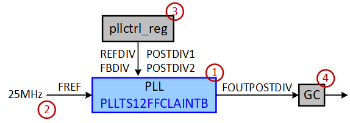
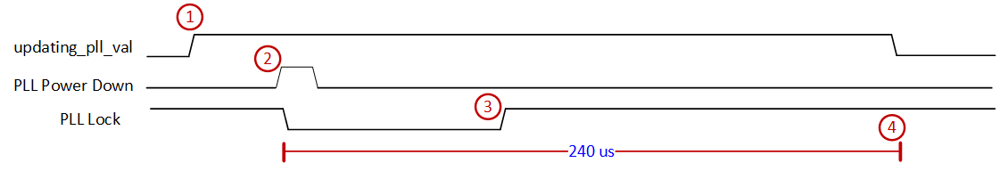
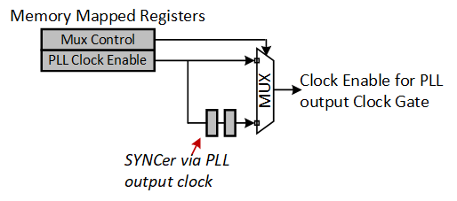
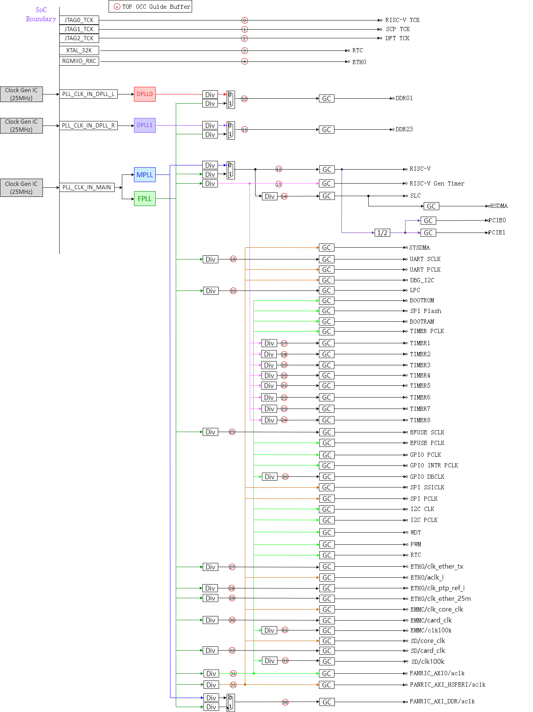

Clock
=======

Clock sources
-------------

Three 25MHz clock generation chips are required to provide reference clocks for
SG2042.

Clock gen chips are the only option for reference clock input and they should be
connected to PLL_CLK_IN_MAIN, PLL_CLK_IN_DPLL_L and PLL_CLK_IN_DPLL_R.

..
        PLL_CLK_IN_MAIN, PLL_CLK_IN_DPLL_L and PLL_CLK_IN_DPLL_R
        may listed in analog pins

External clock sources are listed in table :ref:`clock_source`

.. _clock_source:
.. table:: External clock sources
 
    +-------------------+-----------+------------------------------------------+
    | Clock Name        | Frequency | Description                              |
    +===================+===========+==========================================+
    | PLL_CLK_IN_MAIN   | 25MHz     | Main clock                               |
    +-------------------+-----------+------------------------------------------+
    | PLL_CLK_IN_DPLL_L | 25MHz     | DDR0 and DDR1                            |
    +-------------------+-----------+------------------------------------------+
    | PLL_CLK_IN_DPLL_R | 25MHz     | DDR2 and DDR3                            |
    +-------------------+-----------+------------------------------------------+
    | PCIE0_REFCLK_M    | 100MHz    | PCIe0 reference clock                    |
    +-------------------+-----------+------------------------------------------+
    | PCIE0_REFCLK_P    | 100MHz    | PCIe0 reference clock                    |
    +-------------------+-----------+------------------------------------------+
    | PCIE1_REFCLK_M    | 100MHz    | PCIe1 reference clock                    |
    +-------------------+-----------+------------------------------------------+
    | PCIE1_REFCLK_P    | 100MHz    | PCIe1 reference clock                    |
    +-------------------+-----------+------------------------------------------+

PLL
---

Different parts inside the chip works on different frequencies.
As there is no "one-size-fits-all" PLL, SG2042 instantiates 4 PLLs to satisfy
logic's clock requirements.

* MPLL: the name is short for Main PLL. The output clocks of this PLL are mainly used in RP subsystem and AP subsystem.
* FPLL: the name is shoft for Fixed PLL. This PLL generates fixed frequency clock, with output clock at 1.0 GHz. The output clocks of this PLL are mainly used in data and configuraiton bus.
* DPLL0/1: the name is short for DDR PLL. The output clocks of thes PLLs are mainly used in DDR subsystem.

And in order to reconfigure PLL clock frequency on the fly,
MPLL and DPLL0/1 use FPLL as a backup.

The micro architecture of a pll cell looks like figure :ref:`pll_micro_arch`

.. _pll_micro_arch:

        PLL micro architecture

The output clock frequency is influenced by:

* FREF: Reference Clock Input (10MHz to 800MHz). SG2042 uses 25MHz reference clock.
* FOUTPOSTDIV: Output Clock (16MHz to 3200MHz)
* REFDIV: Reference divide value (1 to 63)
* FBDIV: Feedback divide value (16 to 320)
* POSTDIV1: Post Divide 1 setting (1 to 7)
* POSTDIV2: Post Divide 2 setting (1 to 7)

The output clock frequency is calculated as:

.. math:: FOUTPOSTDIV = FREF * FBDIV / REFDIV / (POSTDIV1 * POSTDIV2)

For reference clock, it is used in reset sequence.
Only after certain reset sequence (1.5ms), PLL starts to work.

Software together with a dedicated hardware module are in charge of the
PLL control, especially the modification of PLL DIV values
(REFDIV, FBDIV, POSTDIV1, POSTDIV2).

After Power-On Reset, embedded hardware is able to select the proper initial
REFDIV, FBDIV, POSTDIV1 and POSTDIV2 values so that each PLL will generated
clocks with expected frequency based on current chip mode.

During runtime, user can alter PLL's output by progamming DIV values inside PLL
Control Registers.

Take DPLL0 configuration as an example:

#. Gate PLL output by clearing PLL Clock Enable Control Reg (0x70_300100C4) bit[4]
#. Modify DPLL0 Control Register (0x70_300100F8)
#. Polling PLL Status Register (0x70_300100C0) until: (1). PLL is locked again (bit[12] == 1) and (2). Updating sequence is finished (bit[4] == 0)
#. Un-gate PLL output clock by Setting PLL Clock Enable Control Reg (0x70_300100C4) bit[4]

When user programs the PLL Control Registers, internal hardware sequence is as
figure :ref:`pll_seq`

.. _pll_seq:

        PLL hardware sequence

#. The updating_pll_val bit is asserted immediately after user writes to PLL Control Registers, and user can check the value of this bit in PLL status register.
#. After hardware logic prepares  the new DIV value for PLL, PLL's PD (Global Power Down) signal will be toggled so that PLL will work on the updated value.
#. PLL Lock goes high again when PLL's output is stable on new frequency.
#. Besides LOCK signal from PLL, internal logic will also wait for 240us then determine the modification sequence is finished and de-assert "updating_pll_val" bit.

User should keep polling PLL Status Register so as to ensure "updating_pll_val" bit field is de-asserted and whole sequece is finished. When the sequence is ongoing, internal logic will prevent initiating another modification.

Clock gate
----------
When users modify the frequency of a PLL, the output frequency may overshoot/exceed the expected frequency before PLL finally gets stable. This will lead to unwanted behavior or errors.

So output clock of PLL should be gated during configuration.

The generation of clock enable signal is shown as figure :ref:`clock_gate`

.. _clock_gate:

        Clock gate

User is able to control the above logic (Enable/MUX) by programming PLL Clock Enable Control Register (0x70_3001_00C4).

Both original PLL Clock Enable register and its synced version can be selected as Clock Enable PLL. This is because when PLL's frequency overshoots, the synchonizer may fail to work. There has to be a backup path.

Note that the address of register for controlling PLL Gating shall not be the same as those mentioned in previous section.  Cos, once you touch the DIV related register, PLL will be powered-down.

Clock tree
----------
SG2042 TOP level clock structure is shown as figure :ref:`clock_tree`

.. _clock_tree:

        Clock tree

Default clock frequency
-----------------------
There three clock modes controlled by clock mode pins. They are safe, normal and
fast modes. The tree mode select pins are listed in table
:ref:`digital_pin_function`

The status of mode select pins is show in table :ref:`mode_select`

.. _mode_select:
.. table:: Mode select

    +-----------+-----------+-----------+--------+
    | MODE_SEL2 | MODE_SEL1 | MODE_SEL0 | MODE   |
    +===========+===========+===========+========+
    | x         | 0         | 0         | Normal |
    +-----------+-----------+-----------+--------+
    | x         | 0         | 1         | Fast   |
    +-----------+-----------+-----------+--------+
    | x         | 1         | 0         | Safe   |
    +-----------+-----------+-----------+--------+
    | x         | 1         | 1         | Bypass |
    +-----------+-----------+-----------+--------+

MODE_SEL2 pin is not used.

The default clock frequency is show as table :ref:`default_clock_frequency`

.. _default_clock_frequency:
.. include:: default-clock-frequency.rst

Registers
---------
There are a set of control registers to control SoC clocks. Clock gate,
divider, mux registers are described in this chapter. PLL controll registers
are described in chapter :ref:`system_control`.

The base address is listed in table :ref:`mmap_table`, CLOCK device.

.. include:: clock-reg.rst
