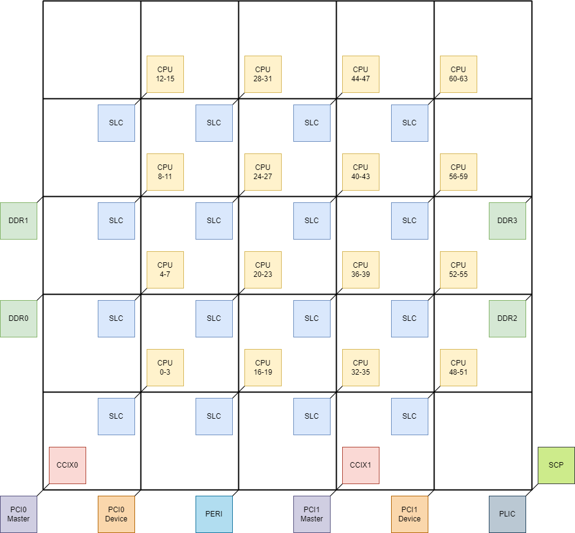

System
=======================

System architecture
-------------------

SG2042 is a typical NoC(network-on-chip) architecture. All transactions are
routed by the router in network. SoC architecture is shown in figure :ref:`mesh`

.. _mesh:

        Mesh architecture

As you have seen, four CPUs are partitioned into one cluster, totally 16 clusters
are connected into the mesh network. Each SLC(System Level Cache) is 4MiB in size
totally 16 SLCs are connected. They are shared by all CPUs. Four DRAM controllers
locate on the left and right side respectively. They can be accessed by all masters
connected on the network.

SG2042 support 2 socket mode through CCIX ports on mesh. Each CCIX port bind to
a PCIe controller. CCIX0 bind to PCIe0, CCIX1 bind to PCIe1. Customers can pick
each of them for dual socket connection.

PCI device maps bars of PCI devices into SoC address space. PCI master nodes
handle requests from PCI devices, like DMA transactions.

SCP(System CoProcessor) is a "out of mesh" CPU subsystem. it has no cache
coherence with other CPUs in mesh network. Its responsibility is initilazing
basic platform specific devices. Mesh network, DRAM controller, PCIe controller
and so on.

Memory organization
-------------------

SG2042 implements RISC-V Sv39 virtual address scheme with 40bits physicall
addressing ability.

Program memory, data memory, registers and I/O ports are organized within the
same linear 1TiB address space.

The bytes are coded in memory in Little Endian format. The lowest numbered byte
in a word is considered the word’s least significant byte and the highest
numbered byte the most significant.

As SG2042 supports two way CPU technolog. When working at two way mode, the
first CPU we naming it as CHIP0, the second CPU we naming it as CHIP1. All
resources in CHIP0 are organized within the 512GiB address space(low 39bits).
Resources in CHIP1 are organized from 512GiB to 1TiB address space(the most
significiant bit of address is 1).

For example, CHIP0 PCIe0 Link0 slave address is located from 0x40_0000_0000 to
0x40_3000_0000. CHIP1 PCIe0 Link0 slave address is located from 0xc0_0000_0000
to 0xc0_3000_0000.

Detailed memory layout is show in table :ref:`mmap_table`

.. _mmap_table:
.. include:: mmap.rst

System coprocessor
------------------

SG2042 has two CPU subsystem, one is the main 64 cores RISC-V subsystem and the
other is system coprocessor(SCP).

After chip power on, system boots from SCP. All RISC-V cores are stay in reset
status. SCP will do some platform initialization, then release all 64 RISC-V
cores. These platform initializations including:

- Setup PCIe topology. Set PCIe controll to a given mode. Link with PCIe devices.
- Setup DRAM by reading SPD through I2C bus.
- Setup mesh.
- Setup chip to chip CCIX link if dual socket mode is enabled.
- Load RISC-V zero stage bootloader(zsbl.bin)
- Setup RISC-V CPU reset address to where zsbl.bin is loaded.
- Release all RISC-V CPUs, now all CPUs run from zero stage bootloader.

So, RISC-V CPUs do not have a so called bootrom. Zero stage bootloader(zsbl.bin)
is the first boot stage of RISC-V CPUs.

Boot
---------

Boot sequency is controlled by both hardware and software

Power on reset
""""""""""""""

After power-on reset sequence, SCP reset will be automatically de-asserted by hardware.
Customers can select boot devices by pull BOOT_SEL[1] up or down. RISC-V CPUs
are asserted remain.

SG2042 provides 8-bit boot strap pins BOOT_SEL[7:0], the usage is shown as table
:ref:`boot_select_pin`

.. _boot_select_pin:
.. table:: Boot select

   ==============       =========       =============== ===========
   Pin                  Detect by       Value           Description
   ==============       =========       =============== ===========
   BOOT_SEL0            Software        Recommend to 1  0: Disable SD card boot. 1: Try SD card boot first, then try SPI flash boot
   BOOT_SEL1            Hardware        Recommend to 0  0: Boot from on-chip bootrom. 1: Bootrom from external SPI flash
   BOOT_SEL2            Software        Recommend to 0  Enable SCP console
   BOOT_SEL3            Software        Must be 0       Enter system level test mode
   BOOT_SEL4-7          Reserved        Must be 0       Reserved, but must be pulled down
   ==============       =========       =============== ===========

When boot from SPI Flash, IO SPIF*_CLK_SEL1 and SPIF*_CLK_SEL0 are used to determine the clock frequency of SPI interface as shown in table :ref:`spi_clk_sel`

.. _spi_clk_sel:
.. table:: SPI flash clock selection

        =============   =============   ===================
        SPIx_CLK_SEL1   SPIx_CLK_SEL0   SPI clock frequency
        =============   =============   ===================
        0               0               2.5MHz
        0               1               0.5MHz
        1               0               10MHz
        1               1               25MHz
        =============   =============   ===================

For SPIx_CLK_SELy, x stands for SPI0 or SPI1, y stands for SEL0 and SEL1.

Bootrom
"""""""

Bootrom supports loading SCP firmware from SPI flash or SD card.

When booting from SPI flash, bootrom loads SCP firmware from a given offset in
flash. When booting from SD card, some restrictions are listed below:

- SD card MUST contain a partition table MBR format.
- The first partition MUST be formatted with FAT32 file system.
- SCP firmware MUST be named fip.bin.
- fip.bin MUST be put into the first partition.

Suggest partitioning and formatting SD card on linux based PC for compatible
considerations. You can do it by following commands
(assume your SD card's device file is /dev/sda):

.. code-block:: bash

   $ sudo parted -s /dev/sda -- mklabel msdos mkpart primary fat32 1MiB -1s
   $ sudo mkfs.vfat -F32 /dev/sda1

SCP firmware
""""""""""""

SCP firmware loads RISC-V zero stage bootloader zsbl.bin from SPI or SD card.

SPI flash layout

TODO: add SPI flash layout

SCP firmware load zsbl.bin from the first partition of SD card. zsbl.bin should
locate at the root of this partition.
